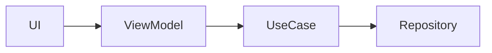

# Sairo Android 프로젝트 지침

## 기술 스택

- Kotlin, Jetpack Compose, Material 3
- Hilt, Retrofit, Kotlin Serialization, OkHttp, DataStore
- Navigation 3, Coil, Timber
- `minSdk` 24, `compileSdk`/`targetSdk` 36, JVM 17
- 의존성 버전은 `gradle/libs.versions.toml`에서 관리한다.

## 패키지와 의존성 방향

- `feature/`: 화면, UI 상태, 사용자 이벤트 등 프레젠테이션 계층
- `domain/`: 비즈니스 모델, UseCase, Repository 인터페이스. Android 또는 네트워크 구현에 의존하지 않는다.
- `data/`: API, DTO, mapper, Repository 구현
- `core/`: 네트워크, DataStore, navigation, 공통 유틸리티 및 디자인 시스템
- `app/`: Application 및 앱 수준 조립(composition root)
- `feature`는 `data` 구현에 직접 의존하지 않고 `domain`의 계약을 통해 접근한다.
- DTO나 API 응답 모델을 `domain` 또는 UI에 노출하지 않는다. 계층 경계에서 mapper를 사용한다.

## Compose 및 UI 규칙

- 화면 상태는 명시적인 불변 UI state로 표현하고, loading/empty/error 상태를 함께 고려한다.
- Composable은 가능한 한 stateless하게 만들고 상태 소유는 화면 또는 ViewModel에 둔다.
- UI 문자열은 하드코딩하지 않고 `app/src/main/res/values/strings.xml`에 둔다.
- 일반적인 색상·타이포그래피는 `MaterialTheme.colorScheme` 및 `MaterialTheme.typography`를 사용한다.
- Material 3에 없는 Sairo 고유 역할(칩, 선택 상태, 반투명 헤더 등)은 `SairoTheme.colors`를 사용한다. 화면별 매직 값과 색상 하드코딩을 피한다.
- `SairoColors`는 `LocalSairoColors`를 통해 `SairoTheme.colors`로 제공한다. 테마 변형이 필요해지면 같은 API를 유지한 채 제공하는 색상 세트만 교체한다.
- Figma 그림자 스타일은 `SairoShadowStyles`와 `Modifier.sairoDropShadow()`를 사용한다. 화면에서 blur, spread, 색상, offset 값을 직접 정의하지 않는다.
- 새 UI는 작은 화면, 시스템 인셋, 접근 가능한 터치 영역을 고려한다.

## 작업 원칙

- 수정 전에 인접한 코드와 기존 패턴을 먼저 확인하고, 요청 범위를 벗어난 리팩터링은 하지 않는다.
- 새 외부 의존성이 필요하면 먼저 기존 라이브러리로 해결 가능한지 확인한다.
- `local.properties`, API 키, 토큰, 실제 사용자 데이터는 읽어도 출력·커밋·문서화하지 않는다.
- 로컬 환경값은 Git 추적 파일에 넣지 않는다. 현재 `BASEURL`은 `local.properties`에서 주입된다.
- Gradle Wrapper를 사용하며, 가능한 경우 변경한 범위에 맞는 테스트 또는 빌드 검증을 실행한다.

## 학습 문서화

- 학습 가치가 있는 구현이나 패턴을 새로 도입했다면, 관련 설명을 난이도에 맞는 `docs/` 하위 폴더의 Markdown 파일로 남긴다.
  - `docs/foundations/`: 그 외/기초~초급 개념. 예: 리소스 관리, Compose 상태의 기초, 화면 구조.
  - `docs/intermediate/`: 중급 개념. 예: UDF, Flow, 계층 간 모델 변환, 오류 처리, 테스트 전략.
  - `docs/advanced/`: 고급 개념. 예: Compose 성능과 재구성, 복잡한 상태 모델링, 의존성 경계, 동시성, 확장 가능한 아키텍처.
- 파일명은 영문 kebab-case의 개념명으로 짓고(예: `unidirectional-data-flow.md`), 문서의 H1 제목은 이해하기 쉬운 한국어 개념명으로 작성한다(예: `# 단방향 데이터 흐름(UDF)`).
- 기존 문서 주제와 겹치면 새 파일보다 해당 문서를 보완한다. 단순한 UI·문구·기계적 변경에는 학습 문서를 만들지 않는다.

### 학습 문서의 필수 구성

1. **개념**: 개념의 정의와 핵심 용어를 먼저 설명한다.
2. **도입 이유**: 이 프로젝트에서 해결하려는 문제와 해당 방식을 선택한 이유를 설명한다.
3. **프로젝트 적용**: 실제 구현 파일을 절대 경로가 아닌 저장소 상대 경로로 링크하고, 관련 코드의 핵심 부분을 짧게 인용하거나 설명한다.
4. **흐름과 영향 범위**: 여러 계층이나 파일을 가로지르면 입력부터 결과까지의 흐름과 각 계층의 책임을 설명한다. 관계가 글만으로 명확하지 않을 때만 Mermaid 다이어그램 또는 표를 사용한다.
5. **트레이드오프와 주의점**: 장점뿐 아니라 복잡도, 성능, 테스트, 유지보수 관점의 비용과 주의점을 적는다.
6. **추가 학습 및 대안**: 현재는 구현하지 않았지만 유용한 대안이 있다면, 적용하지 않은 이유를 밝히고 독립적으로 이해 가능한 짧은 예시 코드를 제공한다.

### 권장 템플릿

````md
# 개념명

## 개념

## 도입 이유

## 프로젝트 적용

- 관련 파일: [`경로`](../../app/src/...)

## 흐름과 영향 범위



## 트레이드오프와 주의점

## 추가 학습 및 대안

> 아래 예시는 현재 프로젝트에 적용되지 않은 대안이다.

```kotlin
// 독립적으로 이해 가능한 최소 예시
```
````

## Git 협업 경계

- 커밋, 브랜치 생성·전환, push, PR 생성, PR 병합은 사용자가 직접 수행한다.
- Codex는 Git 상태와 diff를 읽고, 적절한 커밋 분리, 커밋 메시지, PR 제목/본문, 리뷰·병합 전 확인 사항을 제안할 수 있다.
- 사용자가 명시적으로 요청하지 않는 한 `git commit`, `git push`, 브랜치 변경, PR 생성 또는 병합 명령을 실행하지 않는다.

## 검증

- 단위 테스트: `./gradlew test`
- 디버그 빌드: `./gradlew assembleDebug`
- UI나 네비게이션 변경은 컴파일 검증 뒤, 가능한 경우 에뮬레이터/기기에서 핵심 경로를 확인한다.

## Figma 작업

- Figma 디자인을 구현할 때 기존 `ui/theme` 토큰을 우선 사용한다.
- 새 색상, 타이포그래피, 간격, radius가 필요하면 임의로 중복 정의하지 말고 토큰 추가 위치와 영향을 먼저 제안한다.
- Figma 링크 또는 노드 정보가 제공되면 레이아웃뿐 아니라 상태, 접근성, 작은 화면 대응까지 구현 범위에 포함한다.
