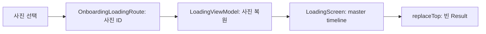

# Compose 협업형 모션 타임라인

## 개념

협업형 모션 타임라인은 여러 Compose 요소의 개별 애니메이션을 하나의 시간 축으로 관리하는 방식이다. 각 요소는 자신의 시작 지연 시간과 지속 시간만 가지며, 현재 타임라인 값으로부터 진행률을 계산한다.

## 도입 이유

온보딩 로딩 화면은 선택한 사진 다섯 장, 카드 착지 눌림, 분위기 태그 세 개, 결과 화면 이동이 서로 다른 시점에 일어나야 한다. 각 카드마다 `LaunchedEffect`와 `delay`를 만들면 화면 재구성 때 순서가 흔들리거나 완료 시점을 판단하기 어렵다. 하나의 타임라인을 사용하면 Figma의 650ms 스태거와 결과 이동 조건을 한 곳에서 유지할 수 있다.

## 프로젝트 적용

- 관련 파일: [`feature/onboarding/OnboardingLoadingScreen.kt`](../../app/src/main/java/com/example/sairo14/feature/onboarding/OnboardingLoadingScreen.kt)
- 관련 파일: [`feature/onboarding/OnboardingLoadingViewModel.kt`](../../app/src/main/java/com/example/sairo14/feature/onboarding/OnboardingLoadingViewModel.kt)
- 관련 파일: [`core/navigation/SairoNavDisplay.kt`](../../app/src/main/java/com/example/sairo14/core/navigation/SairoNavDisplay.kt)

`OnboardingLoadingScreen`은 0ms부터 3,380ms까지 진행하는 `Animatable`을 만들고, 카드의 시작 시간과 지속 시간을 `timedProgress()`에 전달한다. 카드의 위치·회전·투명도는 그 결과만 사용해 `graphicsLayer`에서 바뀐다.

```kotlin
val progress = timedProgress(
    elapsedMillis = elapsedMillis,
    delayMillis = card.delayMillis,
    durationMillis = 600,
)

Modifier.graphicsLayer {
    translationX = startX * (1f - progress)
    rotationZ = lerp(startRotation, restRotation, progress)
    alpha = progress
}
```

사진 데이터 복원은 ViewModel이 담당한다. Route에는 직렬화 가능한 사진 ID만 보관하고, ViewModel이 `GetPhotoCandidatesUseCase`로 다시 조회해 Route의 ID 순서대로 UI 모델을 만든다. 화면은 카드 모션과 임시 분석 대기만 소유한다.

## 흐름과 영향 범위



카드 1~5는 각각 0, 650, 1,300, 1,950, 2,600ms에 시작한다. 두 번째·세 번째·네 번째 카드가 착지한 뒤에는 태그가 순서대로 떠오른다. 화면은 카드 타임라인과 분석 준비가 모두 끝난 뒤 결과 Route로 교체된다. 교체를 사용하므로 결과에서 뒤로가도 중간 로딩 화면이 다시 나타나지 않는다.

## 트레이드오프와 주의점

- master timeline은 동기화에는 강하지만, 요소별로 독립적인 사용자 제스처를 섞기에는 적합하지 않다. 그런 경우에는 해당 요소만 별도 `Animatable`로 분리한다.
- `graphicsLayer`는 레이아웃을 다시 계산하지 않아 카드 비행에 적합하다. 반대로 `padding`, `size`, `offset`을 매 프레임 바꾸면 주변 레이아웃이 흔들릴 수 있다.
- 시스템 애니메이션 배율이 0이면 최종 상태를 즉시 표시해야 한다. 시간 기반 `delay`만 사용하면 축소 모션 환경에서도 결과 이동이 불필요하게 늦어진다.
- Route에는 URL이나 UI 모델 대신 ID를 보관한다. 다만 사진 후보 API가 변경되어 이전 ID를 찾지 못할 수 있으므로, 복원 실패 시 사진 선택 화면으로 돌아갈 오류 상태가 필요하다.

## 추가 학습 및 대안

> 아래 예시는 현재 프로젝트에 적용되지 않은 대안이다.

카드가 같은 모션을 공유하지 않고 사용자의 네트워크 분석 진행률에 맞춰 각각 독립적으로 완료되어야 한다면, 카드마다 `Animatable`을 소유할 수 있다.

```kotlin
val cardProgress = remember(photo.id) { Animatable(0f) }

LaunchedEffect(analysisProgress[photo.id]) {
    cardProgress.animateTo(analysisProgress[photo.id] ?: 0f)
}
```

이 방식은 개별 진행률을 자연스럽게 표현하지만, 다섯 카드가 일정 간격으로 쌓이는 현재 디자인에서는 완료 순서와 결과 이동을 별도로 조율해야 하므로 사용하지 않았다.
