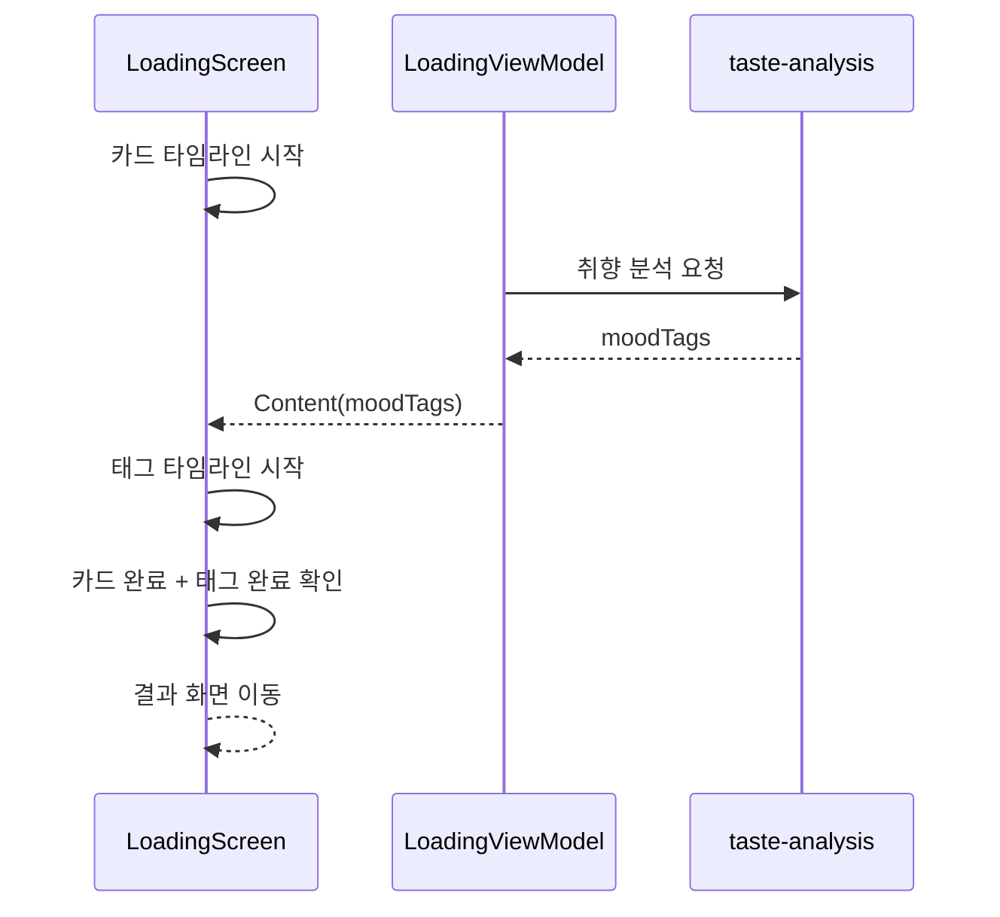

# Compose 협업형 모션 타임라인

## 개념

협업형 모션은 여러 요소가 끝나는 시점을 조율하는 방식이다. 같은 시간 축을 공유해야 하는 요소는 하나의 `Animatable`로, 외부 데이터가 준비된 뒤 시작해야 하는 요소는 별도 `Animatable`로 관리한다.

온보딩 로딩 화면은 카드 5장의 일정한 스태킹과 네트워크 응답 뒤에만 가능한 무드 태그 표시가 함께 있다. 따라서 카드는 하나의 카드 타임라인을 공유하고, 태그는 API 응답을 시작점으로 하는 별도 타임라인을 사용한다.

## 도입 이유

태그를 카드와 같은 고정 타임라인에 넣으면 서버가 아직 응답하지 않았을 때 하드코딩된 태그를 보여주거나, 응답 시점과 무관한 빈 영역을 만들게 된다. 반대로 카드마다 독립적인 코루틴을 두면 Figma의 스태거와 전체 완료 시점을 관리하기 어렵다.

두 타임라인과 완료 게이트를 사용하면 카드 모션은 기존 리듬을 유지하고, 실제 API 무드 태그는 준비된 뒤 안전하게 표시할 수 있다.

## 프로젝트 적용

- 관련 파일: [`OnboardingLoadingScreen.kt`](../../app/src/main/java/com/example/sairo14/feature/onboarding/loading/OnboardingLoadingScreen.kt)
- 분석 상태 소유: [`OnboardingLoadingViewModel.kt`](../../app/src/main/java/com/example/sairo14/feature/onboarding/loading/OnboardingLoadingViewModel.kt)

카드 타임라인은 각 카드의 지연 시간과 지속 시간을 진행률로 바꾼다.

```kotlin
val cardProgress = timedProgress(
    elapsedMillis = elapsedMillis,
    delayMillis = card.delayMillis,
    durationMillis = CardEnterDurationMillis,
)
```

태그 타임라인은 `moodTags`가 `null`이 아닐 때만 시작하고, 태그 인덱스로 순차 지연을 계산한다.

```kotlin
val tagProgress = timedProgress(
    elapsedMillis = elapsedMillis,
    delayMillis = index * TagAppearIntervalMillis,
    durationMillis = TagEnterDurationMillis,
)
```

## 흐름과 영향 범위



완료 게이트는 두 상태가 모두 참일 때만 화면 이동을 허용한다.

```kotlin
if (moodTags != null && isCardAnimationFinished && isTagAnimationFinished) {
    onFinished()
}
```

시스템 애니메이션 배율이 0이면 카드 타임라인은 최종 값으로 즉시 이동한다. 태그도 빈 목록이면 즉시 완료되므로 접근성 설정 때문에 결과 화면 이동이 지연되지 않는다.

## 트레이드오프와 주의점

- 별도 타임라인은 API 응답 시점에 맞춘 표현에는 적합하지만 완료 상태가 하나 더 필요하다.
- `onFinished()`는 재구성으로 중복 호출되지 않도록 완료 상태와 `LaunchedEffect`의 키를 함께 설계해야 한다.
- API 실패 시 태그 타임라인을 시작하지 않고 재시도 UI를 보인다. 카드 모션을 재시도마다 다시 실행할지 여부는 UX 정책으로 결정한다.
- `graphicsLayer`로 위치·회전·투명도만 바꾸면 매 프레임 레이아웃을 다시 계산하지 않아 카드 모션에 적합하다.

## 추가 학습 및 대안

> 아래 예시는 현재 프로젝트에 적용하지 않은 서버 진행률 기반 대안이다.

```kotlin
val progress by viewModel.analysisProgress.collectAsStateWithLifecycle()
LaunchedEffect(progress) {
    tagTimeline.animateTo(progress)
}
```

서버가 실제 분석 진행률을 제공하면 더 정직한 진행 UI를 만들 수 있다. 현재 API는 완료 응답만 반환하므로, 카드 모션과 완료 후 태그 모션을 조합하는 방식이 더 단순하다.
