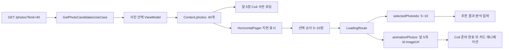

# 온보딩 이미지 전달과 지연 로딩

## 개념

온보딩 사진 선택은 사진 후보 40개를 한 번에 받지만, 모든 이미지를 같은 시점에 화면에 그리지 않는다. 후보 목록은 화면 상태에 모두 보관하고, `HorizontalPager`가 현재 위치 주변의 카드만 구성할 때 Coil이 해당 URL을 요청한다. 이를 여기서는 **화면 페이저 기반 지연 로딩**이라고 부른다.

이는 서버 API를 페이지 단위로 나누는 Paging 3와는 다르다. 현재 API는 `limit=40`인 단일 응답을 주고, 앱은 그 40개를 모두 선택 후보로 유지한다. 지연되는 대상은 목록 데이터가 아니라 이미지의 다운로드·디코딩·Compose 표시다.

## 도입 이유

사용자는 후보 중 5~10장을 고르며, 로딩 애니메이션에는 선택 순서의 앞 5장만 필요하다. 따라서 다음 두 문제가 생긴다.

- 40장의 이미지를 처음부터 동시에 화면에 표시하면 초기 네트워크·디코딩 작업이 불필요하게 커진다.
- 로딩 화면이 사진 풀 API를 다시 호출하면 무작위 후보 API 특성상 선택했던 사진을 복원할 수 없고, 애니메이션이 빈 카드로 시작할 수 있다.

현재 구조는 선택 화면의 첫 카드 5장만 먼저 준비하고, 나머지는 Pager 이동에 맞춰 요청한다. 완료 후에는 전체 선택 ID와 애니메이션용 5개 URL을 서로 다른 목적에 맞게 Route로 전달한다.

## 프로젝트 적용

- 후보 40장 조회: [`GetPhotoCandidatesUseCase.kt`](../../app/src/main/java/com/example/sairo14/domain/usecase/GetPhotoCandidatesUseCase.kt)
- 선택 상태와 완료 효과: [`OnboardingPhotoSelectViewModel.kt`](../../app/src/main/java/com/example/sairo14/feature/onboarding/select/OnboardingPhotoSelectViewModel.kt)
- Pager 및 첫 5장 사전 로딩: [`OnboardingPhotoSelectScreen.kt`](../../app/src/main/java/com/example/sairo14/feature/onboarding/select/OnboardingPhotoSelectScreen.kt)
- Navigation 전달 모델: [`SairoRoute.kt`](../../app/src/main/java/com/example/sairo14/core/navigation/SairoRoute.kt)
- 목적지 연결: [`SairoNavDisplay.kt`](../../app/src/main/java/com/example/sairo14/core/navigation/SairoNavDisplay.kt)
- 로딩 카드 준비 및 애니메이션 시작: [`OnboardingLoadingScreen.kt`](../../app/src/main/java/com/example/sairo14/feature/onboarding/loading/OnboardingLoadingScreen.kt)
- 로딩 화면 상태 변환: [`OnboardingLoadingViewModel.kt`](../../app/src/main/java/com/example/sairo14/feature/onboarding/loading/OnboardingLoadingViewModel.kt)
- 공통 원격 이미지 fallback: [`SairoRemoteImage.kt`](../../app/src/main/java/com/example/sairo14/core/designsystem/component/SairoRemoteImage.kt)

`GetPhotoCandidatesUseCase`는 사진 후보 수 40을 결정한다. ViewModel과 화면은 Retrofit DTO나 API의 `limit` 값을 알지 못한다.

```kotlin
private const val OnboardingPhotoCandidateLimit = 40

operator fun invoke(): AppResult<List<PhotoCandidate>> =
    photoSelectionRepository.getPhotoCandidates(OnboardingPhotoCandidateLimit)
```

사진 선택 화면은 후보 전체를 `Content.photos`에 보관한다. 첫 5개 URL의 Coil 요청이 끝날 때까지 Pager 영역만 대기하고, 이후 `HorizontalPager` 안의 `SairoImageCard`가 카드가 구성되는 시점에 나머지 URL을 요청한다. 개별 요청 실패는 목록 오류가 아니라 이미지 표시 오류이므로 `SairoRemoteImage`가 dummy 리소스로 대체한다.

## 흐름과 영향 범위



`OnboardingLoadingRoute`에는 두 종류의 정보가 함께 있다.

| 값 | 개수 | 책임 |
| --- | ---: | --- |
| `selectedPhotoIds` | 5~10 | 이후 추천 분석에 어떤 사진을 선택했는지 전달한다. |
| `animationPhotos` | 정확히 5 | 로딩 화면 카드에 즉시 표시할 `id`, `imageUrl`을 전달한다. |

로딩 ViewModel은 URL을 다시 네트워크에서 조회하지 않는다. Route의 5개 사진을 화면용 모델로 변환하고 ID 중복·개수만 검증한다. 실제 이미지 요청과 캐시 준비는 Compose 화면이 Coil로 담당한다. 카드가 비어 있는 채 모션을 시작하지 않도록, 다섯 요청이 완료되기 전에는 배경만 표시한다. 요청 실패도 완료로 처리하며, 카드가 나타날 때 공통 fallback 이미지가 보인다.

## 테스트 전략

다음 테스트는 UI를 직접 그리지 않고 계층별 계약을 확인한다.

- [`GetPhotoCandidatesUseCaseTest.kt`](../../app/src/test/java/com/example/sairo14/domain/usecase/GetPhotoCandidatesUseCaseTest.kt): UseCase가 Repository에 `limit=40`을 요청하는지 확인한다.
- [`RemotePhotoSelectionRepositoryTest.kt`](../../app/src/test/java/com/example/sairo14/data/repository/RemotePhotoSelectionRepositoryTest.kt): DTO가 Domain 모델로 변환되고 네트워크 실패가 `AppResult.Failure`가 되는지 확인한다.
- [`OnboardingPhotoSelectViewModelTest.kt`](../../app/src/test/java/com/example/sairo14/feature/onboarding/select/OnboardingPhotoSelectViewModelTest.kt): 40개 후보가 콘텐츠 상태에 유지되는지, 선택 순서와 10장 상한, 완료 효과의 전체 ID 및 앞 5개 URL을 확인한다.
- [`OnboardingLoadingViewModelTest.kt`](../../app/src/test/java/com/example/sairo14/feature/onboarding/OnboardingLoadingViewModelTest.kt): Navigation으로 전달된 ID와 URL의 순서가 로딩 카드 모델까지 보존되는지 확인한다.

Coil의 실제 다운로드 완료 시점과 `HorizontalPager`의 카드 구성 범위는 Compose·네트워크 환경에 영향을 받는다. 따라서 해당 동작은 단위 테스트 대신 에뮬레이터 또는 기기에서 다음 흐름을 확인한다.

1. 사진 선택 진입 뒤 첫 5장 준비 전에는 Pager 카드가 보이지 않는지 확인한다.
2. 준비 뒤 첫 카드가 보이고, 좌우 이동 중 다음 이미지가 표시되는지 확인한다.
3. 5장을 선택해 로딩 화면으로 이동했을 때 빈 카드 없이 애니메이션이 시작되는지 확인한다.
4. 만료되었거나 실패하는 URL에서 dummy 이미지가 표시되고 화면이 무한 대기하지 않는지 확인한다.

## 트레이드오프와 주의점

- 40개 목록을 메모리에 보관하므로 후보 수가 매우 커지면 실제 서버 페이징과 Paging 3 도입을 검토해야 한다. 현재 40개는 선택 UX와 구현 복잡도의 균형점이다.
- `animationPhotos`에는 URL이 포함되므로 URL이 길거나 민감한 서명 정보를 담는 경우 Navigation 상태의 크기와 로그 노출을 점검해야 한다. 현재는 최대 5개만 전달하고 URL을 로그로 남기지 않는다.
- URL이 만료되면 로딩 카드에는 dummy 이미지가 표시된다. 선택과 분석 자체는 `selectedPhotoIds`를 사용하므로, 표시 URL 실패와 분석 입력은 분리되어 있다.
- `usesCleartextTraffic="true"`는 HTTP 이미지 확인을 위한 임시 설정이다. 릴리스 전에는 이미지 서버를 HTTPS로 전환하고 이 설정을 제거해야 한다. 불가피한 개발 환경에서는 앱 전체 허용 대신 디버그 빌드의 특정 도메인만 허용한다.
- 공통 dummy 이미지 `img_dummy_view.jpg`는 여러 화면의 fallback으로 사용된다. 현재 크기가 큰 편이므로 디자인 확인 후 표시 최대 크기에 맞춘 압축·축소를 별도 작업으로 진행한다.

## 추가 학습 및 대안

사진 후보가 수백 장 이상으로 늘어나거나 서버가 커서 기반 페이지 API를 제공하면, 데이터 조회 자체를 페이징할 수 있다. 이 방식은 목록 메모리를 줄이지만, 새 페이지의 중복·정렬·재시도 상태까지 관리해야 한다.

> 아래 예시는 현재 프로젝트에 적용하지 않은 서버 페이징 대안이다.

```kotlin
interface PhotoSelectionRepository {
    suspend fun getPhotoCandidates(
        cursor: String?,
        limit: Int,
    ): AppResult<PhotoCandidatePage>
}

data class PhotoCandidatePage(
    val items: List<PhotoCandidate>,
    val nextCursor: String?,
)
```

현재는 무작위 40개 후보를 한 번에 고정해 보여 주는 제품 정책이므로, 서버 페이징보다 Pager 기반 이미지 지연 로딩이 더 단순하고 예측 가능하다.
