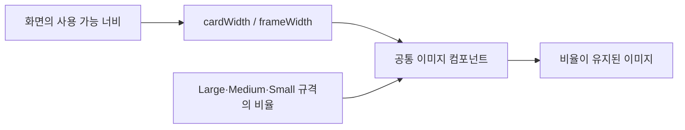

# 비율을 유지하는 이미지 컴포넌트

## 개념

이미지의 가로와 세로를 모두 고정값으로 지정하는 대신, 가로 길이와 종횡비(aspect ratio)를 기준으로 높이를 계산하는 방식이다. 같은 이미지라도 화면 너비와 배치 영역에 따라 크기를 바꿀 수 있고, 원본 비율은 유지된다.

## 도입 이유

Sairo의 사진 카드와 폴더 프레임은 여러 화면에서 반복 사용된다. 공통 컴포넌트가 고정된 가로·세로 크기를 직접 강제하면 작은 화면, 가로 화면, 넓은 화면에서 호출하는 화면이 크기를 조절할 수 없다.

## 프로젝트 적용

- 관련 파일: [`SairoImageCard.kt`](../../app/src/main/java/com/example/sairo14/core/designsystem/component/SairoImageCard.kt)
- 관련 파일: [`SairoFolderFrame.kt`](../../app/src/main/java/com/example/sairo14/core/designsystem/component/SairoFolderFrame.kt)

`SairoImageCard`는 `Large`, `Medium` 규격에 기본 너비와 종횡비를 보관한다. 호출하는 화면이 `cardWidth`를 전달하면, 컴포넌트는 그 너비와 규격의 비율로 카드 높이를 계산한다.

```kotlin
SairoImageCard(
    painter = painter,
    selected = false,
    cardWidth = 260.dp,
)
```

`SairoFolderFrame`도 `frameWidth`를 선택적으로 받아 폴더 리소스를 동일한 방식으로 그린다. 폴더 위 콘텐츠의 위치는 프레임 컴포넌트가 아니라 호출 화면의 `Box`가 관리한다.

홈의 중앙 CTA인 [`HomeDiscoveryCta.kt`](../../app/src/main/java/com/example/sairo14/feature/home/HomeDiscoveryCta.kt)는 `BoxWithConstraints`로 부모의 가용 너비를 읽고, Figma 기준 묶음 너비를 넘지 않는 비율을 계산한다. 카드·폴더·버튼의 너비와 CTA 높이는 같은 비율로 계산하고, 레이어의 위치는 `Alignment`와 `padding`으로 배치한다. 따라서 카드의 화면 좌표를 직접 지정하지 않아도 작은 화면에서 겹침 순서와 비율을 유지한다.

```kotlin
val scale = (maxWidth / DesignWidth).coerceAtMost(1f)
val cardWidth = CardWidth * scale

SairoImageCard(
    cardWidth = cardWidth,
    modifier = Modifier.align(Alignment.TopCenter),
)
```

`SairoButton`은 자체 Figma 높이를 소유하므로 CTA 안에서는 크기가 계산된 래퍼가 레이아웃 공간을 예약하고, 버튼의 시각 레이어만 같은 비율로 축소한다. 이 예외는 고정 터치 규격을 가진 공통 버튼을 화면 폭에 맞추기 위한 것이며, 일반 이미지 크기 조절에는 `width()`와 `aspectRatio()`를 우선한다.

`SairoOverlappingImageCards`는 두 장의 `Painter`와 카드 너비를 받아 Medium 카드 비율을 유지하며 회전·겹침을 적용한다. 온보딩 화면처럼 배경 장식의 위치가 화면마다 달라지는 경우에도, 화면은 이 컴포넌트의 위치만 결정한다.

## 흐름과 영향 범위



## 트레이드오프와 주의점

- `Large`, `Medium`은 기본 크기와 시각 규격만 담당한다. 공통 컴포넌트 내부에서 화면 너비를 직접 읽으면 재사용성이 낮아진다.
- 이미지 배경은 화면에 맞춰 가변해도 텍스트 크기와 버튼의 최소 터치 영역까지 같은 비율로 축소하지 않는다.
- `scale()`은 레이아웃이 측정한 크기를 바꾸지 않으므로, 이미지 크기 조절에는 `width()`와 `aspectRatio()`를 우선 사용한다. 시각 축소가 필요한 고정 규격 버튼은 별도 래퍼가 축소된 레이아웃 공간을 함께 예약해야 한다.

## 추가 학습 및 대안

> 아래 예시는 현재 프로젝트에 적용하지 않은, 부모 너비를 모두 채우는 대안이다.

```kotlin
BoxWithConstraints {
    SairoImageCard(
        painter = painter,
        selected = false,
        cardWidth = maxWidth,
    )
}
```

이 방식은 배치 영역을 모두 채워야 하는 배너에 적합하다. 사진 선택 카드처럼 다음 카드가 일부 보이는 가로 스크롤 UI에는 최대 너비를 두는 편이 더 적합하다.
