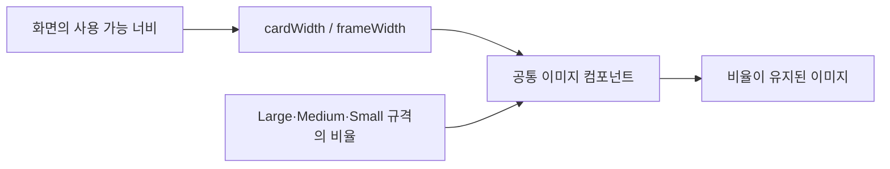

# 비율을 유지하는 이미지 컴포넌트

## 개념

이미지의 가로와 세로를 모두 고정값으로 지정하는 대신, 가로 길이와 종횡비(aspect ratio)를 기준으로 높이를 계산하는 방식이다. 같은 이미지라도 화면 너비와 배치 영역에 따라 크기를 바꿀 수 있고, 원본 비율은 유지된다.

## 도입 이유

Sairo의 사진 카드와 폴더 프레임은 여러 화면에서 반복 사용된다. 공통 컴포넌트가 고정된 가로·세로 크기를 직접 강제하면 작은 화면, 가로 화면, 넓은 화면에서 호출하는 화면이 크기를 조절할 수 없다.

## 프로젝트 적용

- 관련 파일: [`SairoImageCard.kt`](../../app/src/main/java/com/example/sairo14/core/designsystem/component/SairoImageCard.kt)
- 관련 파일: [`SairoFolderFrame.kt`](../../app/src/main/java/com/example/sairo14/core/designsystem/component/SairoFolderFrame.kt)

`SairoImageCard`는 `Large`, `Medium` 규격에 기본 너비와 종횡비를 보관한다. 호출하는 화면이 `cardWidth`를 전달하면, 컴포넌트는 그 너비와 규격의 비율로 카드 높이를 계산한다.

```kotlin
SairoImageCard(
    painter = painter,
    selected = false,
    cardWidth = 260.dp,
)
```

`SairoFolderFrame`도 `frameWidth`를 선택적으로 받아 폴더 리소스를 동일한 방식으로 그린다. 폴더 위 콘텐츠의 위치는 프레임 컴포넌트가 아니라 호출 화면의 `Box`가 관리한다.

사진 선택 화면의 폴더 영역은 하나의 `Box`가 폴더 본문부터 시스템 내비게이션 영역까지 `surfaceRaised`로 유지한다. 탭이 있는 상단 높이만 `backgroundCanvas`로 다시 덮고, 그림자가 있는 폴더와 외곽선용 폴더를 순서대로 올린다. 이 순서로 폴더 위쪽은 캔버스와 자연스럽게 이어지고, 본문 아래의 흰색 표면은 화면 하단까지 끊기지 않는다.

카드와 폴더는 형제 레이아웃이므로, 카드의 회전·그림자가 폴더와 만나는 경우에는 카드 영역에 `zIndex(1f)`를 부여한다. 크기와 위치는 바꾸지 않고 그리기 순서만 카드가 앞서도록 한다.

시스템 내비게이션 inset으로 폴더 영역이 커지면 Pager에 남는 높이가 줄어든다. 카드 너비는 화면 폭뿐 아니라, 상·하단 여유를 제외한 Pager 높이에서도 계산한다. 따라서 충분한 화면에서는 Figma 기준 최대 크기를 유지하고, 세로 공간이 부족한 기기에서만 카드 비율을 보존한 채 축소된다.

다만 Pager의 가용 높이가 상·하단 여유보다 작으면 카드 너비가 0이 될 수 있다. 사진 선택 화면은 이 경우를 저높이 레이아웃으로 구분한다. 화면 전체를 세로 스크롤 가능하게 만들고 Pager에 최소 높이를 부여해, 가로 모드나 분할 화면에서도 카드와 클릭 영역이 사라지지 않게 한다.

선택 보더가 있는 카드에서는 이미지 콘텐츠의 라운드를 보더 안쪽 라운드로 분리한다. 예를 들어 외곽 라운드가 24dp이고 보더가 3dp이면 이미지는 21dp 라운드로 클리핑한다. 보더의 안티앨리어싱 영역에 이미지가 비쳐 모서리 밖으로 튀어나와 보이는 현상을 막을 수 있다.

```kotlin
Box {
    // 부모는 surfaceRaised + navigationBarsPadding()
    Box(Modifier.height(folderBodyTop).background(backgroundCanvas))
    FolderFrame(modifier = Modifier.sairoDropShadow(...))
    FolderFrame() // 외곽선과 그라데이션을 맨 위에 표시
}

Box(Modifier.zIndex(1f)) {
    PhotoCandidatePager(...)
}

val availableCardHeight = (maxHeight - topPadding - bottomShadowClearance)
    .coerceAtLeast(0.dp)
val cardWidth = minOf(
    maxWidth * cardWidthRatio,
    availableCardHeight * cardAspectRatio,
    maximumCardWidth,
)

Column {
    val pagerModifier = if (maxHeight < compactHeightThreshold) {
        Modifier.heightIn(min = compactPagerMinimumHeight)
    } else {
        Modifier.weight(1f)
    }
}

val outerShape = RoundedCornerShape(24.dp)
val contentShape = RoundedCornerShape(21.dp)
Box(Modifier.border(3.dp, brush, outerShape)) {
    Box(Modifier.padding(3.dp).clip(contentShape)) {
        Image(...)
    }
}
```

홈의 중앙 CTA인 [`HomeDiscoveryCta.kt`](../../app/src/main/java/com/example/sairo14/feature/home/HomeDiscoveryCta.kt)는 `BoxWithConstraints`로 부모의 가용 너비를 읽고, Figma 기준 묶음 너비를 넘지 않는 비율을 계산한다. 카드·폴더·버튼의 너비와 CTA 높이는 같은 비율로 계산하고, 레이어의 위치는 `Alignment`와 `padding`으로 배치한다. 따라서 카드의 화면 좌표를 직접 지정하지 않아도 작은 화면에서 겹침 순서와 비율을 유지한다.

```kotlin
val scale = (maxWidth / DesignWidth).coerceAtMost(1f)
val cardWidth = CardWidth * scale

SairoImageCard(
    cardWidth = cardWidth,
    modifier = Modifier.align(Alignment.TopCenter),
)
```

`SairoButton`은 자체 Figma 높이를 소유하므로 CTA 안에서는 크기가 계산된 래퍼가 레이아웃 공간을 예약하고, 버튼의 시각 레이어만 같은 비율로 축소한다. 이 예외는 고정 터치 규격을 가진 공통 버튼을 화면 폭에 맞추기 위한 것이며, 일반 이미지 크기 조절에는 `width()`와 `aspectRatio()`를 우선한다.

`SairoOverlappingImageCards`는 두 장의 `Painter`와 카드 너비를 받아 Medium 카드 비율을 유지하며 회전·겹침을 적용한다. 온보딩 화면처럼 배경 장식의 위치가 화면마다 달라지는 경우에도, 화면은 이 컴포넌트의 위치만 결정한다.

## 흐름과 영향 범위



## 트레이드오프와 주의점

- `Large`, `Medium`은 기본 크기와 시각 규격만 담당한다. 공통 컴포넌트 내부에서 화면 너비를 직접 읽으면 재사용성이 낮아진다.
- 이미지 배경은 화면에 맞춰 가변해도 텍스트 크기와 버튼의 최소 터치 영역까지 같은 비율로 축소하지 않는다.
- 그림자를 폴더 이미지에 직접 한 번만 적용하면 반투명 폴더 표면 안쪽까지 그림자가 비쳐 보일 수 있다. 이 경우 그림자·표면·외곽선의 레이어 순서를 분리하되, 같은 폴더 영역 컨테이너가 함께 소유한다.
- `PageSize.Fixed(0.dp)`는 화면에 카드도 터치 영역도 만들지 않는다. 카드 너비에 임의의 최소값만 적용하기보다, Pager 자체에 양의 높이를 보장하는 저높이 대체 레이아웃이 필요하다.
- `scale()`은 레이아웃이 측정한 크기를 바꾸지 않으므로, 이미지 크기 조절에는 `width()`와 `aspectRatio()`를 우선 사용한다. 시각 축소가 필요한 고정 규격 버튼은 별도 래퍼가 축소된 레이아웃 공간을 함께 예약해야 한다.

## 추가 학습 및 대안

> 아래 예시는 현재 프로젝트에 적용하지 않은, 부모 너비를 모두 채우는 대안이다.

```kotlin
BoxWithConstraints {
    SairoImageCard(
        painter = painter,
        selected = false,
        cardWidth = maxWidth,
    )
}
```

이 방식은 배치 영역을 모두 채워야 하는 배너에 적합하다. 사진 선택 카드처럼 다음 카드가 일부 보이는 가로 스크롤 UI에는 최대 너비를 두는 편이 더 적합하다.
