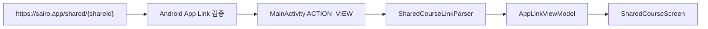

# Android App Links

## 개념

Android App Links는 HTTPS URL의 도메인 소유자가 특정 Android 앱에 해당 URL을 열 권한을 위임하는 방식이다. 앱은 매니페스트의 `ACTION_VIEW` intent filter로 받을 URL 범위를 선언하고, 웹 서버는 `assetlinks.json`으로 앱의 패키지명과 서명 인증서를 검증한다.

## 도입 이유

공유 코스 URL은 `https://sairo.app/shared/{shareId}` 형식으로 외부 메신저와 브라우저에서 열린다. 검증된 App Link로 등록하면 앱이 설치된 Android 기기에서 이 URL이 앱의 공유 코스 화면으로 바로 전달되며, 앱이 없을 때는 기존 웹 URL을 그대로 열 수 있다.

## 프로젝트 적용

- 수신 URL 선언: [`app/src/main/AndroidManifest.xml`](../../app/src/main/AndroidManifest.xml)
- Intent 수신: [`app/src/main/java/com/example/sairo14/MainActivity.kt`](../../app/src/main/java/com/example/sairo14/MainActivity.kt)
- URL 검증 및 공유 ID 추출: [`app/src/main/java/com/example/sairo14/core/navigation/SharedCourseLinkParser.kt`](../../app/src/main/java/com/example/sairo14/core/navigation/SharedCourseLinkParser.kt)

`MainActivity`는 `https`, `sairo.app`, `/shared` 경로로 시작하는 URL만 `ACTION_VIEW` Intent로 수신한다. 수신한 URL은 `SharedCourseLinkParser`가 정확한 공유 링크 형식인지 다시 검증한 뒤, `shareId`만 Navigation에 전달한다. 매니페스트의 경로 제한은 Intent를 받을 앱을 좁히는 역할이고, 파서는 신뢰할 수 없는 외부 URL을 앱 내부 상태로 변환하기 전 최종 검증을 담당한다.

## 흐름과 영향 범위



`android:autoVerify="true"`만으로는 충분하지 않다. `sairo.app` 웹 서버는 다음 위치에서 HTTP 200과 `application/json` 콘텐츠 타입으로 파일을 제공해야 한다.

`https://sairo.app/.well-known/assetlinks.json`

```json
[
  {
    "relation": ["delegate_permission/common.handle_all_urls"],
    "target": {
      "namespace": "android_app",
      "package_name": "com.example.sairo14",
      "sha256_cert_fingerprints": [
        "릴리스 앱 서명 인증서의 SHA-256 지문"
      ]
    }
  }
]
```

Google Play App Signing을 사용한다면 SHA-256 지문은 로컬 업로드 키가 아닌 Play Console의 앱 서명 인증서 값을 사용한다. 웹 배포 저장소가 이 Android 저장소와 분리되어 있다면 위 파일은 웹 저장소의 정적 공개 디렉터리에 추가해 배포한다.

## 트레이드오프와 주의점

`assetlinks.json`이 없거나 패키지명·서명 지문이 다르면 Android는 도메인 검증에 실패한다. 이 경우 URL은 브라우저에서 열리거나 사용자가 앱 선택 화면을 보게 된다. 인증서 교체, 새 Play 앱 서명 등록, 패키지명 변경 시에는 서버 파일도 함께 갱신해야 한다.

`pathPrefix="/shared"`는 `/shared`로 시작하는 URL을 Android에 전달하지만, 앱 내부 파서는 정확히 한 개의 공유 ID 세그먼트만 허용한다. 따라서 `/shared/abc/extra`처럼 의도하지 않은 URL은 화면 이동이나 API 호출을 만들지 않는다.

## 추가 학습 및 대안

개발 중에는 명시적 Intent로 URL 수신 경로만 빠르게 확인할 수 있다. 이 검사는 서버의 도메인 검증을 우회하므로 실제 App Link 배포 검증을 대체하지 않는다.

```bash
adb shell am start -W \\
  -a android.intent.action.VIEW \\
  -d "https://sairo.app/shared/6e33c8c03e" \\
  com.example.sairo14
```

앱이 설치되지 않은 사용자를 위해 웹 공유 페이지를 별도로 만들 수도 있다. 이 경우에도 App Link 검증 파일은 동일 도메인의 `/.well-known/assetlinks.json`에 유지해야 한다.
