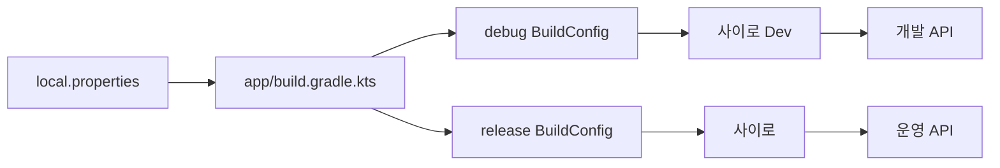

# Android 빌드 변형으로 개발·배포 환경 나누기

## 개념

Android의 build type은 같은 소스 코드에서 개발용과 배포용 앱을 서로 다르게 만드는 Gradle 설정이다. `debug`와 `release`는 각각 독립적인 `BuildConfig` 값, 앱 ID, 버전 이름, 서명 방식을 가질 수 있다.

## 도입 이유

개발 앱이 운영 데이터를 변경하거나, 운영 앱이 개발 서버에 연결되는 실수를 막아야 한다. 개발·배포 앱을 동시에 설치할 수 있게 하면서도 API 주소와 외부 SDK 키를 빌드 시점에 분리한다.

## 프로젝트 적용

- 관련 파일: [`app/build.gradle.kts`](../../app/build.gradle.kts)
- 관련 파일: [`app/src/debug/res/values/strings.xml`](../../app/src/debug/res/values/strings.xml)
- 관련 파일: [`app/src/main/AndroidManifest.xml`](../../app/src/main/AndroidManifest.xml)

`debug`에는 `.debug` 앱 ID suffix와 `-debug` 버전 이름 suffix를 둔다. 운영 앱의 ID는 `com.buddybuddy14.sairo`이며, 개발 앱의 ID는 `com.buddybuddy14.sairo.debug`가 된다.

`local.properties`에는 아래처럼 값을 둘 수 있다. 파일은 Git에 포함하지 않는다.

```properties
DEBUG_BASEURL=https://dev-api.example.com/
RELEASE_BASEURL=https://api.example.com/
DEBUG_KAKAO_NATIVE_APP_KEY=...
RELEASE_KAKAO_NATIVE_APP_KEY=...
```

기존 `BASEURL`, `KAKAO_NATIVE_APP_KEY`도 하위 호환 기본값으로 사용한다. 아직 개발·운영 서버가 같다면 두 환경의 URL을 같게 둔 뒤, 서버가 분리되는 시점에 각각의 값만 변경한다.

## 흐름과 영향 범위



`NetworkModule`과 `SairoApplication`은 빌드 타입에 맞게 생성된 `BuildConfig` 값을 읽는다. 앱 데이터에 포함될 수 있는 기기 UUID가 자동 백업·기기 이전으로 복원되지 않도록 매니페스트의 `allowBackup`은 `false`로 둔다.

## 트레이드오프와 주의점

운영·개발 값이 둘로 나뉘므로 새 환경 변수를 추가할 때 두 빌드 타입 모두 확인해야 한다. `local.properties`에 실제 키를 저장하더라도 APK에 포함되는 클라이언트 키는 추출 가능하므로, 서버 비밀키는 절대 넣지 않는다.

현재 공개 이미지가 HTTP라서 전체 cleartext traffic 허용은 유지한다. HTTP 응답은 변조될 수 있으므로 이미지 제공자를 HTTPS로 전환하면 이 예외를 제거해야 한다.

## 추가 학습 및 대안

> 아래 예시는 현재 프로젝트에 적용되지 않은 대안이다.

서버 환경이 늘어나면 product flavor로 qa 환경까지 분리할 수 있다.

```kotlin
flavorDimensions += "environment"
productFlavors {
    create("qa") {
        dimension = "environment"
        applicationIdSuffix = ".qa"
    }
}
```

이 방식은 변형 수가 늘어 빌드와 테스트 시간이 길어지므로, 현재처럼 개발·운영 두 환경만 필요할 때는 build type 분리가 더 단순하다.
