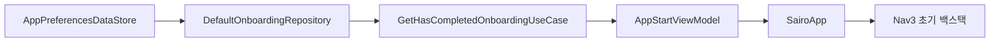

# DataStore 기반 앱 시작 판단

## 개념

앱 시작 판단은 영구 저장된 사용자 상태를 읽고, 그 결과로 최초 화면을 정하는 과정이다. 이 프로젝트에서는 Preferences DataStore의 `has_completed_onboarding` 값을 사용해 온보딩 인트로 또는 홈을 선택한다.

`suspend`는 한 번만 읽거나 저장하는 작업에 사용하고, `Flow`는 값 변경을 계속 관찰해야 할 때 사용한다. 시작 목적지는 앱을 구성하기 전에 한 번만 필요하므로 Repository 밖으로는 단발성 `suspend` 계약을 노출한다.

## 도입 이유

Compose가 렌더링되자마자 기본값으로 화면을 만들면 DataStore 읽기 결과가 도착한 뒤 화면이 바뀌어 깜빡임이나 잘못된 백스택이 생길 수 있다. `Loading`, `Ready`, `Error` 상태를 분리하면 완료 여부를 읽은 뒤에만 최초 Nav3 백스택을 만들 수 있다.

저장소 읽기 실패를 단순히 `false`로 처리하면 온보딩을 완료한 사용자도 인트로로 이동할 수 있다. 따라서 Data 계층은 기술 예외를 [AppError](../../app/src/main/java/com/example/sairo14/domain/model/AppResult.kt)로 변환하고, 앱은 재시도 UI를 표시한다.

## 프로젝트 적용

- DataStore: [`AppPreferencesDataStore.kt`](../../app/src/main/java/com/example/sairo14/core/datastore/AppPreferencesDataStore.kt)
- 익명 식별자 저장소: [`AnonymousIdentityDataStore.kt`](../../app/src/main/java/com/example/sairo14/core/datastore/AnonymousIdentityDataStore.kt)
- Domain 계약: [`OnboardingRepository.kt`](../../app/src/main/java/com/example/sairo14/domain/repository/OnboardingRepository.kt)
- Data 구현: [`DefaultOnboardingRepository.kt`](../../app/src/main/java/com/example/sairo14/data/repository/DefaultOnboardingRepository.kt)
- 시작 상태: [`AppStartViewModel.kt`](../../app/src/main/java/com/example/sairo14/app/AppStartViewModel.kt)
- Compose 조립: [`SairoApp.kt`](../../app/src/main/java/com/example/sairo14/app/SairoApp.kt)

`DefaultOnboardingRepository`는 `IOException`과 `CorruptionException`을 Domain 오류로 변환한다. `CancellationException`은 다시 던져 ViewModel 수명주기 취소가 정상 동작하도록 한다.

온보딩 상태는 파일 손상 시 빈 Preferences로 자동 복구해 인트로를 다시 표시한다. 반면 익명 사용자 ID는 서버 데이터 연결에 영향을 주므로 별도 파일에 저장하며, 손상 시 자동으로 새 UUID를 만들지 않는다. 이 분리는 온보딩 파일의 손상이 익명 ID 손실로 이어지지 않게 한다.

## 흐름과 영향 범위



온보딩 미완료이면 `[HomeRoute, OnboardingIntroRoute]`를 생성해 인트로의 뒤로가기에서 홈 empty view를 표시한다. 완료 상태이면 `[HomeRoute]`만 생성한다.

## 트레이드오프와 주의점

`AppResult`는 오류 처리를 명시적으로 만들지만 단순한 작업에도 타입 변환 코드가 생긴다. 사용자 흐름이 달라지는 저장소 접근처럼 실패를 화면에서 처리해야 하는 경계에만 사용한다.

DataStore와 Retrofit의 suspend API는 main-safe하므로 시작 판단에 `Dispatchers.IO`를 직접 지정하지 않는다. 대량 변환이나 직접적인 파일 I/O처럼 CPU 또는 blocking 작업이 추가될 때만 Dispatcher를 주입한다.

`hasCompletedOnboarding`은 인트로 CTA가 아니라 전체 온보딩의 최종 완료 시점에만 저장해야 한다. 인트로에서 홈으로 돌아간 사용자는 다음 앱 실행에서 다시 인트로를 보게 된다.

## 추가 학습 및 대안

지속적인 상태 변화가 필요한 화면은 Repository가 `Flow<AppResult<Boolean>>`를 제공할 수 있다. 현재 시작 판단에는 한 번의 결과만 필요하므로 사용하지 않는다.

```kotlin
fun observeHasCompletedOnboarding(): Flow<AppResult<Boolean>> =
    preferencesDataStore.hasCompletedOnboarding
        .map<AppResult<Boolean>> { AppResult.Success(it) }
        .catch { exception ->
            emit(AppResult.Failure(AppError.StorageUnavailable))
        }
```

이 방식은 변경 사항을 즉시 반영할 수 있지만, 앱이 이미 만든 초기 백스택을 다시 구성할 위험이 있어 시작 화면 판별에는 적합하지 않다.
