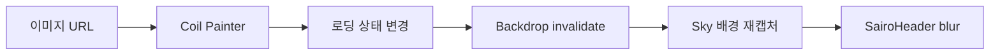

# Backdrop blur 상태 관리

## 개념

Backdrop blur는 특정 UI 뒤의 화면을 먼저 캡처하고, 그 캡처 결과를 흐리게 그리는 방식이다. Sairo는 Cloudy의 `Sky`를 사용해 배경을 캡처하며, Coil 이미지처럼 비동기로 바뀌는 콘텐츠는 로드 상태가 변경될 때 캡처를 갱신해야 한다.

## 도입 이유

각 feature가 `Sky`, Android 버전별 CPU blur 설정, Coil 이미지 상태를 직접 관리하면 화면마다 계층과 갱신 방식이 달라질 수 있다. 특히 Android 30 이하의 CPU blur는 캡처 버전을 기준으로 이미지를 캐시하므로, 이미지 로드 후 갱신하지 않으면 본문에는 이미지가 보이지만 헤더에는 이전의 빈 화면이 남는다.

## 프로젝트 적용

- 관련 파일: [`SairoBackdrop.kt`](../../app/src/main/java/com/example/sairo14/core/designsystem/component/SairoBackdrop.kt)
- 관련 파일: [`SairoHeader.kt`](../../app/src/main/java/com/example/sairo14/core/designsystem/component/SairoHeader.kt)
- 관련 파일: [`OnboardingIntroScreen.kt`](../../app/src/main/java/com/example/sairo14/feature/onboarding/OnboardingIntroScreen.kt)

`SairoBackdropState`가 Cloudy의 상태와 구형 Android blur 정책을 감싸고, `SairoBackdropHost`가 배경과 blur 대상을 같은 캡처 계층에 배치한다. `rememberSairoBackdropImagePainter`는 Coil 상태를 수집하여 이미지가 변경될 때 캡처를 갱신한다.

## 흐름과 영향 범위



화면은 `rememberSairoBackdropState()`로 상태를 생성하고 `SairoBackdropHost` 안에 배경과 헤더를 함께 둔다. ViewModel은 이미지 URL 같은 화면 데이터만 소유하며 그래픽 캡처 상태는 소유하지 않는다.

## 트레이드오프와 주의점

- `SairoBackdropState`는 Compose 그래픽 레이어와 연결되므로 ViewModel이나 Application에 저장하지 않는다.
- Android 30 이하에서 CPU blur를 사용하면 fallback scrim보다 자연스럽지만 렌더링 비용이 증가한다. 작은 고정 헤더처럼 제한된 영역에서 선택적으로 사용한다.
- 같은 화면에서 별개의 배경을 각각 흐려야 한다면 `SairoBackdropState`도 영역별로 분리한다.
- 비동기 이미지 상태를 수집하지 않으면 CPU blur 캐시가 최신 이미지를 반영하지 않을 수 있다.

## 추가 학습 및 대안

> 아래 예시는 현재 프로젝트에 적용하지 않은, `AsyncImage` 콜백을 직접 연결하는 대안이다.

```kotlin
AsyncImage(
    model = imageUrl,
    contentDescription = null,
    onSuccess = {
        backdropState.invalidate()
    },
    onError = {
        backdropState.invalidate()
    },
)
```

이미지 자체를 `AsyncImage`로 그릴 수 있는 화면에서는 이 방식이 간단하다. 현재 온보딩 카드는 공통 컴포넌트에 `Painter`를 전달하므로 Painter 상태를 수집하는 helper를 사용한다.
