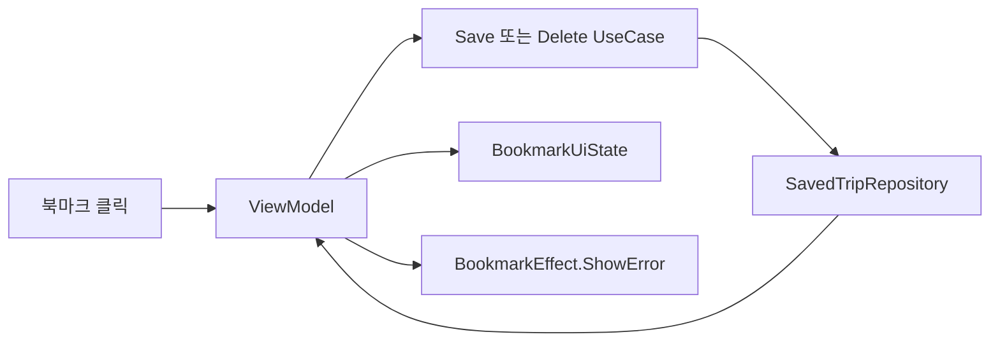

# 북마크 UI 상태와 단발성 오류 효과

## 개념

북마크 UI는 서버가 확인한 저장 표시, 저장 해제에 필요한 식별자, 진행 중 요청을 서로 다른 값으로 관리한다. 오류 안내는 화면을 다시 그릴 때도 유지해야 하는 상태가 아니라 한 번만 소비할 효과로 분리한다.

## 도입 이유

`savedTripId`는 삭제 요청을 위한 값일 뿐 저장 여부의 기준이 아니다. 예를 들어 코스 응답이 `saved = true`만 주면 체크 상태는 보여 줄 수 있지만, 삭제 API에 전달할 ID가 없어 해제 요청은 할 수 없다. 또한 API 실패를 UI state에 남기면 화면 회전이나 재수집 때 과거 오류가 반복 표시될 수 있다.

## 프로젝트 적용

- 관련 파일: [`BookmarkUiState.kt`](../../app/src/main/java/com/example/sairo14/feature/bookmark/BookmarkUiState.kt)

```kotlin
data class BookmarkUiState(
    val isSaved: Boolean = false,
    val savedTripId: String? = null,
    val isRequesting: Boolean = false,
)
```

`BookmarkEffect.ShowError`는 `SharedFlow`로 전달한다. 추천 결과와 여행 상세 ViewModel은 다음 구현 단계에서 각자의 `effect`를 통해 이 값을 내보내고, Composable은 문자열 리소스로 변환해 안내한다.

## 흐름과 영향 범위



성공하면 ViewModel이 `isSaved`와 필요한 경우 `savedTripId`를 갱신한다. 실패하면 기존 상태는 유지하고 `isRequesting`만 해제한 뒤 효과만 전달한다.

## 트레이드오프와 주의점

`SharedFlow`는 구독 중인 화면에만 단발성 오류를 전달하므로, 화면이 없는 동안 발생한 오류를 나중에 다시 보여 주지 않는다. 이는 이미 사라진 화면의 Snackbar가 다시 나타나는 문제를 막지만, 오류 이력을 보존해야 하는 요구에는 적합하지 않다. `isRequesting` 검사는 버튼의 `enabled` 처리뿐 아니라 ViewModel에도 있어야 중복 이벤트를 막을 수 있다.

## 추가 학습 및 대안

> 아래 예시는 현재 프로젝트에 적용하지 않은 상태 기반 오류 표시 방식이다.

```kotlin
data class BookmarkUiState(
    val error: AppError? = null,
)
```

이 방식은 오류를 다시 표시하거나 화면에 고정할 때 유용하다. 하지만 오류를 소비한 뒤 명시적으로 제거해야 하며, 단순한 저장·해제 실패 안내에는 `BookmarkEffect`가 더 적합하다.
