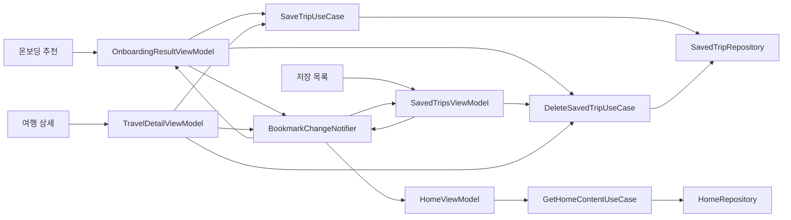

# 북마크 UI 상태와 화면 간 동기화

## 개념

북마크 UI는 서버가 확인한 저장 표시, 저장 해제에 필요한 식별자, 진행 중 요청을 서로 다른 값으로 관리한다. 화면 간에는 저장·삭제에 성공한 결과만 메모리로 전달하고, 오류 안내는 필요한 화면에서만 한 번 소비하는 효과로 분리한다.

## 도입 이유

`savedTripId`는 삭제 요청을 위한 값일 뿐 저장 여부의 기준이 아니다. 예를 들어 코스 응답이 `saved = true`만 주면 체크 상태는 보여 줄 수 있지만, 삭제 API에 전달할 ID가 없어 해제 요청은 할 수 없다. 또한 API 실패를 UI state에 남기면 화면 회전이나 재수집 때 과거 오류가 반복 표시될 수 있다.

## 프로젝트 적용

- 관련 파일: [`BookmarkUiState.kt`](../../app/src/main/java/com/example/sairo14/feature/bookmark/BookmarkUiState.kt)

```kotlin
data class BookmarkUiState(
    val isSaved: Boolean = false,
    val savedTripId: String? = null,
    val isRequesting: Boolean = false,
)
```

`BookmarkEffect.ShowError`는 `SharedFlow`로 전달한다. [`OnboardingResultViewModel.kt`](../../app/src/main/java/com/example/sairo14/feature/onboarding/result/OnboardingResultViewModel.kt)은 추천 카드별 상태를 `Map<courseId, BookmarkUiState>`로 보관하고, [`OnboardingResultScreen.kt`](../../app/src/main/java/com/example/sairo14/feature/onboarding/result/OnboardingResultScreen.kt)은 이 효과를 Snackbar 문구로 변환해 안내한다.

저장 상태가 성공적으로 바뀐 사실은 [`BookmarkChangeNotifier.kt`](../../app/src/main/java/com/example/sairo14/feature/bookmark/BookmarkChangeNotifier.kt)에서 별도로 전달한다. 온보딩 추천, 저장 목록, 여행 상세 화면은 성공한 저장·삭제 결과만 발행하고, [`HomeViewModel.kt`](../../app/src/main/java/com/example/sairo14/feature/home/HomeViewModel.kt)은 이를 최신 홈 콘텐츠 재조회 신호로 사용한다.

`savedTripId`는 저장 성공 응답에서만 얻는다. 초기 코스 응답의 `saved = true`가 ID 없이 내려오면 체크 표시는 가능하지만, 상세 화면의 삭제 요청은 실행하지 않는다.

```kotlin
BookmarkUiState(
    isSaved = true,
    savedTripId = null,
)
```

## 흐름과 영향 범위



성공하면 ViewModel이 `isSaved`와 필요한 경우 `savedTripId`를 갱신한다. 실패하면 기존 상태는 유지하고 `isRequesting`만 해제한 뒤 효과만 전달한다.

저장 성공 뒤 `savedTripId`가 이동하는 경로는 다음으로 제한한다.

```text
POST /saved-trips 응답
→ SavedTripSaveResponseDto
→ SavedTripSaveResult
→ BookmarkUiState.savedTripId
→ TravelDetailRoute.savedTripId
→ 상세 BookmarkUiState.savedTripId
→ DELETE /saved-trips?savedTripId=...
```

온보딩 추천 결과에서 상세로 이동할 때는 `TravelDetailRoute`가 `initialSaved`와 `savedTripId`를 원시 값으로 전달한다. Route는 `BookmarkUiState`에 의존하지 않으며, `initialSaved = false`이면 ID가 함께 있어도 상세 화면은 이를 사용하지 않는다.

[`TravelDetailViewModel.kt`](../../app/src/main/java/com/example/sairo14/feature/traveldetail/TravelDetailViewModel.kt)은 `initialSaved`가 있으면 그 값을, 없으면 `Course.isSaved`를 사용해 상세 북마크를 초기화한다. 저장·삭제 요청 중에는 `isRequesting`만 먼저 바꾸고, 실패하면 이 값만 다시 해제해 기존 체크 상태와 `savedTripId`를 유지한다. 이 화면은 현재 오류 효과를 표시하지 않는다.

저장·삭제 성공 결과는 온보딩 추천, 저장 목록, 여행 상세의 각 ViewModel이 [`BookmarkChangeNotifier.kt`](../../app/src/main/java/com/example/sairo14/feature/bookmark/BookmarkChangeNotifier.kt)를 통해 발행한다. 이벤트는 서버가 성공을 반환한 뒤에만 발행하므로, API 실패가 다른 화면의 상태를 바꾸지 않는다.

```kotlin
BookmarkChange(
    courseId = "course-1",
    isSaved = false,
    savedTripId = null,
)
```

통지자는 `tryEmit()`처럼 실패를 호출자가 무시할 수 있는 비동기 발행 대신 suspend `emit()`을 사용한다. 활성 수집자가 느려서 `SharedFlow`의 버퍼가 가득 차면 발행 coroutine은 빈 공간이 생길 때까지 기다리므로, 서로 다른 코스의 연속 저장·삭제 결과가 유실되지 않는다. 따라서 발행은 반드시 `viewModelScope.launch`처럼 suspend 문맥에서 수행한다.

이 통지자는 앱 메모리에서 살아 있는 화면만 갱신하며, DataStore나 서버 상태 캐시가 아니다. 추천 결과 ViewModel은 현재 목록에 포함된 같은 `courseId`만 반영하고, 화면을 다시 로드할 때는 서버 응답을 다시 사용한다. [`SavedTripsViewModel.kt`](../../app/src/main/java/com/example/sairo14/feature/savedtrip/SavedTripsViewModel.kt)는 저장 해제 알림을 받으면 해당 `courseId` 카드를 즉시 제거한 뒤 첫 페이지를 다시 조회한다. 이 재조회가 실패하면 방금 제거한 로컬 목록을 유지한다.

[`HomeViewModel.kt`](../../app/src/main/java/com/example/sairo14/feature/home/HomeViewModel.kt)는 이벤트의 `isSaved`나 `savedTripId`로 카드를 직접 수정하지 않는다. 저장 이벤트에는 새 카드의 지역명·대표 이미지가 없고, 삭제 이벤트에는 네 번째 자리를 채울 다음 카드가 없기 때문이다. 대신 [`GetHomeContentUseCase.kt`](../../app/src/main/java/com/example/sairo14/domain/usecase/GetHomeContentUseCase.kt)를 다시 호출해 서버의 최신 저장 여행지 요약을 받아 교체한다.

홈의 최초 조회와 사용자가 누르는 재시도는 로딩 상태를 표시한다. 반면 북마크 변경으로 시작한 재조회는 기존 `HomeUiState.Content`를 유지한다. 이 백그라운드 갱신이 실패하면 기존 카드가 계속 보이고, 최초 조회처럼 콘텐츠가 없을 때만 오류 상태로 전환한다. 연속 이벤트에서는 이전 조회 Job을 취소하고 요청 번호를 비교해, 취소를 무시하고 늦게 끝난 응답도 최신 홈 콘텐츠를 덮어쓰지 못하게 한다.

## 트레이드오프와 주의점

`BookmarkChangeNotifier`의 `SharedFlow`는 구독 중인 화면에만 변경을 전달한다. 활성 수집자가 있는 동안에는 `emit()`이 연속 이벤트의 순서를 보존하지만, 구독자가 전혀 없을 때는 `replay = 0` 계약에 따라 과거 이벤트를 재생하지 않는다. 홈 ViewModel이 없는 동안 이벤트가 사라져도, 홈이 새로 생성될 때 서버를 최초 조회하므로 최종 상태는 복구된다. 반대로 이벤트를 영속하거나 다른 기기 변경까지 즉시 반영해야 한다면 이 방식만으로는 부족하다.

홈은 이벤트가 아니라 서버 재조회 결과를 사용하므로 카드 메타데이터와 최신 정렬 순서는 정확하지만, 변경 직후 네트워크 요청이 한 번 더 발생한다. 이벤트만으로 카드를 직접 더하거나 지우면 요청 수는 줄일 수 있지만, 삭제 후 다음 카드를 채우거나 저장 직후의 이미지·지역명을 보장하기 어렵다. `isRequesting` 검사는 버튼의 `enabled` 처리뿐 아니라 ViewModel에도 있어야 중복 이벤트를 막을 수 있다.

## 추가 학습 및 대안

> 아래 예시는 현재 프로젝트에 적용하지 않은 상태 기반 오류 표시 방식이다.

```kotlin
data class BookmarkUiState(
    val error: AppError? = null,
)
```

이 방식은 오류를 다시 표시하거나 화면에 고정할 때 유용하다. 하지만 오류를 소비한 뒤 명시적으로 제거해야 하며, 단순한 저장·해제 실패 안내에는 `BookmarkEffect`가 더 적합하다.
