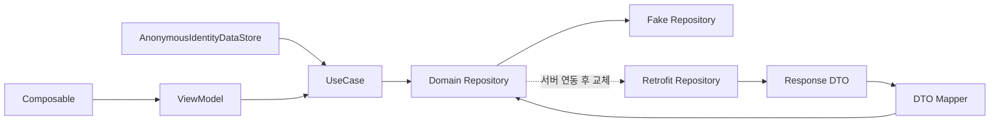
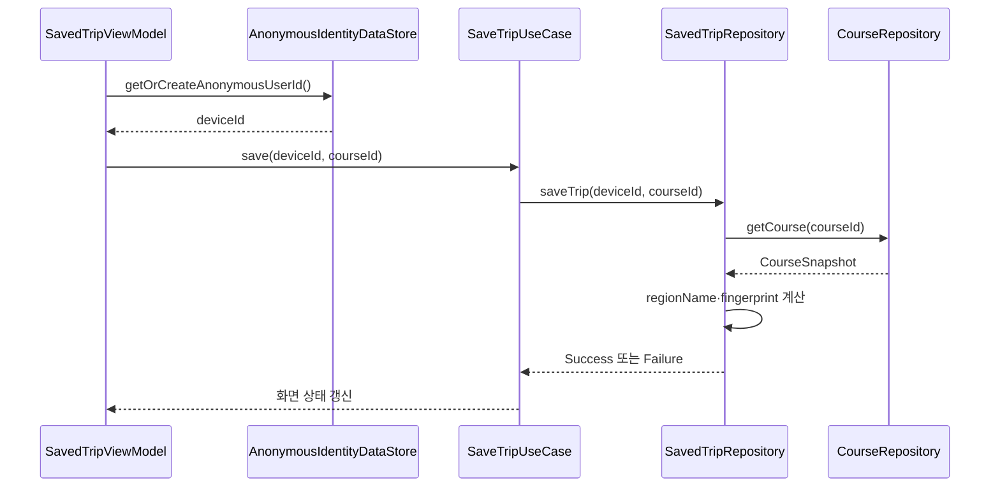

# 코스 API 계약과 Fake Repository 설계

## 개념

코스 API 계약은 서버의 테이블 구조를 앱이 직접 알지 않도록, 화면에 필요한 요청·응답 데이터(DTO)와 도메인 모델의 경계를 정하는 약속이다. Fake Repository는 이 도메인 계약을 로컬 더미 데이터로 구현해 서버 API가 준비되기 전에도 화면·상태·사용자 흐름을 개발하고 검증할 수 있게 한다.

DTO는 Retrofit 응답의 JSON 형태를 표현하고, Domain 모델은 화면과 UseCase가 의존하는 의미 있는 데이터만 표현한다. 따라서 PostgreSQL의 `JSONB`, `vector(512)`, 인덱스 같은 저장소 구현 세부 사항은 Domain과 UI에 노출하지 않는다.

이 문서는 현재 DB migration V1~V3와 서버 API의 용도를 바탕으로 한 **앱 설계용 예상 계약**이다. 실제 서버의 경로, JSON 키, nullable 정책이 확정되면 DTO와 mapper만 서버 명세에 맞춰 조정한다.

## 도입 이유

서버 구현 전 UI가 DB 컬럼 또는 임시 JSON에 직접 의존하면 API가 확정될 때 화면까지 함께 바뀌기 쉽다. 특히 `courses.course_data`와 `shared_courses.course_data`는 같은 코스 스냅샷을 담지만, 저장 목록은 전체 코스가 아닌 카드에 필요한 요약 정보만 필요하다.

Repository 인터페이스를 Domain에 두고 Fake 구현과 Retrofit 구현을 교체하면 ViewModel은 데이터 출처를 알 필요가 없다. 이 프로젝트의 온보딩 흐름도 같은 방식으로 DataStore 구현을 [OnboardingRepository](../../app/src/main/java/com/example/sairo14/domain/repository/OnboardingRepository.kt) 계약 뒤에 둔다.

## 프로젝트 적용

현재 관련 구현과 이 문서가 제안하는 책임은 다음과 같다.

| 계층 | 현재 또는 추가 위치 | 책임 |
|---|---|---|
| Core | [`core/datastore/AnonymousIdentityDataStore.kt`](../../app/src/main/java/com/example/sairo14/core/datastore/AnonymousIdentityDataStore.kt) | `X-Device-Id`에 쓸 익명 사용자 ID를 보존한다. |
| Domain | `domain/model`, `domain/repository`, `domain/usecase` | `Spot`, `Course`, `SavedTrip` 모델과 Repository 계약을 정의한다. |
| Data | `data/remote`, `data/mapper`, `data/repository` | DTO, Retrofit API, mapper, Fake/실서버 Repository 구현을 둔다. |
| Feature | `feature/<화면>` | `AppResult`를 UI 상태의 loading·content·error 상태로 변환한다. |

Fake Repository는 Data 계층에 두되, UI 전용 DTO를 직접 반환하지 않는다. 아래 흐름처럼 Domain 계약을 구현한다.

여행 상세 화면은 [`CourseRepository.kt`](../../app/src/main/java/com/example/sairo14/domain/repository/CourseRepository.kt) 계약과 [`FakeCourseRepository.kt`](../../app/src/main/java/com/example/sairo14/data/repository/FakeCourseRepository.kt) 구현을 연결한다. [`Course.kt`](../../app/src/main/java/com/example/sairo14/domain/model/Course.kt)의 `CourseDay`와 `CoursePlace`는 일차별 목록 순서와 지도 좌표를 함께 보존한다. 실제 API가 준비되면 동일한 `CourseRepository` 구현만 Retrofit 구현으로 교체하면 된다.

현재 [`TravelDetailViewModel.kt`](../../app/src/main/java/com/example/sairo14/feature/traveldetail/TravelDetailViewModel.kt)는 `Course`를 `TravelDetailCourseUiModel`로 변환한다. 선택한 일차 번호를 하나의 `TravelDetailUiState.Content`에 두므로, [`TravelDetailScreen.kt`](../../app/src/main/java/com/example/sairo14/feature/traveldetail/TravelDetailScreen.kt)의 지도 핀과 장소 타임라인은 항상 같은 장소 순서를 사용한다. Domain의 `CoursePlace`를 Composable에 직접 전달하지 않아 이후 DTO·도메인 모델 변경의 영향이 Feature의 변환 지점에 머문다.

```kotlin
when (uiState) {
    HomeUiState.Loading -> HomeLoadingScreen()
    is HomeUiState.Content -> HomeContentScreen(uiState)
    HomeUiState.Error -> HomeErrorScreen(onRetryClick)
}
```



### 예상 응답 DTO

`photos.embedding`은 서버의 벡터 검색용 컬럼이므로 앱 응답에 포함하지 않는다. 이미지 검색 화면은 매칭된 사진의 메타데이터와 추천 장소 목록을 받는 형태가 적합하다.

```kotlin
@Serializable
data class ImageSearchResponseDto(
    val image: MatchedImageDto,
    val recommendations: List<SpotDto>,
)

@Serializable
data class MatchedImageDto(
    val id: String,
    val title: String,
    val imageUrl: String,
    val location: String? = null,
    val keywords: String? = null,
    val similarity: Float? = null,
)

@Serializable
data class SpotDto(
    val spotId: String,
    val name: String? = null,
    val regionName: String? = null,
    val latitude: Double? = null,
    val longitude: Double? = null,
    val imageUrl: String? = null,
    val operatingHours: String? = null,
    val closedDays: String? = null,
    val parking: String? = null,
    val contact: String? = null,
    val category: SpotCategoryDto? = null,
)

@Serializable
data class SpotCategoryDto(
    val level1: String? = null,
    val level2: String? = null,
    val level3: String? = null,
)
```

코스 생성·상세·공유 화면에는 지역명과 일자별 장소를 가진 전체 스냅샷이 필요하다.

```kotlin
@Serializable
data class CourseSnapshotDto(
    val regionName: String,
    val days: List<CourseDayDto>,
)

@Serializable
data class CourseDayDto(
    val day: Int,
    val spots: List<SpotDto>,
)

@Serializable
data class CourseDto(
    val courseId: String,
    val courseData: CourseSnapshotDto,
    val createdAt: String,
)

@Serializable
data class SharedCourseDto(
    val shareId: String,
    val courseId: String? = null,
    val courseData: CourseSnapshotDto,
    val createdAt: String,
)
```

`SharedCourseDto.courseId`는 V2 이전에 저장된 공유 행에는 없을 수 있으므로 nullable이다. 반면 `courseData`는 원본 코스가 삭제되어도 공유 화면을 구성할 수 있도록 유지해야 한다.

저장 목록은 전체 코스 JSON 대신 카드에 필요한 요약 데이터를 받는다. `thumbnailImageUrl`, `dayCount`, `spotCount`는 `saved_trips` 컬럼은 아니지만, 서버가 `courses.course_data`에서 계산해 제공할 수 있는 조회 전용 값이다.

```kotlin
@Serializable
data class SavedTripDto(
    val savedTripId: String,
    val courseId: String,
    val regionName: String,
    val createdAt: String,
    val thumbnailImageUrl: String? = null,
    val dayCount: Int? = null,
    val spotCount: Int? = null,
)
```

## 흐름과 영향 범위

저장 요청은 익명 ID와 코스 ID만 앱에서 보내고, 서버 또는 Fake Repository가 지역·장소 구성·지문을 코스 스냅샷에서 결정한다. 앱이 `regionKey`나 `courseFingerprint`를 요청 본문에 보내면 조작되거나 서로 불일치할 여지가 생긴다.



### 권장 Domain 계약

아래는 API 확정 전에도 화면을 개발할 수 있는 최소 계약이다. 실제 모델명과 반환 타입은 기능 구현 시 기존 패키지 관례에 맞춘다.

```kotlin
interface CourseRepository {
    suspend fun createCourse(snapshot: CourseSnapshot): AppResult<Course>
    suspend fun getCourse(courseId: String): AppResult<Course>
}

interface SharedCourseRepository {
    suspend fun shareCourse(courseId: String): AppResult<SharedCourse>
    suspend fun getSharedCourse(shareId: String): AppResult<SharedCourse>
}

interface SavedTripRepository {
    suspend fun saveTrip(deviceId: String, courseId: String): AppResult<SaveTripResult>
    suspend fun getSavedTrips(
        deviceId: String,
        cursor: SavedTripCursor? = null,
        size: Int = 20,
    ): AppResult<SavedTripPage>
    suspend fun deleteSavedTrip(deviceId: String, savedTripId: String): AppResult<Unit>
}
```

`SaveTripResult`는 신규 저장과 기존 저장 항목 반환을 구분할 수 있어야 한다. 같은 사용자가 같은 장소 구성의 코스를 다시 저장했을 때 DB의 `(device_id, course_fingerprint)` 유니크 제약을 사용자 친화적인 결과로 바꾸기 위해서다.

```kotlin
sealed interface SaveTripResult {
    data class Saved(val trip: SavedTrip) : SaveTripResult
    data class AlreadySaved(val trip: SavedTrip) : SaveTripResult
}
```

Fake 구현도 `courseFingerprint`를 장소 ID 전체를 정렬한 뒤 SHA-256으로 계산한다. 일자·순서만 달라도 장소 구성이 같으면 중복 저장으로 취급하는 서버 제약과 일치해야 한다. 목록은 `createdAt` 내림차순, 그 다음 `savedTripId` 내림차순으로 정렬해 커서 페이지 순서를 안정화한다.

## 오류 처리와 상태 흐름

Fake Repository는 성공 데이터만 반환하는 단순 목업이 아니라, 실제 Repository와 같은 실패 계약을 지켜야 한다. 기존 [DefaultOnboardingRepository](../../app/src/main/java/com/example/sairo14/data/repository/DefaultOnboardingRepository.kt)는 DataStore 예외를 [AppResult](../../app/src/main/java/com/example/sairo14/domain/model/AppResult.kt)로 변환하고 `CancellationException`은 다시 던진다. 코스 Fake/실서버 구현도 다음 원칙을 따른다.

1. `CancellationException`은 잡아 결과로 바꾸지 않고 다시 던진다. 화면이 사라져 취소된 작업이 오류 화면을 만들지 않게 한다.
2. 예상 가능한 실패는 `AppResult.Failure`로 변환한다. 예: 존재하지 않는 코스·공유 ID, 중복 저장, 잘못된 커서, 일시적 네트워크 오류.
3. 상세한 HTTP·DataStore 예외를 ViewModel까지 올리지 않는다. Data 계층이 Domain 오류로 변환하고 Timber에 원인을 기록한다.
4. ViewModel은 `Loading`, 콘텐츠, `Error`를 불변 UI state로 분리하고 재시도 이벤트를 제공한다.

상세 화면에서 코스 ID가 연속으로 바뀌거나 재시도가 겹칠 수 있다. [`TravelDetailViewModel.kt`](../../app/src/main/java/com/example/sairo14/feature/traveldetail/TravelDetailViewModel.kt)는 이전 조회 Job을 취소하고 요청 ID를 비교해, 취소를 지키지 않는 외부 구현의 늦은 결과도 최신 UI 상태를 덮지 못하게 한다. 이 요청 ID는 화면 동시성 제어용이며 Domain 모델이나 Repository 계약에는 포함하지 않는다.

현재 `AppError`에는 존재하지 않는 코스 조회를 표현하는 `ResourceNotFound`가 추가되어 있다. 실제 서버 연동 때는 네트워크와 잘못된 요청을 구분할 수 있도록 아래처럼 확장하는 방안을 검토한다.

```kotlin
sealed interface AppError {
    data object NetworkUnavailable : AppError
    data object ResourceNotFound : AppError
    data object InvalidRequest : AppError
    data object StorageUnavailable : AppError
    data object StorageCorrupted : AppError
    data object Unknown : AppError
}
```

중복 저장은 실패 화면보다 `SaveTripResult.AlreadySaved`로 표현하는 편이 좋다. UI는 “이미 저장한 여행입니다”를 표시하고 기존 저장 항목으로 이동할 기회를 줄 수 있다. 반면 서버가 중복을 HTTP 409으로 응답한다면 Retrofit 구현이 이를 `AlreadySaved` 또는 별도의 `AppError.Conflict`로 매핑하는 정책을 한 곳에 둔다.

`AnonymousIdentityDataStore`는 파일 손상 시 새 ID를 조용히 만들지 않는다. 익명 ID가 바뀌면 기존 저장 여행 목록에 접근할 수 없기 때문이다. 저장·목록 요청 전에 `getOrCreateAnonymousUserId()`를 호출하되, DataStore 읽기 실패는 저장소 오류로 UI에 노출하고 재시도하게 한다.

## 트레이드오프와 주의점

`course_data` 스냅샷에 장소의 이름·이미지·좌표까지 넣으면 공유 코스는 장소 원본이 바뀌어도 생성 당시 모습을 유지한다. 대신 스키마의 `spots` 정보와 중복되어 용량과 갱신 정책을 고려해야 한다. 현재 `shared_courses`가 스냅샷을 보관하는 의도에는 적합하다.

반대로 `saved_trips`는 코스 JSON을 복사하지 않고 `course_id`만 참조한다. 저장 목록 API에서 카드 요약을 만들려면 서버가 코스 JSON을 해석해야 하지만, 같은 JSON을 두 벌 저장해 서로 달라지는 문제를 피할 수 있다.

Fake Repository의 지연 시간·오류는 테스트나 개발 빌드에서만 주입 가능하게 둔다. 정상 앱 사용마다 무작위 실패를 만들면 UI 검증 결과가 불안정해진다. 더미 데이터에는 다음 경우를 포함한다.

- 서울·부산·제주 등 여러 지역과 지역별 장소 5개 이상
- Day 1·Day 2가 있는 코스와 대표 이미지가 없는 장소
- 공유된 코스와 공유되지 않은 코스
- 같은 사용자의 서로 다른 저장, 다른 사용자의 같은 코스 저장
- 같은 `createdAt`을 가진 저장 항목 두 개 이상
- 장소 순서만 다른 중복 저장 시도

## 추가 학습 및 대안

저장 목록을 화면이 열려 있는 동안 자동 갱신해야 한다면, 단발 `suspend` 조회 대신 `Flow<AppResult<SavedTripPage>>`를 제공할 수 있다. 이는 [AppPreferencesDataStore](../../app/src/main/java/com/example/sairo14/core/datastore/AppPreferencesDataStore.kt)가 Preferences 변경을 `Flow`로 관찰하는 방식과 같다.

> 아래 예시는 현재 프로젝트에 적용되지 않은 대안이다.

```kotlin
fun observeSavedTrips(deviceId: String): Flow<AppResult<List<SavedTrip>>> =
    localCache.observeSavedTrips(deviceId)
        .map<AppResult<List<SavedTrip>>> { AppResult.Success(it) }
        .catch { exception ->
            if (exception is CancellationException) throw exception
            emit(AppResult.Failure(AppError.StorageUnavailable))
        }
```

이 방식은 다른 화면에서 저장·삭제한 결과를 즉시 반영하는 데 유리하다. 하지만 서버 목록의 커서 페이지와 로컬 캐시 동기화 정책이 추가로 필요하다. 서버 API가 아직 확정되지 않은 현재 단계에서는 단발 `suspend` 목록 조회와 명시적 새로고침이 더 단순하다.
