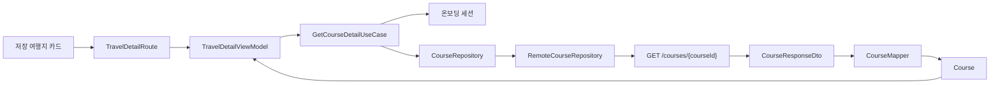

# 코스 조회 API 계약과 Repository 경계

## 개념

코스 조회 API 계약은 서버 응답을 여행 상세 화면이 사용할 도메인 모델로 바꾸는 약속이다. Retrofit DTO는 HTTP 응답의 JSON 구조를 표현하고, `Course`는 지역명, 일차별 장소, 저장 상태처럼 화면과 UseCase가 필요한 의미만 표현한다.

서버의 코스 스냅샷은 `day1`, `day2` 배열로 내려온다. 앱은 이를 각각 `CourseDay(dayNumber = 1)`, `CourseDay(dayNumber = 2)`로 바꿔, 지도 마커와 타임라인이 같은 순서의 장소 목록을 사용하게 한다.

## 도입 이유

상세 화면이 Retrofit 응답을 직접 사용하면 서버의 JSON 키와 nullable 정책이 Feature 계층까지 퍼진다. API가 변경되거나 온보딩 분석 응답이 같은 장소 정보를 반환할 때 화면까지 함께 수정해야 하는 문제가 생긴다.

현재 취향 분석 응답과 코스 상세 응답은 모두 `SpotSummaryDto` 형태의 장소 정보를 반환한다. 공통 mapper를 두면 이미지 URL의 공백 처리, 좌표 완전성 판단, 운영 정보 태그 순서가 두 응답에서 달라지는 일을 막을 수 있다.

## 프로젝트 적용

- API 계약: [`SairoApi.kt`](../../app/src/main/java/com/example/sairo14/data/remote/SairoApi.kt)
- 상세 응답 DTO: [`CourseDto.kt`](../../app/src/main/java/com/example/sairo14/data/remote/dto/CourseDto.kt)
- 공통 코스 mapper: [`CourseMapper.kt`](../../app/src/main/java/com/example/sairo14/data/mapper/CourseMapper.kt)
- 도메인 모델: [`Course.kt`](../../app/src/main/java/com/example/sairo14/domain/model/Course.kt)
- 원격 구현: [`RemoteCourseRepository.kt`](../../app/src/main/java/com/example/sairo14/data/repository/remote/RemoteCourseRepository.kt)
- 상세 상태 변환: [`TravelDetailViewModel.kt`](../../app/src/main/java/com/example/sairo14/feature/traveldetail/TravelDetailViewModel.kt)

실제 조회 계약은 다음과 같다.

```kotlin
@GET("courses/{courseId}")
suspend fun getCourse(
    @Path("courseId") courseId: String,
    @Header("X-Device-Id") deviceId: String,
): CourseResponseDto
```

`X-Device-Id`는 앱이 만든 UUID v4 익명 식별자다. 코스 ID만으로는 다른 기기가 만든 코스를 조회할 수 없으며, 서버는 존재하지 않거나 다른 기기의 코스에 `404 COURSE_NOT_FOUND`를 반환한다.

```kotlin
@Serializable
data class CourseResponseDto(
    val courseId: String,
    val regionName: String,
    val regionArea: String? = null,
    val imageUrl: String? = null,
    val reason: String? = null,
    val saved: Boolean,
    val day1: List<SpotSummaryDto>,
    val day2: List<SpotSummaryDto>,
)
```

`regionArea`, `imageUrl`, `reason`은 서버 응답에는 포함되지만 현재 상세 화면의 `Course`에는 필요하지 않다. 이 값들은 DTO 경계에 유지하고 Domain을 불필요하게 확장하지 않는다.

```kotlin
fun CourseResponseDto.toDomain(): Course = Course(
    courseId = courseId,
    regionName = regionName,
    days = listOf(
        CourseDay(1, day1.map(SpotSummaryDto::toCoursePlace)),
        CourseDay(2, day2.map(SpotSummaryDto::toCoursePlace)),
    ),
    isSaved = saved,
)
```

`toCoursePlace()`는 취향 분석 응답의 `CourseCardDto`에도 사용된다. 좌표는 `lat`와 `lng`가 모두 있을 때만 `MapCoordinate`로 만들며, 둘 중 하나가 없으면 장소는 유지하고 지도 좌표만 `null`로 둔다. 운영시간, 휴무일, 주차, 연락처는 공백을 제거한 뒤 지정한 순서로 태그 목록에 넣는다.

## 흐름과 영향 범위



1. 저장 여행지 카드는 `courseId`, `initialSaved = true`, `savedTripId`를 `TravelDetailRoute`로 전달한다.
2. `GetCourseDetailUseCase`는 온보딩에서 막 생성한 코스라면 인메모리 세션 스냅샷을 먼저 사용한다.
3. 세션에 없으면 `RemoteCourseRepository`가 `DeviceIdProvider`에서 UUID를 읽고 API를 호출한다.
4. `CourseMapper`가 Day 1·Day 2와 장소 정보를 Domain 모델로 변환한다.
5. ViewModel은 `Course`를 UI 모델로 바꿔 지도와 타임라인에 같은 선택 일차를 제공한다.

`saved = true`는 저장 여부 표시용 값이다. 저장 해제에는 `savedTripId`가 필요하므로, 저장 목록에서 진입한 Route가 전달한 ID를 사용한다. 코스 조회 응답만으로는 저장 항목 ID를 얻지 못한다.

## 트레이드오프와 주의점

- 코스 응답은 생성 시점 스냅샷이다. 누락된 운영 정보가 있어도 앱이 `GET /places/{spotId}`를 자동 호출하지 않는다. 자동 보완은 요청 수와 데이터 최신성 정책을 별도로 결정한 뒤 도입한다.
- `CourseResponseDto`와 `CourseCardDto`는 비슷한 구조지만 서로 다른 API 응답이다. 응답 모델은 분리하고 장소 변환 규칙만 공유해 한 API의 계약 변화가 다른 API의 DTO를 바꾸지 않게 한다.
- `FakeCourseRepository`는 앱의 Hilt 바인딩에서는 제거됐지만, 단위 테스트와 미리보기에서 고정 데이터를 제공하는 용도로 남겨 둔다.
- Day 1이 비어도 정상 응답일 수 있다. 상세 화면은 빈 상태를 표시하고 사용자가 Day 2를 선택할 수 있어야 한다.

## 추가 학습 및 대안

> 아래 예시는 현재 프로젝트에 적용하지 않은, 장소 정보를 자동 보완하는 대안이다.

```kotlin
suspend fun loadLatestPlaceOrSnapshot(place: CoursePlace): CoursePlace =
    when (val result = placeDetailRepository.getPlace(place.placeId)) {
        is AppResult.Success -> result.value
        is AppResult.Failure -> place
    }
```

이 방식은 최신 장소 정보를 보완할 수 있지만, 장소 수만큼 추가 요청이 생기고 코스 스냅샷과 최신 정보가 섞인다. 현재는 빠르게 상세 화면을 구성할 수 있는 서버 스냅샷을 그대로 사용한다.
