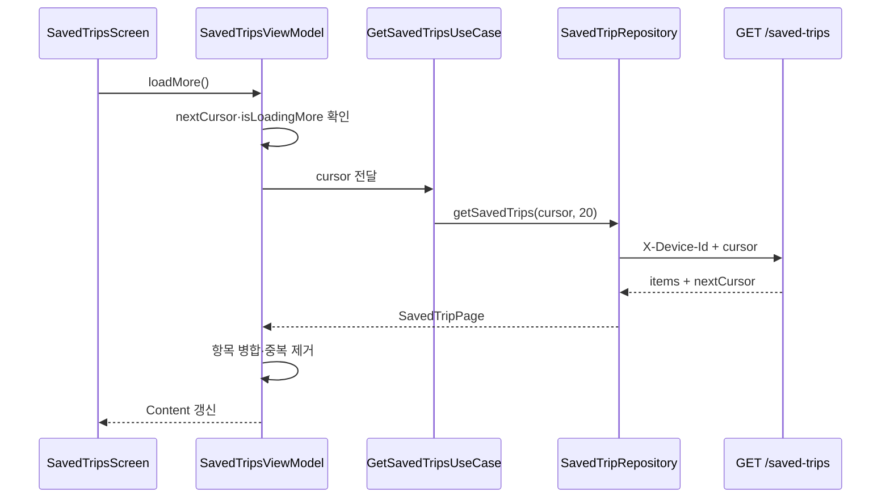

# 커서 기반 페이지네이션 UI 상태

## 개념

커서 기반 페이지네이션은 목록의 다음 위치를 숫자 페이지가 아닌 서버가 발급한 문자열 cursor로 식별하는 조회 방식이다. 앱은 cursor의 의미를 해석하지 않고, 응답의 `nextCursor`를 다음 요청에 그대로 전달한다. `nextCursor`가 `null`이면 더 불러올 항목이 없다.

이 방식에서 최초 로딩, 추가 로딩, 최초 오류, 추가 오류는 서로 다른 상태다. 특히 이미 보이는 목록 뒤의 추가 요청이 실패했다고 전체 화면을 오류로 바꾸면 사용자가 읽던 콘텐츠까지 사라진다.

## 도입 이유

저장된 여행지 API는 최신 저장순 목록과 함께 다음 cursor를 반환한다. 여행지를 새로 저장하거나 해제하는 동안 목록이 바뀔 수 있으므로, offset 기반 번호를 계산하는 대신 서버가 기준으로 삼은 cursor를 사용한다.

저장 목록 화면은 한 페이지보다 많은 항목을 자연스럽게 보여 주어야 한다. 동시에 Compose가 목록 끝을 여러 번 감지할 수 있으므로, 화면 이벤트만 믿지 않고 ViewModel이 중복 요청을 차단해야 한다.

## 프로젝트 적용

- 관련 파일: [`SavedTripPage.kt`](../../app/src/main/java/com/example/sairo14/domain/model/SavedTripPage.kt)
- 관련 파일: [`SavedTripRepository.kt`](../../app/src/main/java/com/example/sairo14/domain/repository/SavedTripRepository.kt)
- 관련 파일: [`SavedTripsUiState.kt`](../../app/src/main/java/com/example/sairo14/feature/savedtrip/SavedTripsUiState.kt)
- 관련 파일: [`SavedTripsViewModel.kt`](../../app/src/main/java/com/example/sairo14/feature/savedtrip/SavedTripsViewModel.kt)
- 관련 파일: [`SavedTripsScreen.kt`](../../app/src/main/java/com/example/sairo14/feature/savedtrip/SavedTripsScreen.kt)

Domain은 항목과 서버 cursor를 함께 보관한다.

```kotlin
data class SavedTripPage(
    val items: List<SavedTrip>,
    val nextCursor: String?,
)
```

화면의 콘텐츠 상태는 이미 불러온 카드와 다음 조회 상태를 함께 가진다.

```kotlin
data class Content(
    val trips: List<SavedTripUiModel>,
    val nextCursor: String?,
    val isLoadingMore: Boolean = false,
    val loadMoreError: AppError? = null,
)
```

`SavedTripsViewModel.loadMore()`는 `nextCursor`가 있고 이미 요청 중이 아닐 때만 호출한다. 성공한 페이지는 기존 목록 뒤에 붙이고 `savedTripId` 기준으로 중복을 제거한다. 서버의 최신 저장순을 보존해야 하므로 `createdAt`으로 다시 정렬하지 않는다.

```kotlin
trips = (content.trips + page.items.map(SavedTrip::toUiModel))
    .distinctBy(SavedTripUiModel::savedTripId)
```

`SavedTripsScreen`은 `LazyListState`의 마지막 가시 항목이 마지막 카드 근처인지 감지해 `onLoadMore`를 요청한다. 하단 로딩과 재시도 버튼은 `isLoadingMore`, `loadMoreError`로만 표시한다.

## 흐름과 영향 범위



1. 최초 진입은 `cursor = null`로 첫 페이지를 조회한다.
2. 빈 첫 페이지는 `Empty`, 첫 요청 실패는 전체 `Error`가 된다.
3. 콘텐츠의 끝에 가까워지면 UI가 추가 조회를 요청한다.
4. ViewModel은 진행 중 요청과 없는 cursor를 차단하고, 성공 시에만 새 cursor로 교체한다.
5. 추가 요청 실패는 기존 카드와 cursor를 유지한 채 하단 재시도 UI만 표시한다.
6. 서버가 `INVALID_CURSOR`를 반환하면 해당 cursor를 재사용하지 않고 첫 페이지부터 다시 조회한다.

저장 해제 성공 후에는 현재 카드부터 즉시 제거하고 첫 페이지를 조용히 재조회한다. 재조회 실패 때는 즉시 제거한 상태를 유지한다. 이 과정에서 이전 추가 요청의 응답이 최신 목록을 덮지 않도록 ViewModel은 조회 세대 번호를 비교한다.

## 트레이드오프와 주의점

- cursor는 내부 형식이 바뀔 수 있는 서버 값이므로 앱에서 숫자로 변환하거나 조합하면 안 된다. Fake Repository만 테스트 목적으로 자체 cursor를 만들 수 있다.
- 항목을 `distinctBy(savedTripId)`로 병합하면 재시도 또는 서버 목록 변경에 따른 중복 카드를 막을 수 있다. 반면 같은 ID의 요약 정보가 갱신돼도 기존 항목을 유지하므로, 최신 내용이 중요하면 첫 페이지 새로고침을 사용한다.
- 하단 도달 감지는 화면 크기와 카드 높이에 따라 여러 번 발생할 수 있다. `isLoadingMore` 검사는 Composable이 아니라 ViewModel에도 있어야 한다.
- 추가 페이지가 요청에 사용한 cursor와 같은 `nextCursor`를 반환하면 앱은 해당 cursor를 폐기하고 하단 오류 상태로 멈춘다. 재시도는 첫 페이지부터 다시 동기화한다. 서버도 반복 cursor를 반환하지 않아야 하지만, 클라이언트가 자동 요청 루프를 만들지 않도록 함께 방어한다.

## 추가 학습 및 대안

> 아래 예시는 현재 프로젝트에 적용하지 않은 페이지 번호 기반 대안이다.

```kotlin
data class PageRequest(
    val page: Int,
    val size: Int = 20,
)

suspend fun getSavedTrips(request: PageRequest): AppResult<SavedTripPage>
```

페이지 번호는 주소 공유나 특정 페이지 이동에는 이해하기 쉽다. 그러나 새 저장 항목이 목록 앞에 추가되면 다음 페이지의 경계가 밀려 중복·누락을 처리해야 한다. 저장순이 자주 바뀔 수 있는 현재 목록에는 서버 cursor를 그대로 사용하는 방식이 더 적합하다.
