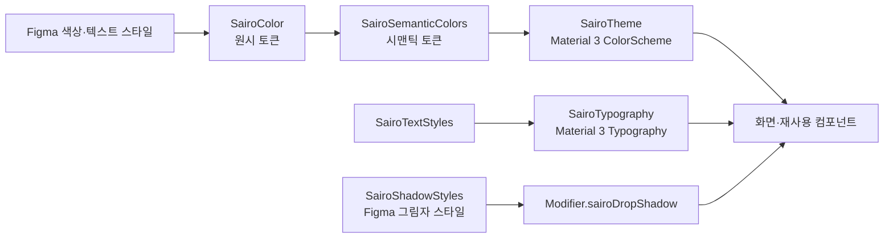

# 디자인 토큰과 시맨틱 컬러

## 개념

디자인 토큰은 색상, 타이포그래피, 그림자처럼 반복되는 디자인 값을 이름으로 관리하는 방식이다. 이 프로젝트는 이를 두 단계로 나눈다.

| 단계 | 역할 | 예시 |
|---|---|---|
| 원시 토큰(primitive token) | 디자인 팔레트의 실제 값 | `Green500`, `Gray900` |
| 시맨틱 토큰(semantic token) | UI에서 수행하는 역할 | `actionDefault`, `textPrimary` |

화면과 컴포넌트는 원시 색상보다 시맨틱 토큰을 사용한다. 같은 초록색이라도 "브랜드의 Green500"이 아니라 "기본 액션 색상"이라는 의도를 참조하게 되므로, 테마 변경의 영향 범위를 한 곳으로 제한할 수 있다.

## 도입 이유

Figma의 색상·텍스트 스타일을 Compose 코드에 직접 복사하면, 같은 색을 여러 화면에서 다시 정의하게 되고 다크 테마나 브랜드 변경 시 수정 지점이 늘어난다. 현재 구조는 Figma의 구체적 팔레트를 `SairoColor`에 모으고, 앱 UI가 필요한 의미를 `SairoSemanticColors`와 `SairoTypography`로 표현한다.

## 프로젝트 적용

- 원시 색상: [`SairoColor.kt`](../../app/src/main/java/com/example/sairo14/core/designsystem/token/SairoColor.kt)
  - Figma 팔레트의 `Green`, `Lime`, `Gray`, `Warning` 값을 정의한다.
  - `internal` 접근 제한으로 디자인 시스템 외부의 직접 사용을 막는다.
- 시맨틱 색상: [`SairoSemanticColors.kt`](../../app/src/main/java/com/example/sairo14/core/designsystem/theme/SairoSemanticColors.kt)
  - `textPrimary`, `actionDefault`, `warningBackground`처럼 사용 목적을 이름으로 제공한다.
- Material 3 연결: [`SairoTheme.kt`](../../app/src/main/java/com/example/sairo14/core/designsystem/theme/SairoTheme.kt)
  - 시맨틱 색상을 `lightColorScheme`의 `primary`, `background`, `surface` 등에 매핑한다.
- 타이포그래피: [`SairoTypography.kt`](../../app/src/main/java/com/example/sairo14/core/designsystem/theme/SairoTypography.kt)
  - Figma 텍스트 스타일을 `SairoTextStyles`로 정의하고 Material 3의 typography slot에 연결한다.
  - `includeFontPadding = false`로 Android 기본 폰트 여백을 제거해 Figma의 줄 높이와의 차이를 줄인다.
- 앱 진입점: [`MainActivity.kt`](../../app/src/main/java/com/example/sairo14/MainActivity.kt)
  - `SairoTheme`가 `SairoApp`을 감싸 앱 전체 Composable 트리에 토큰을 제공한다.

### 그림자 토큰

- Figma 그림자 스타일: [`SairoShadow.kt`](../../app/src/main/java/com/example/sairo14/core/designsystem/token/SairoShadow.kt)
  - `shadow_medium_right`, `shadow_deep_right`, `shadow_glow_subtle`, `shadow_glow_default`, `shadow_glow_deep`의 레이어·blur·spread·offset·색상을 정의한다.
- 그림자 적용 Modifier: [`ModifierExt.kt`](../../app/src/main/java/com/example/sairo14/core/extension/ModifierExt.kt)
  - Figma 사용처가 확정되기 전에는 `glowSubtle`, `mediumRight`처럼 Figma 스타일명을 그대로 선택한다.
  - `sairoDropShadow()`는 Compose의 `dropShadow()`를 레이어 수만큼 연결해 Figma의 다중 그림자를 표현한다.

## 흐름과 영향 범위



새 화면은 일반적인 Material 3 컴포넌트라면 `MaterialTheme.colorScheme`와 `MaterialTheme.typography`를 사용한다. Sairo에만 존재하는 역할(예: 선택 테두리, 태그 배경)이 필요할 때는 `SairoSemanticColors`의 역할 기반 값을 사용한다. `SairoColor.Green500`처럼 원시 값을 화면에서 직접 참조하지 않는다.

```kotlin
// 일반적인 Material 3 컴포넌트: 테마의 시맨틱 slot을 사용한다.
Text(
    text = title,
    style = MaterialTheme.typography.titleLarge,
    color = MaterialTheme.colorScheme.onBackground,
)

// Sairo 고유 요소: 역할 기반 토큰을 사용한다.
val borderColor = SairoSemanticColors.selectionRing
```

그림자는 `Modifier.shadow()`의 elevation 값으로 근사하지 않고, Figma 스타일이 필요한 경우 `sairoDropShadow()`와 `SairoShadowStyles`를 사용한다. Compose의 `dropShadow()`는 radius, spread, color, offset을 제공하며, 여러 Modifier를 연결해 다중 그림자를 만들 수 있다. [Android 공식 Compose 문서](https://developer.android.com/develop/ui/compose/graphics/draw/shadows)를 참고한다.

```kotlin
val shape = RoundedCornerShape(16.dp)

Box(
    modifier = Modifier
        .sairoDropShadow(shape = shape, shadowStyle = SairoShadowStyles.glowSubtle)
        .background(MaterialTheme.colorScheme.surface, shape),
)
```

## 트레이드오프와 주의점

- 토큰 계층이 하나 더 생겨 초기 탐색 비용은 늘어난다. 대신 테마·브랜드 수정은 토큰 정의에 집중된다.
- 시맨틱 이름은 색상명이 아니라 목적을 나타내야 한다. `greenButton`보다 `actionDefault`가 낫다.
- `SairoSemanticColors`는 현재 light theme용 `object`다. 다크 테마가 추가되면 같은 역할 이름에 대해 서로 다른 값을 제공해야 한다.
- Material 3 slot에 맞지 않는 역할을 억지로 매핑하지 말고, Sairo 전용 semantic token으로 유지한다.
- 그림자는 복잡한 GPU 렌더링 비용을 유발할 수 있다. 스크롤 목록의 모든 작은 항목에 깊은 다중 그림자를 적용하지 말고, 카드·플로팅 요소처럼 시각적 계층이 필요한 곳에 한정한다.

## 추가 학습 및 대안

현재 프로젝트는 라이트 테마만 구현한다. 다크 모드가 필요해지면 시맨틱 역할을 테마별 immutable 객체로 만들고 `isSystemInDarkTheme()`에 따라 공급하는 방식을 사용할 수 있다. 아래 예시는 현재 구현에 포함되지 않은 간략한 대안이다.

```kotlin
@Immutable
data class AppColors(
    val actionDefault: Color,
    val textPrimary: Color,
)

private val LightAppColors = AppColors(
    actionDefault = SairoColor.Gray900,
    textPrimary = SairoColor.Gray900,
)

private val DarkAppColors = AppColors(
    actionDefault = SairoColor.Green400,
    textPrimary = SairoColor.Gray50,
)

@Composable
fun SairoTheme(content: @Composable () -> Unit) {
    val colors = if (isSystemInDarkTheme()) DarkAppColors else LightAppColors
    CompositionLocalProvider(LocalAppColors provides colors) {
        MaterialTheme(content = content)
    }
}
```

이 방법은 역할 기반 API를 유지한 채 테마를 확장할 수 있지만, `CompositionLocal`, Material 3 `ColorScheme`, 사용자 테마 선택 저장 정책을 함께 설계해야 한다.
