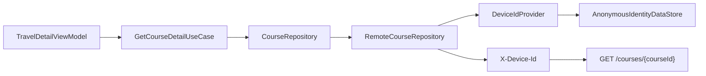

# 기기 식별자 Provider와 Data 계층 경계

## 개념

기기 식별자 Provider는 현재 기기의 익명 UUID를 필요할 때 제공하는 계약이다. ViewModel과 UseCase는 UUID의 생성·저장 방법을 알지 않고, 원격 Repository만 Provider를 통해 서버 요청에 사용할 식별자를 얻는다.

## 도입 이유

SAIRO의 저장 여행지, 취향 분석, 코스 조회 API는 `X-Device-Id`로 요청 기기를 구분한다. 이 값을 ViewModel에서 읽어 전달하면 프레젠테이션 계층이 DataStore와 HTTP 헤더 정책을 함께 알게 된다.

코스 조회는 다른 기기가 만든 코스에 대해 404를 반환한다. 따라서 `GET /courses/{courseId}`에도 저장 여행지 API와 같은 UUID를 보내야, 사용자가 저장한 여행지에서 상세 코스를 다시 열 수 있다.

## 프로젝트 적용

- Provider 계약: [`DeviceIdProvider.kt`](../../app/src/main/java/com/example/sairo14/core/datastore/DeviceIdProvider.kt)
- DataStore 구현: [`AnonymousIdentityDataStore.kt`](../../app/src/main/java/com/example/sairo14/core/datastore/AnonymousIdentityDataStore.kt)
- Hilt 제공: [`DeviceIdentityModule.kt`](../../app/src/main/java/com/example/sairo14/core/datastore/di/DeviceIdentityModule.kt)
- 코스 조회 소비자: [`RemoteCourseRepository.kt`](../../app/src/main/java/com/example/sairo14/data/repository/remote/RemoteCourseRepository.kt)
- 저장 여행지 소비자: [`RemoteSavedTripRepository.kt`](../../app/src/main/java/com/example/sairo14/data/repository/remote/RemoteSavedTripRepository.kt)

`DataStoreDeviceIdProvider`는 최초 요청에 UUID v4를 만들고 보관하며, 이후 같은 값을 반환한다.

```kotlin
class DataStoreDeviceIdProvider(
    private val anonymousIdentityDataStore: AnonymousIdentityDataStore,
) : DeviceIdProvider {
    override suspend fun getDeviceId(): String =
        anonymousIdentityDataStore.getOrCreateAnonymousUserId()
}
```

Domain의 `CourseRepository`는 기기 ID를 파라미터로 받지 않는다.

```kotlin
interface CourseRepository {
    suspend fun getCourse(courseId: String): AppResult<Course>
}
```

원격 구현이 Provider에서 값을 읽어 Retrofit header에 전달한다.

```kotlin
val deviceId = deviceIdProvider.getDeviceId()
api.getCourse(courseId = courseId, deviceId = deviceId)
```

## 흐름과 영향 범위



1. 상세 ViewModel은 `courseId`만 전달한다.
2. `RemoteCourseRepository`가 `DeviceIdProvider.getDeviceId()`를 호출한다.
3. Provider는 DataStore에 저장된 UUID를 반환하거나 최초 값을 생성한다.
4. Repository는 UUID를 `X-Device-Id` header로 전달한다.
5. 기기 ID와 코스 ID가 모두 일치할 때 서버가 코스 스냅샷을 반환한다.

## 트레이드오프와 주의점

- Provider가 추가되므로 간단한 API도 생성자 의존성이 하나 늘어난다. 대신 기기 식별 정책이 모든 화면에 중복되는 것을 막는다.
- Provider는 `suspend` 함수다. DataStore 값을 OkHttp Interceptor에서 `runBlocking`으로 읽으면 네트워크 스레드를 막을 수 있으므로 사용하지 않는다.
- DataStore가 손상되거나 읽기 실패하면 `RemoteCourseRepository`는 각각 `StorageCorrupted`, `StorageUnavailable`을 반환한다. 이 실패는 `runRemoteOperation` 밖에서 처리해 네트워크 오류로 바꾸지 않는다.
- 앱 데이터 삭제로 UUID가 바뀌면 이전 서버의 익명 저장 여행지와 코스를 다시 조회할 수 없다. 기기 간 복원이 필요하면 계정 기반 식별 기능이 필요하다.

## 추가 학습 및 대안

> 아래 예시는 현재 프로젝트에 적용하지 않은, 메모리 캐시를 사용하는 대안이다.

```kotlin
class CachedDeviceIdProvider(
    private val delegate: DeviceIdProvider,
) : DeviceIdProvider {
    private var cachedId: String? = null

    override suspend fun getDeviceId(): String =
        cachedId ?: delegate.getDeviceId().also { cachedId = it }
}
```

캐시는 반복 DataStore 읽기를 줄일 수 있다. 하지만 프로세스 생명주기와 DataStore 변경 동기화 정책이 추가되므로, 현재는 단순하고 일관된 Provider 호출 방식을 사용한다.
