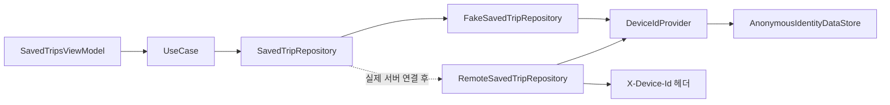

# 기기 식별자 Provider와 Data 계층 경계

## 개념

기기 식별자 Provider는 현재 기기의 익명 UUID를 필요할 때 제공하는 작은 계약이다. 화면과 UseCase는 UUID의 생성·저장 위치를 알지 않고, Repository 구현만 Provider를 통해 서버 요청에 쓸 식별자를 얻는다.

## 도입 이유

SAIRO 서버의 일부 API는 `X-Device-Id` 헤더로 요청 기기를 구분한다. 이 값을 ViewModel에서 읽어 UseCase와 Repository로 전달하면 프레젠테이션 계층이 DataStore와 서버 헤더 정책을 모두 알게 된다. 또한 실제 Repository와 Fake Repository의 함수 모양이 달라져 교체가 어려워진다.

`DeviceIdProvider`로 책임을 분리하면 Domain 계약은 사용자가 의도한 동작만 표현하고, Data 계층이 식별자 준비 방법을 선택할 수 있다.

## 프로젝트 적용

- 관련 파일: [`DeviceIdProvider.kt`](../../app/src/main/java/com/example/sairo14/core/datastore/DeviceIdProvider.kt)
- 관련 파일: [`DeviceIdentityModule.kt`](../../app/src/main/java/com/example/sairo14/core/datastore/di/DeviceIdentityModule.kt)
- 관련 파일: [`SavedTripRepository.kt`](../../app/src/main/java/com/example/sairo14/domain/repository/SavedTripRepository.kt)
- 관련 파일: [`FakeSavedTripRepository.kt`](../../app/src/main/java/com/example/sairo14/data/repository/FakeSavedTripRepository.kt)
- 관련 파일: [`SavedTripsViewModel.kt`](../../app/src/main/java/com/example/sairo14/feature/savedtrip/SavedTripsViewModel.kt)

`DataStoreDeviceIdProvider`는 기존 `AnonymousIdentityDataStore`에 위임한다. 따라서 최초 요청에는 UUID v4를 생성해 저장하고, 이후에는 같은 값을 반환한다.

```kotlin
class DataStoreDeviceIdProvider(
    private val anonymousIdentityDataStore: AnonymousIdentityDataStore,
) : DeviceIdProvider {
    override suspend fun getDeviceId(): String =
        anonymousIdentityDataStore.getOrCreateAnonymousUserId()
}
```

저장 여행지 Domain 계약은 기기 ID를 받지 않는다. 기기별 구분은 Repository 구현이 담당한다.

```kotlin
interface SavedTripRepository {
    suspend fun getSavedTrips(): AppResult<List<SavedTrip>>
    suspend fun deleteSavedTrip(savedTripId: String): AppResult<Unit>
}
```

## 흐름과 영향 범위



1. ViewModel은 목록 조회 또는 저장 해제라는 사용자 행동만 UseCase에 전달한다.
2. Repository는 `DeviceIdProvider.getDeviceId()`로 현재 기기의 UUID를 얻는다.
3. Fake Repository는 UUID를 인메모리 목록의 키로 사용한다.
4. 이후 Remote Repository는 같은 UUID를 Retrofit의 `X-Device-Id` 헤더 파라미터에 전달한다.

## 트레이드오프와 주의점

- Provider 인터페이스가 하나 더 생기므로 간단한 화면에서는 코드가 늘어난다. 그러나 기기 식별 API가 여러 개이므로 헤더 정책을 ViewModel에 반복하지 않는 이점이 더 크다.
- Provider는 `suspend` 함수다. DataStore를 네트워크 Interceptor에서 `runBlocking`으로 읽지 않아 UI·네트워크 스레드를 막는 일을 피한다.
- 앱 데이터를 삭제하면 UUID도 사라져 기존 서버 데이터와 연결할 수 없다. 이는 익명 사용자 정책의 한계이며, 기기 간 복원이 필요하면 별도 계정 기능이 필요하다.
- 서버 호출의 `CancellationException`은 오류 결과로 바꾸지 않고 그대로 전달해야 한다. 기존 `runRemoteOperation`이 이 정책을 담당한다.

## 추가 학습 및 대안

> 아래 예시는 현재 프로젝트에 적용하지 않은 OkHttp Interceptor 기반 대안이다.

```kotlin
class DeviceIdInterceptor(
    private val cachedDeviceId: String,
) : Interceptor {
    override fun intercept(chain: Interceptor.Chain): Response =
        chain.proceed(
            chain.request().newBuilder()
                .header("X-Device-Id", cachedDeviceId)
                .build(),
        )
}
```

Interceptor는 헤더 누락을 줄이지만, DataStore의 suspend 읽기와 초기화 순서를 별도로 해결해야 하며 공개 API에도 헤더가 붙는다. 현재는 Repository가 Retrofit `@Header` 파라미터에 Provider 값을 전달하는 방식이 요청별 요구 사항을 가장 분명하게 표현한다.
