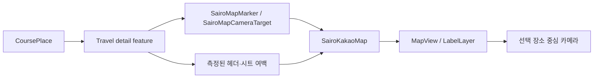

# Compose와 카카오 지도 수명주기

## 개념

Compose 화면에서 Android View 기반 SDK를 표시할 때는 `AndroidView`로 View를 감싸고, Compose
Lifecycle과 SDK 고유의 시작·일시정지·종료 호출을 함께 관리해야 한다. 카카오 지도는 `MapView`를
시작한 뒤 수동 종료 설정을 적용하고, `resume`, `pause`, `finish` 순서로 수명주기를 제어한다. 지도
위 UI와 카메라 중심은 viewport padding으로 조정한다.

## 도입 이유

여행 상세 화면의 지도는 Compose로 작성되지만 카카오 지도 SDK는 `MapView`와 LabelLayer를 제공한다.
Feature가 SDK 객체를 직접 소유하면 일차 변경, 바텀시트 위치, 화면 종료의 책임이 섞인다. SDK 연동을
`core/map`에 모으면 Feature는 도메인 장소를 마커 입력으로 변환하고 UI 상태만 관리할 수 있다.

## 프로젝트 적용

- 지도 Compose 어댑터: [`SairoKakaoMap.kt`](../../app/src/main/java/com/example/sairo14/core/map/SairoKakaoMap.kt)
- 지도 입력 모델: [`SairoMapMarker.kt`](../../app/src/main/java/com/example/sairo14/core/map/SairoMapMarker.kt)
- 번호 핀 Bitmap 생성: [`SairoMapMarkerBitmapFactory.kt`](../../app/src/main/java/com/example/sairo14/core/map/SairoMapMarkerBitmapFactory.kt)
- 코스 좌표 Domain 모델: [`Course.kt`](../../app/src/main/java/com/example/sairo14/domain/model/Course.kt)

`SairoKakaoMap`은 `SairoMapMarker`와 `SairoMapCameraTarget`만 받으므로 `CoursePlace` 또는
Repository를 직접 참조하지 않는다. 화면은 선택한 일차의 장소를 ID·순서·위경도로 변환해 전달하고,
ViewModel은 선택한 장소 ID와 카메라 요청 ID를 UI 상태로 소유한다. MapView가 준비되면 전용
LabelLayer에 순서 핀을 생성하고, 선택된 장소 좌표로 카메라를 이동한다. 같은 장소를 다시 눌러도
요청 ID가 바뀌므로, 사용자가 지도를 이동한 뒤 해당 장소를 다시 중심으로 맞출 수 있다. 선택이 없을
때만 첫 번째 핀을 기본 중심으로 사용한다.

## 흐름과 영향 범위



시트가 지도 하단을 가리면 Feature가 측정한 높이를 `SairoMapViewportPadding.bottom`으로 넘긴다.
어댑터는 이를 px로 변환해 카카오 지도에 적용한다. 따라서 선택한 장소의 지리 좌표는 가려진 전체
MapView가 아니라 실제 보이는 지도 영역의 중심에 배치된다.

## 트레이드오프와 주의점

- MapView는 Compose 자체 View가 아니므로 `DisposableEffect`에서 `finish()`를 호출하지 않으면
  화면 전환 뒤 엔진과 리소스가 남을 수 있다.
- 지도 핀은 Bitmap으로 캐시한다. 같은 순서 번호를 재사용하면 생성 비용은 줄지만, 핀 색상이나 글꼴을
  테마별로 바꾸려면 캐시 키에 해당 상태를 추가해야 한다.
- 뷰포트 padding을 드래그 중 매 프레임 갱신하면 지도 렌더링 비용이 커질 수 있다. 상세 화면은 시트
  위치 변화 또는 의미 있는 offset 변화에 맞춰 전달 빈도를 제한하는 편이 좋다.
- 장소 선택은 서버 상태를 바꾸지 않는 화면 상호작용이므로 UseCase를 추가하지 않고 ViewModel이
  `selectedPlaceId`를 UI 상태로 관리한다. 서버 저장·추천 갱신 같은 도메인 행위가 생길 때만 UseCase를
  추가한다.
- 카카오 지도 인증 실패는 코스 조회 실패와 별개다. 상세 화면은 목록을 유지하면서 지도 오류를 별도로
  안내해야 한다.

## 추가 학습 및 대안

> 아래 예시는 현재 프로젝트에 적용하지 않은 대안이다.

지도 영역을 시트 위쪽으로만 직접 줄일 수도 있다.

```kotlin
SairoKakaoMap(
    markers = markers,
    viewportPadding = SairoMapViewportPadding(),
    modifier = Modifier.height(visibleMapHeight),
)
```

이 방식은 구현이 단순하지만, 시트를 드래그할 때 MapView 자체 크기가 계속 바뀌고 Figma처럼 지도가
시트 뒤에 이어지는 표현을 만들기 어렵다. 현재는 전체 화면 MapView를 유지하고 viewport padding으로
보이는 중심만 조정한다.
