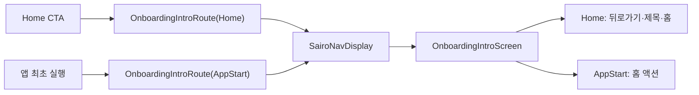

# 내비게이션 진입 출처

## 개념

내비게이션 진입 출처는 같은 화면이라도 사용자가 어느 흐름에서 도달했는지를 Route 값으로 표현하는 방식이다. 화면은 이 값을 바탕으로 헤더처럼 진입 맥락에 따라 달라지는 UI와 뒤로가기 동작을 선택한다.

## 도입 이유

온보딩 인트로는 최초 실행과 Home의 여행지 탐색 CTA에서 모두 사용한다. 두 경우 본문은 같지만 Home에서 다시 진입한 화면은 뒤로가기·제목·홈 액션이 필요하다. 이전 백스택을 화면에서 추측하면 재사용 가능한 화면이 특정 내비게이션 구조에 의존하므로, Route에 출처를 명시한다.

## 프로젝트 적용

- 관련 파일: [`core/navigation/SairoRoute.kt`](../../app/src/main/java/com/example/sairo14/core/navigation/SairoRoute.kt)
- 관련 파일: [`core/navigation/SairoNavDisplay.kt`](../../app/src/main/java/com/example/sairo14/core/navigation/SairoNavDisplay.kt)
- 관련 파일: [`feature/onboarding/OnboardingIntroScreen.kt`](../../app/src/main/java/com/example/sairo14/feature/onboarding/OnboardingIntroScreen.kt)

`OnboardingIntroRoute`는 `AppStart` 또는 `Home` 출처를 저장한다. `SairoNavDisplay`가 Route 값을 화면으로 전달하고, 인트로 화면은 출처에 맞게 `ActionOnly` 또는 `Sub` 헤더를 선택한다.

## 흐름과 영향 범위



## 트레이드오프와 주의점

- 출처가 늘면 enum 값과 화면 분기가 함께 늘어난다. 단, 출처에 따라 실제 본문과 상태가 크게 달라진다면 하나의 화면에 분기를 계속 추가하기보다 별도 Route·화면을 검토한다.
- `Home` 진입의 뒤로가기는 `navigateUp()`으로 이전 Home으로 돌아가고, 홈 아이콘은 `popToHome()`으로 이후 화면까지 모두 닫는다. 두 동작이 현재는 같은 화면으로 보일 수 있어도 의미를 합치지 않는다.
- 출처는 UI 상태가 아니라 백스택을 복원할 때도 필요한 Route 데이터이므로 Kotlin Serialization이 가능한 값으로 유지한다.

## 추가 학습 및 대안

화면 파라미터로 단순 Boolean을 전달할 수도 있다.

> 아래 예시는 현재 프로젝트에 적용하지 않은 대안이다.

```kotlin
@Composable
fun OnboardingIntroScreen(showBackButton: Boolean) {
    if (showBackButton) {
        // 뒤로가기 헤더
    }
}
```

이 방식은 Preview에는 간단하지만, 실제 내비게이션 복원 시 값의 출처가 불분명해진다. 따라서 이 프로젝트에서는 화면 상태가 아닌 Route의 의미 있는 출처 enum을 사용한다.
