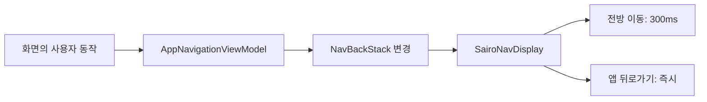

# Navigation 3 공통 화면 전환

## 개념

Navigation 3의 `NavDisplay`는 백스택이 바뀔 때 화면을 표시하고, 전방 이동·뒤로가기·시스템 predictive back에 각각 다른 전환을 지정할 수 있다. `transitionSpec`은 목적지를 백스택에 추가할 때, `popTransitionSpec`은 목적지를 제거할 때 적용된다.

## 도입 이유

화면마다 전환 시간을 선언하면 화면이 늘어날수록 속도와 이징이 달라질 수 있다. Sairo는 전방 이동에 동일한 화면 전환 경험을 제공하고, Figma의 뒤로가기 즉시 복귀 원칙을 한 곳에서 유지하기 위해 `NavDisplay` 수준의 기본값을 사용한다.

## 프로젝트 적용

- 관련 파일: [`app/src/main/java/com/example/sairo14/core/navigation/SairoNavDisplay.kt`](../../app/src/main/java/com/example/sairo14/core/navigation/SairoNavDisplay.kt)

`SairoNavDisplay`는 전방 이동에 300ms ease-out-quint 기반의 수평 이동과 페이드를 적용한다. 나가는 화면은 225ms ease-in으로 더 짧게 처리하며, 앱의 뒤로가기 액션은 애니메이션 없이 즉시 이전 백스택 항목을 표시한다.

```kotlin
NavDisplay(
    transitionSpec = { /* 전방 이동 공통 전환 */ },
    popTransitionSpec = { EnterTransition.None togetherWith ExitTransition.None },
)
```

## 흐름과 영향 범위



전방 이동은 `AppNavigationViewModel.navigate()`가 route를 추가할 때 자동 적용된다. `navigateUp()`으로 제거하는 앱의 뒤로가기는 즉시 처리된다. 시스템 predictive back은 `NavDisplay`에 별도 값을 지정하지 않아 Android의 기본 제스처 전환을 유지한다.

## 트레이드오프와 주의점

공통 전환은 일관성을 높이지만, 바텀시트 단계 변경·로딩 완료·저장 상태처럼 화면 내부 상태 변화에는 적용되지 않는다. 이런 상태는 해당 Composable에서 별도 애니메이션으로 구현한다. 또한 카드와 상세 화면을 실제로 이어 보이게 하는 shared transition은 공통 화면 전환과 별개이며, 필요한 목적지 조합에서만 도입한다.

## 추가 학습 및 대안

> 아래 예시는 현재 프로젝트에 적용되지 않은 대안이다.

특정 목적지만 다른 방향으로 전환해야 하면 route의 메타데이터에 개별 전환을 지정할 수 있다.

```kotlin
entry<DetailRoute>(
    metadata = metadata {
        put(NavDisplay.TransitionKey) {
            slideInVertically() togetherWith slideOutVertically()
        }
    },
) { DetailScreen() }
```
