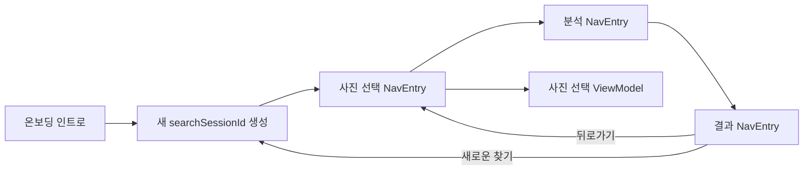

# Navigation 3 목적지별 ViewModel 수명

## 개념

Navigation 3의 `NavEntry`는 백스택의 한 목적지를 나타낸다. `ViewModelStoreNavEntryDecorator`는 각 `NavEntry`에 별도의 `ViewModelStoreOwner`를 제공해, 화면 ViewModel이 Activity 전체가 아니라 해당 목적지의 수명을 따르게 한다.

## 도입 이유

사진 선택 화면의 선택·확인 상태는 뒤로가기로 돌아올 때 유지해야 하지만, 새 탐색을 시작할 때는 남아 있으면 안 된다. Activity 범위 ViewModel은 목적지가 백스택에서 제거된 뒤에도 살아 있으므로 이 두 정책을 구분할 수 없다.

목적지별 ViewModel 수명과 탐색 세션 ID를 함께 사용하면, 일반 뒤로가기는 기존 `NavEntry`를 유지하고 새 탐색은 새 `NavEntry`를 만들어 상태를 처음부터 시작할 수 있다.

## 프로젝트 적용

- 관련 파일: [`core/navigation/SairoNavDisplay.kt`](../../app/src/main/java/com/example/sairo14/core/navigation/SairoNavDisplay.kt)
- 관련 파일: [`core/navigation/SairoRoute.kt`](../../app/src/main/java/com/example/sairo14/core/navigation/SairoRoute.kt)
- 관련 파일: [`core/navigation/SairoNavigator.kt`](../../app/src/main/java/com/example/sairo14/core/navigation/SairoNavigator.kt)

`SairoNavDisplay`는 `rememberSaveableStateHolderNavEntryDecorator()` 뒤에 `rememberViewModelStoreNavEntryDecorator()`를 적용한다. 이 순서는 목적지별 `SavedStateHandle`과 `ViewModel` 상태가 같은 `NavEntry`에 연결되게 한다.

`OnboardingPhotoSelectRoute`, `OnboardingLoadingRoute`, `OnboardingResultRoute`는 같은 탐색의 `searchSessionId`를 전달한다. `SairoNavigator.startNewOnboardingSearch()`는 가장 가까운 인트로 뒤의 이전 탐색 목적지를 제거한 후 새 세션의 사진 선택 Route를 추가한다.

## 흐름과 영향 범위



사진 선택·분석·결과 Route가 백스택에 있는 동안 해당 화면 ViewModel은 유지된다. 선택 화면이 뒤로가기로 다시 표시될 때는 같은 `NavEntry`이므로 선택 상태가 남는다. 새 탐색은 이전 선택 Route를 제거하고 다른 `searchSessionId`를 가진 Route를 추가하므로 새 ViewModel이 생성된다.

## 트레이드오프와 주의점

- `searchSessionId`는 추천 API의 비즈니스 입력이 아니라 Route 상태 수명을 구분하는 식별자다. 사진 ID와 혼용하거나 Repository에 전달하지 않는다.
- 새 탐색은 기존 결과로 돌아갈 수 없게 백스택을 정리한다. 결과를 비교하거나 이력을 제공해야 하면 별도의 탐색 이력 모델이 필요하다.
- `entryDecorators`를 직접 전달하면 `NavDisplay`의 기본 저장 상태 decorator를 명시적으로 포함해야 한다. 이를 생략하면 `rememberSaveable`과 `SavedStateHandle` 복원 정책이 달라질 수 있다.
- 목적지별 스코프는 화면 간 ViewModel 공유를 제거한다. 여러 목적지가 같은 상태를 의도적으로 공유해야 하면 별도의 공유 범위 또는 상위 상태 소유자를 설계해야 한다.

## 추가 학습 및 대안

> 아래 예시는 현재 프로젝트에 적용하지 않은 대안이다.

```kotlin
class PhotoSelectionViewModel : ViewModel() {
    fun resetSelection() {
        // 기존 ViewModel의 선택 상태만 수동으로 비운다.
    }
}
```

수동 초기화는 빠르게 적용할 수 있지만 새 탐색과 뒤로가기의 상태 수명을 내비게이션 구조로 표현하지 못한다. 현재 프로젝트에서는 새 `NavEntry`를 생성하는 방식이 화면 상태의 책임과 더 잘 맞는다.
