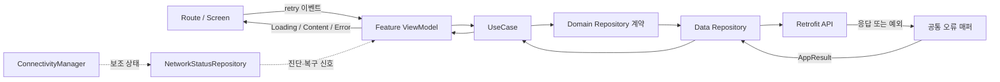

# 네트워크 오류 화면과 상태 판단 설계

## 개념

네트워크 오류 화면은 실제 서버 요청이 전송되지 못했거나 제한 시간 안에 응답을 받지 못했을 때, 실패한 화면을 대신해 재시도와 홈 이동을 제공하는 전체 화면 상태다.

네트워크 연결 상태와 요청 성공 여부는 같은 개념이 아니다. Android가 인터넷 사용 가능 상태라고 알려도 DNS, 서버, 인증서 또는 특정 API가 실패할 수 있다. 반대로 연결 콜백이 갱신되기 전에 요청은 성공할 수 있다. 따라서 **실제 요청 결과를 오류 판정의 기준**으로 삼고, `ConnectivityManager`의 상태는 안내와 복구 감지를 위한 보조 정보로만 사용한다.

## 도입 이유

현재 [`HomeUiState`](../../app/src/main/java/com/example/sairo14/feature/home/HomeUiState.kt)는 모든 실패를 하나의 `Error`로 합치고, [`HomeViewModel`](../../app/src/main/java/com/example/sairo14/feature/home/HomeViewModel.kt)은 `AppResult.Failure`의 원인을 버린다. 또한 [`AppError`](../../app/src/main/java/com/example/sairo14/domain/model/AppResult.kt)는 DataStore 오류를 중심으로 정의되어 있어 네트워크 단절, 시간 초과, 서버 오류를 구분할 수 없다.

오류 원인을 구분하지 않으면 네트워크와 무관한 4xx, 응답 파싱 오류에도 “네트워크 상태를 확인”하라고 안내하게 된다. 반대로 기술 예외를 UI까지 전달하면 Retrofit과 OkHttp 구현이 프레젠테이션 계층에 노출된다. Data 계층에서 기술 예외를 Domain 오류로 변환하고, ViewModel에서 화면에 필요한 오류 종류로 축약하는 경계가 필요하다.

## Figma 해석과 반응형 배치

Figma 기준 프레임은 360×800이고 다음 토큰과 자산이 이미 프로젝트에 있다.

| Figma 요소 | Compose 매핑 |
|---|---|
| 배경 `#FAFBFA` | `SairoTheme.colors.backgroundCanvas` |
| 폴더 오류 이미지 100×56 | `R.drawable.img_folder_error` |
| 제목 24/31 Light | `SairoTextStyles.displayLight24` |
| 설명 16/22 Light | `SairoTextStyles.bodyLight16` |
| Primary 328×56 | `SairoButton(size = Large, style = Primary)` |
| Outline 328×56 | `SairoButton(size = Large, style = Outline)` |
| 버튼 간격 10 | `Arrangement.spacedBy(10.dp)` |
| 화면 좌우 여백 16 | 버튼 Column의 `padding(horizontal = 16.dp)` |
| 이미지-문구 간격 24 | 콘텐츠 Column의 `Arrangement.spacedBy(24.dp)` |
| 제목-설명 간격 8 | 문구 Column의 `Arrangement.spacedBy(8.dp)` |

Figma의 `top = 301`, `top = 646` 같은 절대 위치와 상태 표시줄·제스처 바 그림은 Compose에 옮기지 않는다. 앱은 실제 시스템 바 inset을 사용한다.

권장 구조는 `BoxWithConstraints` 안에서 중앙 콘텐츠와 하단 버튼을 각각 정렬하는 방식이다.

```kotlin
BoxWithConstraints(
    modifier = modifier
        .fillMaxSize()
        .background(SairoTheme.colors.backgroundCanvas)
        .windowInsetsPadding(WindowInsets.safeDrawing),
) {
    if (maxHeight >= NetworkErrorCompactHeight) {
        NetworkErrorMessage(
            modifier = Modifier.align(Alignment.Center),
        )
        NetworkErrorActions(
            modifier = Modifier
                .align(Alignment.BottomCenter)
                .fillMaxWidth()
                .padding(horizontal = 16.dp),
        )
    } else {
        Column(
            modifier = Modifier
                .fillMaxSize()
                .verticalScroll(rememberScrollState())
                .padding(horizontal = 16.dp),
        ) {
            Spacer(Modifier.height(24.dp))
            NetworkErrorMessage(Modifier.align(Alignment.CenterHorizontally))
            Spacer(Modifier.height(24.dp))
            NetworkErrorActions(Modifier.fillMaxWidth())
            Spacer(Modifier.height(8.dp))
        }
    }
}
```

일반 높이에서는 오류 메시지를 안전 영역의 중앙에 두고 버튼은 하단에 둔다. 작은 화면, 큰 글꼴, 가로 모드처럼 두 영역이 겹칠 수 있는 조건에서는 스크롤 가능한 단일 Column으로 전환한다. `NetworkErrorCompactHeight`는 미리보기와 기기 검증으로 정하되, 특정 기기의 y 좌표를 재현하기 위한 값으로 사용하지 않는다. 화면 전체에 `navigationBarsPadding()`과 `windowInsetsPadding(WindowInsets.safeDrawing)`을 동시에 적용해 inset을 중복 계산하지 않는다.

설명은 Figma와 동일하게 문자열 리소스에 줄바꿈을 포함할 수 있지만, `Text`에 고정 너비나 `maxLines = 2`를 강제하지 않는다. 글꼴 배율이 커지거나 번역 문자열이 길어졌을 때 자연스럽게 줄바꿈되어야 한다. 이미지에는 장식이 아니라 오류 의미가 있으므로 “네트워크 요청 오류”에 해당하는 `contentDescription`을 제공하거나, 제목이 같은 정보를 충분히 전달한다고 접근성 검증에서 판단하면 `null`로 두어 중복 읽기를 피한다.

## 프로젝트 적용

### 1. Domain 오류 계약 확장

[`AppResult.kt`](../../app/src/main/java/com/example/sairo14/domain/model/AppResult.kt)의 `AppError`에 최소한 다음 오류를 추가한다. Retrofit, OkHttp, `IOException`, HTTP 상태 코드는 Domain에 노출하지 않는다.

```kotlin
sealed interface AppError {
    data object NetworkUnavailable : AppError
    data object RequestTimeout : AppError
    data object ServerUnavailable : AppError
    data object Unauthorized : AppError
    data object InvalidResponse : AppError

    data object StorageUnavailable : AppError
    data object StorageCorrupted : AppError
    data object Unknown : AppError
}
```

- `NetworkUnavailable`: 인터넷 연결 없음, DNS 조회 실패, 연결 수립 실패처럼 요청을 전달하지 못한 경우
- `RequestTimeout`: 연결·읽기·쓰기 제한 시간을 초과한 경우
- `ServerUnavailable`: HTTP 5xx처럼 요청은 전달됐지만 서버가 일시적으로 처리하지 못한 경우
- `Unauthorized`: HTTP 401/403이며, 추후 로그인 또는 익명 ID 복구 흐름으로 분기할 대상
- `InvalidResponse`: 성공 응답의 필수 필드 누락 또는 역직렬화 실패
- `Unknown`: 위 정책으로 분류하지 못한 예외

HTTP 404, 409 등 기능 의미가 있는 상태는 해당 기능의 Domain 결과 또는 별도 오류로 매핑한다. 모든 4xx를 네트워크 오류로 취급하지 않는다.

### 2. Data 계층의 단일 예외 매퍼

`data/remote`에 `Throwable.toAppError()`와 HTTP 응답 매핑 정책을 한 곳에 둔다. 각 Repository가 서로 다른 기준으로 예외를 분류하지 않게 하기 위함이다.

```kotlin
suspend inline fun <T> networkCall(
    crossinline block: suspend () -> T,
): AppResult<T> = try {
    AppResult.Success(block())
} catch (exception: CancellationException) {
    throw exception
} catch (exception: Throwable) {
    Timber.e(exception, "Network request failed")
    AppResult.Failure(exception.toAppError())
}
```

매핑 우선순위는 구체적인 예외부터 적용한다.

1. `CancellationException`은 반드시 다시 던진다.
2. `SocketTimeoutException`, OkHttp의 호출 시간 초과는 `RequestTimeout`으로 변환한다.
3. `UnknownHostException`, `ConnectException`, 네트워크 관련 `IOException`은 `NetworkUnavailable`로 변환한다.
4. HTTP 500~599는 `ServerUnavailable`, 401/403은 `Unauthorized`로 변환한다.
5. `SerializationException`은 `InvalidResponse`로 변환한다.
6. 나머지는 `Unknown`으로 변환한다.

`IOException` 전체를 먼저 처리하면 그 하위 타입인 시간 초과가 `NetworkUnavailable`로 잘못 분류될 수 있으므로 순서가 중요하다. 로그에는 예외와 요청을 식별할 최소 정보만 남기고 토큰, API 키, 사용자 데이터, 전체 응답 본문은 남기지 않는다.

### 3. 연결 상태 관찰은 보조 신호로 분리

연결 상태가 실제로 필요한 시점에만 Android 구현을 추가한다. Domain에는 Android에 의존하지 않는 계약을 둔다.

```kotlin
interface NetworkStatusRepository {
    val status: Flow<NetworkStatus>
}

enum class NetworkStatus {
    Available,
    Unavailable,
}
```

`core/network/AndroidNetworkStatusRepository`는 `ConnectivityManager.registerDefaultNetworkCallback()`을 `callbackFlow`로 감싸고, `NET_CAPABILITY_INTERNET`뿐 아니라 `NET_CAPABILITY_VALIDATED`를 함께 확인한다. `awaitClose`에서 콜백을 해제하고, 동일 상태는 `distinctUntilChanged()`로 제거한다. Hilt 바인딩은 기존 [`NetworkModule.kt`](../../app/src/main/java/com/example/sairo14/core/network/di/NetworkModule.kt)에 둔다.

단, 1차 구현에서는 이 Flow를 요청 전 차단 장치로 사용하지 않는다. “오프라인”으로 관찰돼도 재시도 버튼은 활성 상태로 유지하고 실제 요청을 수행한다. OS 상태가 늦게 갱신되거나 VPN·캡티브 포털 환경에서 잘못 차단되는 것을 피하기 위해서다. 네트워크가 복구됐다는 이유만으로 자동 재시도도 하지 않는다. 사용자의 명시적 재시도는 중복 요청과 예상하지 못한 화면 전환을 막는다.

연결 Flow의 1차 용도는 다음으로 제한한다.

- 오류 발생 당시 분류가 애매한 `IOException`의 진단 로그 보조
- 오류 화면에서 연결 복구 여부를 접근성 공지 또는 향후 문구 개선에 사용
- 테스트에서 연결 복구 후 재시도 흐름을 결정적으로 재현

### 4. Feature UiState가 오류 원인을 보존

화면은 Domain 오류 전체를 직접 렌더링하지 않고 표시 정책으로 변환한다. 홈 기준 권장 상태는 다음과 같다.

```kotlin
sealed interface HomeUiState {
    data object Loading : HomeUiState
    data class Content(/* ... */) : HomeUiState
    data class Error(val type: LoadErrorType) : HomeUiState
}

enum class LoadErrorType {
    Network,
    Generic,
}
```

`NetworkUnavailable`, `RequestTimeout`은 `LoadErrorType.Network`로 매핑한다. `ServerUnavailable`을 같은 Figma 화면으로 보일지는 문구 정확성을 고려해야 한다. 권장안은 레이아웃은 재사용하되 설명만 “서버에 잠시 연결할 수 없어요. 잠시 후 다시 시도해주세요.”로 바꾸는 것이다. `Unauthorized`는 인증/익명 사용자 복구 흐름으로, `InvalidResponse`와 `Unknown`은 일반 오류 화면으로 분리한다.

재시도는 다음 규칙을 따른다.

- 버튼을 누르면 같은 ViewModel의 마지막 조회 함수를 다시 호출한다.
- 즉시 `Loading`으로 바꾸어 중복 탭을 막고 진행 중임을 표시한다.
- 이미 `Loading`이면 새 요청을 시작하지 않는다.
- 성공하면 `Content`, 다시 실패하면 새 오류 원인에 맞는 `Error`로 전환한다.
- 최초 로딩 실패에는 전체 화면 오류를 사용한다.
- 이미 표시 중인 콘텐츠의 새로고침 실패에는 기존 콘텐츠를 유지하고 Snackbar 같은 비차단 피드백을 사용한다. 사용 가능한 데이터를 네트워크 오류 화면으로 덮지 않는다.

ViewModel은 내비게이션을 소유하지 않는다. “홈으로 이동”은 Route의 `onHomeClick` 콜백을 거쳐 [`SairoNavigator.popToHome()`](../../app/src/main/java/com/example/sairo14/core/navigation/SairoNavigator.kt)을 호출한다.

### 5. 공통 오류 Composable

재사용 가능한 `NetworkErrorScreen`은 `core/designsystem/component`보다 `core/common` 또는 `feature/common`에 두는 것을 권장한다. 이 화면은 단순 시각 컴포넌트가 아니라 재시도와 앱 내비게이션 의미를 가진 전체 화면 상태이기 때문이다. 반면 이미지·문구 묶음처럼 순수한 시각 요소만 분리한다면 디자인 시스템 컴포넌트로 둘 수 있다.

권장 API는 상태를 내부에서 소유하지 않는 형태다.

```kotlin
@Composable
fun NetworkErrorScreen(
    onRetryClick: () -> Unit,
    onHomeClick: () -> Unit,
    modifier: Modifier = Modifier,
    retryEnabled: Boolean = true,
    showHomeAction: Boolean = true,
)
```

공용 API이므로 프로젝트 규칙에 맞는 한글 KDoc에 역할, 상태 소유자, 콜백 책임을 적는다. 문자열은 다음 이름으로 [`strings.xml`](../../app/src/main/res/values/strings.xml)에 둔다.

```xml
<string name="network_error_title">요청을 완료하지 못했어요</string>
<string name="network_error_description">네트워크 상태를 확인하고\n다시 시도해주세요.</string>
<string name="network_error_retry">재시도</string>
<string name="network_error_go_home">홈으로 이동</string>
<string name="network_error_image_description">네트워크 요청 오류</string>
```

Figma에 이미 대응하는 [`img_folder_error.xml`](../../app/src/main/res/drawable/img_folder_error.xml), `SairoButton`, `SairoTheme.colors`, `SairoTextStyles`를 사용한다. 색상, radius, 버튼 높이, 이미지 크기를 화면에서 새로 정의하지 않는다.

오류 화면을 별도의 `SairoRoute`로 만들지 않는다. Nav3 route에는 실패한 suspend 함수나 콜백을 직렬화할 수 없고, 오류 목적지를 push하면 재시도 성공 후 원래 화면 복귀와 백스택 정리가 복잡해진다. 각 목적지의 `UiState.Error`가 공통 `NetworkErrorScreen`을 렌더링하면 ViewModel이 실패한 작업의 문맥을 그대로 유지한다.

## 흐름과 영향 범위



오류 표시 결정표는 다음과 같다.

| 요청 결과 | 초기 조회 | 콘텐츠가 이미 있음 | 재시도 |
|---|---|---|---|
| 연결 없음/DNS/연결 실패 | Figma 네트워크 오류 화면 | 콘텐츠 유지 + Snackbar | 같은 요청 실행 |
| 시간 초과 | Figma 네트워크 오류 화면 | 콘텐츠 유지 + Snackbar | 같은 요청 실행 |
| HTTP 5xx | 같은 레이아웃 + 서버용 설명 | 콘텐츠 유지 + Snackbar | 같은 요청 실행 |
| HTTP 401/403 | 인증/사용자 식별 복구 흐름 | 콘텐츠 정책에 따라 유지 | 단순 반복 요청 금지 |
| HTTP 404/409 | 기능별 empty/conflict 상태 | 기능별 처리 | 기능 정책에 따름 |
| 응답 파싱 실패/알 수 없음 | 일반 오류 화면 | 콘텐츠 유지 + 오류 기록 | 허용하되 네트워크 문구 금지 |

홈 화면에서 “홈으로 이동”은 현재 목적지와 같아 의미가 없다. 따라서 `showHomeAction`의 기본값은 `true`로 두어 Figma 구성을 재사용하되, Home의 최초 로딩 실패에서는 `false`를 전달해 홈 버튼을 숨긴다. 다른 목적지에서는 버튼을 표시하고 `SairoNavigator.popToHome()`을 연결한다. 숨긴 버튼의 자리를 빈 공간으로 유지하지 않고 재시도 버튼을 하단 액션 영역의 마지막 요소로 배치한다.

## 구현 순서와 파일 단위 인수인계

다른 모델이 구현할 때 다음 순서로 진행하면 중간 단계에서도 컴파일 가능한 변경을 유지하기 쉽다.

1. [`AppResult.kt`](../../app/src/main/java/com/example/sairo14/domain/model/AppResult.kt)에 네트워크/서버 오류를 추가하고 기존 `when`의 exhaustive 오류를 수정한다.
2. `data/remote`에 공통 `networkCall`과 예외 매퍼를 추가하고 단위 테스트를 작성한다.
3. 실제 Retrofit Repository가 추가되는 시점에만 공통 매퍼를 적용한다. 현재 [`FakeHomeRepository`](../../app/src/main/java/com/example/sairo14/data/repository/FakeHomeRepository.kt)는 성공만 반환하므로 오류 미리보기 또는 테스트용 Fake에 결정적 실패 값을 주입한다.
4. 공통 `NetworkErrorScreen`과 문자열을 추가하고 360×800, 작은 높이, 큰 글꼴 미리보기를 만든다.
5. [`HomeUiState.kt`](../../app/src/main/java/com/example/sairo14/feature/home/HomeUiState.kt)와 [`HomeViewModel.kt`](../../app/src/main/java/com/example/sairo14/feature/home/HomeViewModel.kt)이 오류 종류를 보존하도록 변경한다.
6. [`HomeScreen.kt`](../../app/src/main/java/com/example/sairo14/feature/home/HomeScreen.kt)의 임시 `HomeErrorScreen`을 공통 화면으로 교체하고, 홈 이동 정책에 맞는 콜백을 [`SairoNavDisplay.kt`](../../app/src/main/java/com/example/sairo14/core/navigation/SairoNavDisplay.kt)에서 연결한다.
7. 연결 복구 신호가 실제 UX에 필요할 때 `NetworkStatusRepository`와 Android 구현을 추가한다. 단순히 요청 오류 화면을 표시하는 1차 범위에는 필수가 아니다.

## 검증 기준

### 단위 테스트

- 시간 초과가 `RequestTimeout`, DNS/연결 실패가 `NetworkUnavailable`로 변환된다.
- `CancellationException`은 `AppResult.Failure`가 되지 않고 다시 던져진다.
- HTTP 5xx, 401/403, 역직렬화 실패가 서로 다른 Domain 오류로 변환된다.
- ViewModel의 `Loading → Error(Network) → Loading → Content` 전이가 일치한다.
- 재시도 중 연속 탭에도 Repository 호출은 한 번만 추가된다.
- 콘텐츠가 있는 상태의 갱신 실패는 콘텐츠를 제거하지 않는다.

### Compose/UI 검증

- 360×800에서 이미지, 제목, 설명, 두 버튼의 순서와 간격이 Figma와 일치한다.
- 320dp 폭에서도 버튼 좌우 여백이 유지되고 텍스트가 잘리지 않는다.
- 작은 높이와 가로 모드에서 콘텐츠와 버튼이 겹치지 않고 스크롤할 수 있다.
- 글꼴 배율 1.3 및 2.0에서 제목·설명이 잘리거나 버튼과 겹치지 않는다.
- 상태 표시줄, 내비게이션 바, 디스플레이 컷아웃 영역에 콘텐츠가 침범하지 않는다.
- TalkBack이 제목, 설명, 재시도, 홈 이동을 자연스러운 순서로 읽는다.
- 재시도 버튼을 누른 뒤 중복 요청이 발생하지 않고 로딩 상태가 보인다.

변경 후 최소 검증은 `./gradlew test`와 `./gradlew assembleDebug`다. UI는 가능하면 에뮬레이터에서 네트워크 차단, 시간 초과 Fake, 연결 복구 후 수동 재시도의 세 경로를 확인한다.

## 트레이드오프와 주의점

공통 전체 화면을 사용하면 시각 일관성이 높아지지만, 모든 실패를 같은 문구로 표현하면 원인을 잘못 안내할 수 있다. 레이아웃은 재사용하되 오류 종류별 제목/설명을 허용하는 확장 여지를 둔다.

연결 상태를 실시간 관찰하면 복구 안내를 개선할 수 있지만 Android 콜백 수명주기, 초기 상태 계산, VPN·캡티브 포털 예외가 추가된다. 현재 요구처럼 재시도 버튼이 있는 요청 오류 화면에는 실제 요청 결과만으로 충분하므로, 연결 관찰 구현은 UX에서 사용할 근거가 생길 때 추가하는 편이 단순하다.

전체 화면 오류를 별도 Nav 목적지로 만들면 어느 화면에서든 쉽게 열 수 있지만 실패한 작업과 ViewModel 수명을 잃기 쉽다. UiState로 렌더링하면 화면별 연결 코드는 조금 필요해도 재시도가 정확히 원래 작업을 반복한다.

## 추가 학습 및 대안

네트워크가 복구되는 즉시 자동 재시도하는 방법도 있다. 다만 화면 진입 요청이 비용이 크거나 저장·생성처럼 멱등성이 보장되지 않는 작업에는 중복 실행 위험이 있다. 적용한다면 조회(GET) 계열의 최초 로딩에만 한 번 허용하고, 사용자가 이미 수동 재시도를 누른 경우 취소해야 한다.

> 아래 예시는 현재 프로젝트에 적용하지 않는 대안이다.

```kotlin
combine(uiState, networkStatusRepository.status) { state, network -> state to network }
    .filter { (state, network) ->
        state is HomeUiState.Error && network == NetworkStatus.Available
    }
    .take(1)
    .onEach { retry() }
    .launchIn(viewModelScope)
```

이 대안을 도입하려면 자동 재시도 대상이 읽기 요청인지, 한 화면 진입당 몇 번 허용할지, 수동 재시도와 경합할 때 어떤 작업을 취소할지를 먼저 정의해야 한다.
