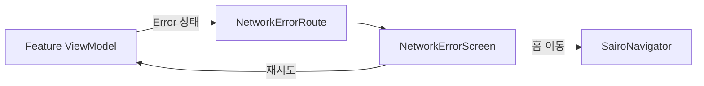
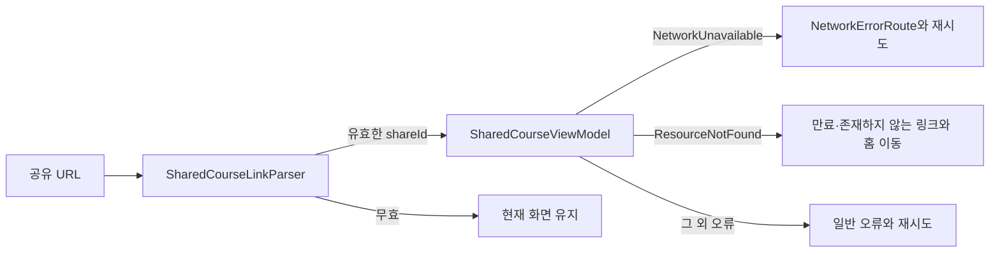

# 네트워크 오류 화면의 상태 소유

## 개념

네트워크 오류 화면은 실패한 요청을 다시 실행하거나 홈으로 이동할 수 있게 하는 공통 전체 화면 UI다. 화면의 모양은 공통으로 재사용하지만, 어떤 요청이 실패했는지와 재시도 중인지의 상태는 원래 요청을 시작한 Feature ViewModel이 소유한다.

## 도입 이유

오류 화면이 자체 ViewModel에서 재시도 대상을 기억하면 화면마다 다른 UseCase와 입력값을 전달해야 하고, Nav3 백스택 전환 중 원래 요청 문맥을 잃기 쉽다. 공통 화면을 stateless하게 두면 Home, 온보딩, 이후의 API 화면이 같은 UI를 쓰면서도 각자 정확한 요청을 재시도할 수 있다.

## 프로젝트 적용

- 공통 Route와 Screen: [`NetworkErrorScreen.kt`](../../app/src/main/java/com/example/sairo14/feature/error/NetworkErrorScreen.kt)
- 오류 원인 보존과 공통 화면 연결: [`HomeScreen.kt`](../../app/src/main/java/com/example/sairo14/feature/home/HomeScreen.kt), [`SavedTripsScreen.kt`](../../app/src/main/java/com/example/sairo14/feature/savedtrip/SavedTripsScreen.kt), [`TravelDetailScreen.kt`](../../app/src/main/java/com/example/sairo14/feature/traveldetail/TravelDetailScreen.kt), [`SharedCourseScreen.kt`](../../app/src/main/java/com/example/sairo14/feature/sharedcourse/SharedCourseScreen.kt), [`OnboardingPhotoSelectScreen.kt`](../../app/src/main/java/com/example/sairo14/feature/onboarding/select/OnboardingPhotoSelectScreen.kt), [`OnboardingLoadingScreen.kt`](../../app/src/main/java/com/example/sairo14/feature/onboarding/loading/OnboardingLoadingScreen.kt), [`OnboardingResultScreen.kt`](../../app/src/main/java/com/example/sairo14/feature/onboarding/result/OnboardingResultScreen.kt)

`NetworkErrorRoute`는 콜백을 `NetworkErrorScreen`으로 전달한다. `NetworkErrorScreen`은 버튼 클릭을 처리하지만 네트워크 요청을 직접 실행하거나 상태를 변경하지 않는다.

```kotlin
NetworkErrorRoute(
    onRetryClick = viewModel::retry,
    onHomeClick = navigator::popToHome,
)
```

## 흐름과 영향 범위



모든 연결 화면은 기본 홈 버튼을 사용하고 `SairoNavigator.popToHome()`을 연결한다. Home은 이미 홈에 있으므로 이 호출이 백스택을 바꾸지 않아 네트워크 오류 화면이 그대로 유지된다.

화면은 `WindowInsets.safeDrawing` 안에서 일반 높이에는 메시지를 중앙, 버튼을 하단에 배치한다. 작은 높이에서는 세로 스크롤 Column으로 전환해 큰 글꼴이나 가로 모드에서도 겹치지 않게 한다.

## 트레이드오프와 주의점

stateless 화면은 재사용하기 쉽지만, 호출한 Feature가 재시도 중 상태를 즉시 `Loading`으로 바꾸지 않으면 연속 탭으로 중복 요청이 생길 수 있다. Home은 진행 중 `Job`을 확인하고, 새 요청을 시작하기 전에 동기적으로 `Loading`을 설정해 이를 막는다.

[`AppError`](../../app/src/main/java/com/example/sairo14/domain/model/AppResult.kt)는 네트워크 연결 불가, 잘못된 요청·커서, 찾을 수 없는 리소스, 충돌, 서버 실패, 저장소 실패를 구분한다. [`RemoteErrorMapper.kt`](../../app/src/main/java/com/example/sairo14/data/remote/RemoteErrorMapper.kt)의 `runRemoteOperation`이 실제 Retrofit 호출을 이 계약으로 변환하고, `CancellationException`은 다시 던진다. `IOException`의 하위 타입인 시간 초과도 `NetworkUnavailable`로 통일한다. 화면은 이 오류에만 공통 네트워크 오류 화면을 사용하며, 서버·저장소 오류는 일반 오류 UI를 표시한다.

[`AndroidNetworkStatusRepository`](../../app/src/main/java/com/example/sairo14/core/network/AndroidNetworkStatusRepository.kt)는 `ConnectivityManager`의 검증된 인터넷 연결 상태를 `Flow`로 제공한다. 이를 위해 매니페스트에 `ACCESS_NETWORK_STATE` 권한이 필요하다. [`NetworkErrorViewModel`](../../app/src/main/java/com/example/sairo14/feature/error/NetworkErrorViewModel.kt)은 이 상태로 오프라인 중 재시도 버튼만 비활성화하고, 연결이 복구되면 다시 활성화한다. 이 값은 실제 서버 요청의 성공을 보장하지 않으므로 일반 요청을 미리 차단하거나 오류 화면을 먼저 표시하지 않는다.

여행 상세의 공유처럼 이미 코스 콘텐츠를 표시한 뒤 실행하는 요청은 전체 오류 화면으로 전환하지 않는다. [`TravelDetailViewModel.kt`](../../app/src/main/java/com/example/sairo14/feature/traveldetail/TravelDetailViewModel.kt)은 실패 원인을 `TravelDetailEffect.ShowShareError`로 전달하고, [`TravelDetailScreen.kt`](../../app/src/main/java/com/example/sairo14/feature/traveldetail/TravelDetailScreen.kt)은 기존 지도와 시트를 유지한 채 Snackbar로 안내한다. 사용자는 공유 버튼을 다시 눌러 같은 요청을 재시도한다.

## 공개 공유 코스 링크의 오류 처리

공유 링크 수신은 아직 표시할 콘텐츠가 없는 최초 조회이므로, 공유 생성 실패와 달리 [`SharedCourseUiState.Error`](../../app/src/main/java/com/example/sairo14/feature/sharedcourse/SharedCourseUiState.kt)을 사용해 전체 화면을 교체한다. URL 형식은 [`SharedCourseLinkParser.kt`](../../app/src/main/java/com/example/sairo14/core/navigation/SharedCourseLinkParser.kt)이 먼저 검증하므로 잘못된 도메인·경로는 API 요청이나 화면 이동을 만들지 않는다.



`GET /courses/shared/{shareId}`의 404는 `RemoteErrorMapper`를 거쳐 `AppError.ResourceNotFound`가 된다. 이 경우 같은 ID로 재시도해도 성공 가능성이 낮으므로, 화면은 재시도 대신 홈 이동을 제공한다. 반면 `IOException`은 `NetworkUnavailable`로 변환되어 기존 공통 네트워크 화면의 재시도 정책을 그대로 사용한다. 서버 5xx는 일반 오류와 재시도로 안내한다. 서버의 원본 오류 문구는 어느 경우에도 표시하지 않는다.

## 추가 학습 및 대안

오류 화면을 별도 Nav3 목적지로 만들 수도 있다. 하지만 route에는 suspend 요청이나 콜백을 저장할 수 없어 재시도 문맥이 복잡해진다.

> 아래 예시는 현재 프로젝트에 적용하지 않은 대안이다.

```kotlin
@Serializable
data object NetworkErrorRoute : SairoRoute
```

이 방식은 오류 원인과 재시도 동작을 공유 상태나 별도 저장소로 옮겨야 하므로, 현재처럼 Feature `UiState`가 화면을 교체하는 구조보다 복잡하다.
