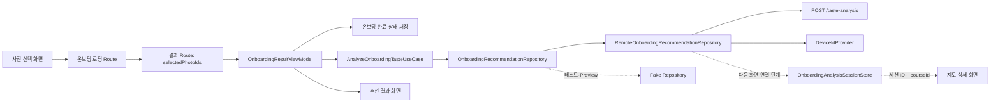

# 온보딩 추천 결과 흐름

## 개념

온보딩 추천 결과는 사용자가 고른 사진 ID를 입력으로 받아 취향을 분석하고, 무드 태그·지역 추천 목록·코스 상세 스냅샷을 함께 생성하는 기능이다. `OnboardingRecommendationRepository`는 분석 데이터의 출처를 숨기고, ViewModel은 그 결과를 화면에 필요한 loading·content·error 상태로 변환한다.

추천 수가 0개인 것은 서버나 저장소 오류가 아니라 유효한 검색 결과다. 따라서 빈 목록은 `Error`가 아닌 `Content(emptyList())`로 유지한다.

## 도입 이유

추천 화면이 API 응답을 직접 읽으면, 실제 추천 API가 준비될 때 화면·테스트·내비게이션까지 동시에 바뀌기 쉽다. 취향 분석을 Domain Repository 계약 뒤에 두면 Retrofit 구현과 Fake 구현을 같은 계약으로 교체할 수 있다.

또한 결과 Route가 선택 사진 ID를 보관해야 화면 재구성 뒤에도 같은 입력으로 결과를 다시 조회할 수 있다. 로딩 화면이 끝났다는 사실만 넘기면 결과 화면은 어떤 사진을 분석했는지 알 수 없다.

## 프로젝트 적용

- Domain 모델: [`OnboardingAnalysisResult.kt`](../../app/src/main/java/com/example/sairo14/domain/model/OnboardingAnalysisResult.kt), [`OnboardingRecommendation.kt`](../../app/src/main/java/com/example/sairo14/domain/model/OnboardingRecommendation.kt), [`Course.kt`](../../app/src/main/java/com/example/sairo14/domain/model/Course.kt)
- 사진 선택 상태: [`OnboardingPhotoSelectUiState.kt`](../../app/src/main/java/com/example/sairo14/feature/onboarding/select/OnboardingPhotoSelectUiState.kt), [`OnboardingPhotoSelectViewModel.kt`](../../app/src/main/java/com/example/sairo14/feature/onboarding/select/OnboardingPhotoSelectViewModel.kt)
- 로딩 전달 모델: [`SairoRoute.kt`](../../app/src/main/java/com/example/sairo14/core/navigation/SairoRoute.kt)
- 로딩 상태와 ViewModel: [`OnboardingLoadingUiState.kt`](../../app/src/main/java/com/example/sairo14/feature/onboarding/loading/OnboardingLoadingUiState.kt), [`OnboardingLoadingViewModel.kt`](../../app/src/main/java/com/example/sairo14/feature/onboarding/loading/OnboardingLoadingViewModel.kt)
- API DTO·계약: [`TasteAnalysisDto.kt`](../../app/src/main/java/com/example/sairo14/data/remote/dto/TasteAnalysisDto.kt), [`SairoApi.kt`](../../app/src/main/java/com/example/sairo14/data/remote/SairoApi.kt)
- DTO mapper: [`TasteAnalysisMapper.kt`](../../app/src/main/java/com/example/sairo14/data/mapper/TasteAnalysisMapper.kt)
- Repository 계약·구현: [`OnboardingRecommendationRepository.kt`](../../app/src/main/java/com/example/sairo14/domain/repository/OnboardingRecommendationRepository.kt), [`RemoteOnboardingRecommendationRepository.kt`](../../app/src/main/java/com/example/sairo14/data/repository/remote/RemoteOnboardingRecommendationRepository.kt)
- 분석 세션 저장소: [`OnboardingAnalysisSessionStore.kt`](../../app/src/main/java/com/example/sairo14/domain/repository/OnboardingAnalysisSessionStore.kt), [`InMemoryOnboardingAnalysisSessionStore.kt`](../../app/src/main/java/com/example/sairo14/data/repository/InMemoryOnboardingAnalysisSessionStore.kt)
- 완료 상태 정책: [`UpdateOnboardingCompletionUseCase.kt`](../../app/src/main/java/com/example/sairo14/domain/usecase/UpdateOnboardingCompletionUseCase.kt)
- Fake 구현: [`FakeOnboardingRecommendationRepository.kt`](../../app/src/main/java/com/example/sairo14/data/repository/fake/FakeOnboardingRecommendationRepository.kt)
- 화면 상태와 ViewModel: [`OnboardingResultUiState.kt`](../../app/src/main/java/com/example/sairo14/feature/onboarding/result/OnboardingResultUiState.kt), [`OnboardingResultViewModel.kt`](../../app/src/main/java/com/example/sairo14/feature/onboarding/result/OnboardingResultViewModel.kt)
- 결과 화면: [`OnboardingResultScreen.kt`](../../app/src/main/java/com/example/sairo14/feature/onboarding/result/OnboardingResultScreen.kt)

`OnboardingAnalysisResult`는 로딩 화면의 무드 태그, 결과 화면의 카드, 지도 상세 화면의 코스 스냅샷을 함께 가진 Domain 모델이다. API DTO는 Data 계층에만 남기고, mapper가 `OnboardingRecommendation`과 `Course`로 변환한다.

`OnboardingAnalysisSessionStore`는 탐색 세션 ID를 키로 `OnboardingAnalysisResult`를 앱 프로세스 안에 보관한다. 결과 화면은 전체 결과를, 지도 상세 화면은 같은 세션의 `courseId`로 코스 스냅샷만 읽을 수 있다. 프로세스 재시작 뒤에는 결과가 남지 않으므로, 이후 화면 연결 단계에서는 세션 누락을 사진 재선택 안내로 처리한다.

사진 선택 상태는 ID를 `Set`이 아닌 `List`로 보관한다. 중복은 ViewModel 이벤트 처리에서 막고, 목록 순서는 사용자가 고른 순서를 뜻한다. 따라서 완료 효과와 이후 로딩 애니메이션이 같은 앞 5장을 사용할 수 있다. 선택은 5장부터 완료할 수 있고 10장에 도달하면 새 사진 선택만 막는다. 이미 선택한 사진은 언제든 해제할 수 있다.

```kotlin
when (uiState) {
    OnboardingResultUiState.Loading -> ResultPending()
    is OnboardingResultUiState.Content -> ResultContent(uiState.recommendations)
    OnboardingResultUiState.Error -> ResultError(onRetryClick)
}
```

화면은 기존 `SairoPlaceFolderCard`를 사용한다. 이 공통 카드는 가로 제약에서 300:286 비율을 계산하므로, 결과 화면은 최대 너비만 정하고 그림·폴더·문구의 겹침 위치를 직접 계산하지 않는다. 긴 장소명은 최대 두 개까지만 표시하고 말줄임 처리한다.

## 흐름과 영향 범위



1. 사진 선택 화면이 선택 순서가 보존된 5~10개의 사진 ID와 앞 5장의 `id`·`imageUrl`을 로딩 Route로 전달한다.
2. 로딩 ViewModel은 전달받은 5장의 URL을 카드 UI 상태로 즉시 변환하고 사진 풀 API를 다시 호출하지 않는다. 화면은 Coil로 다섯 장의 요청이 끝날 때까지 대기한 뒤 카드 모션을 시작한다.
3. 로딩 완료 뒤 `OnboardingResultRoute(searchSessionId, selectedPhotoIds)`가 기존 로딩 Route를 교체한다.
4. Repository는 사진 ID의 중복을 제거한 뒤 5~10장인지 검증하고, `DeviceIdProvider`에서 UUID를 읽어 `X-Device-Id` 헤더와 함께 `POST /taste-analysis`를 호출한다. DataStore 오류는 네트워크 오류로 바꾸지 않고 저장소 오류로 반환한다.
5. DTO mapper는 API 응답을 `OnboardingAnalysisResult`로 변환한다. 빈 `courses`는 실패가 아닌 정상적인 빈 추천 결과다.
6. 현재 결과 ViewModel은 분석 결과의 추천 카드 목록을 `UpdateOnboardingCompletionUseCase`에 전달한다. UseCase는 결과가 1개 이상이면 완료 상태를 저장하고, 0개면 완료 상태를 해제한다.
7. 결과가 2개 이상이면 카드 목록만 스크롤한다.
8. 결과가 0개 또는 1개면 하단 안내와 재추천 버튼을 고정한다. 카드가 있는 경우에도 작은 화면에서는 목록 하단 여백으로 버튼과 겹치지 않는다.
9. 뒤로가기는 기존 사진 선택 화면으로 돌아가 선택 상태를 유지한다. 반면 재추천은 기존 사진 선택·결과 목적지를 제거하고 새 탐색 세션의 사진 선택 화면을 추가한다. 홈 버튼은 홈 목적지까지 백스택을 정리한다.

## 트레이드오프와 주의점

- 현재 북마크는 화면 안의 `isSaved`만 전환한다. 실제 저장 여행 기능이 도입되면 코스 API 문서에서 제안한 `SavedTripRepository`에 연결해야 하며, 화면 상태만 바꾸는 로직은 낙관적 업데이트와 실패 복구로 교체한다.
- 완료 상태 저장 또는 해제가 실패하면 추천 결과를 표시하지 않고 오류·재시도를 제공한다. 다음 앱 시작 시의 진입 화면과 결과 수의 정책이 어긋나지 않도록 보장한다.
- Fake Repository는 실제 Repository와 같은 `OnboardingAnalysisResult` 계약을 반환해 무드 태그·카드·상세 코스의 화면 연결을 테스트할 수 있다.
- 현재는 결과 ViewModel이 분석 요청을 시작한다. 다음 단계에서는 로딩 화면이 카드 모션과 API 요청을 동시에 시작하고, 태그 모션까지 끝난 뒤 결과 화면으로 이동하도록 요청 위치를 옮긴다.
- 선택 ID를 `Set`으로 보관하면 중복은 막기 쉽지만 사용자의 선택 순서를 표현할 수 없다. 현재는 최대 10장으로 제한하므로 목록 기반 상태의 탐색 비용보다 순서 보존의 이점이 크다.
- 사진 풀 API는 무작위 후보를 반환하므로 로딩 화면에서 ID만으로 같은 사진을 다시 조회할 수 없다. 앞 5장의 URL을 Route로 전달하면 사진 풀 API를 재조회하지 않아도 된다. 다만 카드가 비어 있는 상태로 모션을 시작하지 않도록 Coil 이미지 요청이 끝날 때까지는 중앙 인디케이터를 표시한다. URL이 만료되거나 요청에 실패하면 fallback 이미지가 표시된 뒤 모션을 시작한다.

## 추가 학습 및 대안

실제 API가 사진 업로드 자체를 요구한다면 Route에 이미지 URL 전체를 넣는 대신 임시 분석 요청 ID만 넘기는 방식을 고려할 수 있다. 큰 데이터나 민감한 메타데이터를 Navigation 상태에 넣지 않아도 되는 장점이 있다.

> 아래 예시는 현재 프로젝트에 적용되지 않은 대안이다.

```kotlin
@Serializable
data class OnboardingResultRoute(
    val analysisId: String,
) : SairoRoute

interface OnboardingRecommendationRepository {
    suspend fun analyzeTaste(photoIds: List<String>): AppResult<OnboardingAnalysisResult>
}
```

현재는 추천 분석에 필요한 선택 사진 ID와 애니메이션에 필요한 앞 5장의 URL만 전달한다. 별도 분석 ID를 저장·만료 관리하는 복잡도보다 Navigation 입력이 작고 흐름이 단순하다.
