# 온보딩 취향 분석과 추천 세션 흐름

## 개념

온보딩 취향 분석은 사용자가 고른 5~10장의 사진 ID를 `POST /taste-analysis`에 보내고, 서버가 반환한 무드 태그·추천 카드·코스 상세 스냅샷을 하나의 탐색 세션으로 연결하는 기능이다.

분석 응답은 화면 사이에 직접 전달하지 않는다. `searchSessionId`와 `courseId`처럼 작은 식별자만 Navigation에 넣고, `OnboardingAnalysisSessionStore`가 응답을 앱 프로세스 안에서 보관한다. 이로써 로딩·결과·지도 상세 화면이 같은 분석 결과를 재사용한다.

## 도입 이유

결과 화면에서 분석 API를 호출하면 로딩 애니메이션과 실제 서버 작업이 분리되고, 결과 화면 재진입 시 같은 요청을 다시 보낼 수 있다. 로딩 화면에서 카드 모션과 분석 요청을 동시에 시작하면 사용자는 대기 시간을 자연스러운 진행 과정으로 인식한다.

또한 `taste-analysis` 응답은 추천 카드뿐 아니라 일차별 장소·좌표도 포함한다. 결과 카드에서 지도 상세로 이동할 때 그 스냅샷을 우선 사용하면 Fake Repository에 없는 서버의 실제 `courseId`도 상세 화면에서 바로 표시할 수 있다.

## 프로젝트 적용

- API DTO·계약: [`TasteAnalysisDto.kt`](../../app/src/main/java/com/example/sairo14/data/remote/dto/TasteAnalysisDto.kt), [`SairoApi.kt`](../../app/src/main/java/com/example/sairo14/data/remote/SairoApi.kt)
- Remote Repository·mapper: [`RemoteOnboardingRecommendationRepository.kt`](../../app/src/main/java/com/example/sairo14/data/repository/remote/RemoteOnboardingRecommendationRepository.kt), [`TasteAnalysisMapper.kt`](../../app/src/main/java/com/example/sairo14/data/mapper/TasteAnalysisMapper.kt)
- 분석과 세션 저장 UseCase: [`AnalyzeAndStoreOnboardingTasteUseCase.kt`](../../app/src/main/java/com/example/sairo14/domain/usecase/AnalyzeAndStoreOnboardingTasteUseCase.kt)
- 세션 계약·구현: [`OnboardingAnalysisSessionStore.kt`](../../app/src/main/java/com/example/sairo14/domain/repository/OnboardingAnalysisSessionStore.kt), [`InMemoryOnboardingAnalysisSessionStore.kt`](../../app/src/main/java/com/example/sairo14/data/repository/InMemoryOnboardingAnalysisSessionStore.kt)
- 로딩·결과 화면 상태: [`OnboardingLoadingViewModel.kt`](../../app/src/main/java/com/example/sairo14/feature/onboarding/loading/OnboardingLoadingViewModel.kt), [`OnboardingResultViewModel.kt`](../../app/src/main/java/com/example/sairo14/feature/onboarding/result/OnboardingResultViewModel.kt)
- 지도 상세 fallback: [`GetCourseDetailUseCase.kt`](../../app/src/main/java/com/example/sairo14/domain/usecase/GetCourseDetailUseCase.kt)
- Route 연결: [`SairoRoute.kt`](../../app/src/main/java/com/example/sairo14/core/navigation/SairoRoute.kt), [`SairoNavDisplay.kt`](../../app/src/main/java/com/example/sairo14/core/navigation/SairoNavDisplay.kt)

`OnboardingAnalysisResult`는 로딩 화면용 `moodTags`, 결과 카드용 `recommendations`, 상세 화면용 `courses`를 함께 가진 Domain 모델이다. DTO는 Data 계층에만 두고 mapper가 Domain 모델로 변환한다.

```kotlin
data class OnboardingAnalysisResult(
    val moodTags: List<String>,
    val summary: String,
    val recommendations: List<OnboardingRecommendation>,
    val courses: Map<String, Course>,
)
```

## 흐름과 영향 범위

```mermaid
flowchart LR
    Select["사진 선택"] --> Loading["OnboardingLoadingViewModel"]
    Loading --> Cards["카드 5장 애니메이션"]
    Loading --> Analyze["AnalyzeAndStoreOnboardingTasteUseCase"]
    Analyze --> Repo["RemoteOnboardingRecommendationRepository"]
    Repo --> Api["POST /taste-analysis"]
    Api --> Mapper["DTO → OnboardingAnalysisResult"]
    Mapper --> Session["OnboardingAnalysisSessionStore"]
    Session --> Tags["API moodTags 애니메이션"]
    Cards --> Gate["두 애니메이션 완료"]
    Tags --> Gate
    Gate --> Result["OnboardingResultViewModel"]
    Session --> Result
    Result --> Detail["TravelDetailRoute\ncourseId + onboardingSessionId"]
    Detail --> Course["GetCourseDetailUseCase"]
    Session --> Course
```



1. 사진 선택 화면은 사진 ID 5~10개와 카드 애니메이션용 앞 5장의 이미지 정보를 로딩 Route에 전달한다.
2. 로딩 ViewModel은 카드 데이터를 준비하고 `AnalyzeAndStoreOnboardingTasteUseCase`를 호출한다.
3. 로딩 ViewModel은 새 분석 또는 재시도 전에 기존 `Job`을 취소하고 요청 세대 번호를 올린다. 늦게 도착한 이전 성공·실패 응답은 현재 세대와 다르므로 UI에 반영하지 않는다.
4. UseCase는 API 호출 전에 요청 세대를 담은 `OnboardingAnalysisRequestToken`을 세션 저장소에 등록한다. 성공 응답은 등록된 최신 토큰과 일치할 때만 Mutex 안에서 저장하므로, 취소 시점과 저장 사이에 요청이 바뀌어도 이전 결과가 세션을 덮어쓰지 않는다. 실패 결과는 저장하지 않는다.
5. 화면은 카드 애니메이션을 즉시 시작한다. API가 성공하면 그 응답의 `moodTags`로 별도의 태그 애니메이션을 시작한다.
6. 카드와 태그 애니메이션이 모두 끝났을 때만 결과 Route로 이동한다. 빈 태그 목록은 즉시 완료로 간주한다.
7. 결과 ViewModel은 API를 다시 호출하지 않고 세션에서 추천 카드 목록을 읽는다. 빈 코스 목록은 정상 콘텐츠 상태다.
8. 결과 카드 선택은 `courseId`와 `onboardingSessionId`를 지도 상세 Route에 전달한다.
9. 상세 UseCase는 세션의 코스 스냅샷을 먼저 찾고, 없을 때만 일반 `CourseRepository`를 fallback으로 사용한다.

## 트레이드오프와 주의점

- 세션 저장소는 인메모리 `@Singleton` 구현이다. 빠르고 큰 응답을 Navigation에 넣지 않아도 되지만, 프로세스가 재시작되면 결과가 사라진다.
- `SairoNavigator`는 백스택에서 마지막으로 남은 세션 Route가 제거될 때 앱 수준의 `OnboardingSessionCleanupViewModel`에 삭제를 요청한다. 따라서 홈 이동·재추천·온보딩 뒤로가기로 흐름을 완전히 벗어나면 이전 `searchSessionId`를 `remove()`하고, 상세 화면의 일반 뒤로가기는 결과 Route가 같은 세션을 유지하므로 삭제하지 않는다. 재추천은 새 UUID를 생성해 별도 세션으로 시작한다.
- 세션 결과가 없으면 결과 화면은 현재 오류 상태를 보인다. 제품 UX를 다듬을 때는 사진 재선택 안내로 구분하는 편이 좋다.
- 세션을 우선 조회해도, 세션이 없을 때 일반 Repository가 실제 서버 UUID를 아직 모르면 상세 화면을 복구하지 못한다. `GET /courses/{courseId}` 연결이 장기 fallback이다.
- 사진 ID는 사용자 선택 순서가 의미 있으므로 `List`로 유지한다. Repository는 서버 요청 전 중복 제거 후 5~10장인지 검증한다.
- 취소는 Retrofit 같은 협조적 suspend 작업을 즉시 중단한다. 외부 구현이 취소를 따르지 않아도 ViewModel의 요청 세대 비교와 세션 저장소의 토큰 기반 원자 저장이 오래된 응답의 UI·세션 반영을 막는다.
- 무드 태그는 공백·중복을 제거한 뒤 최대 6개만 표시한다. `FlowRow`는 한 줄 최대 4개로 자연스럽게 줄바꿈하며, 긴 태그는 최대 150dp와 한 줄 말줄임을 적용해 한 줄에 보통 2개만 배치되도록 한다. API가 빈 태그 목록을 반환하면 태그 애니메이션은 즉시 완료한다.

## 추가 학습 및 대안

분석 결과를 앱 재시작 뒤에도 다시 열어야 한다면 인메모리 저장소 대신 로컬 DB나 서버 상세 API를 사용한다. DataStore는 기기 ID·온보딩 완료 여부 같은 작은 설정에는 적합하지만, 여러 코스와 장소 스냅샷을 장기 보관하기에는 적합하지 않다.

> 아래 예시는 현재 프로젝트에 적용하지 않은 영속 캐시 대안이다.

```kotlin
interface OnboardingAnalysisCache {
    suspend fun save(sessionId: String, result: OnboardingAnalysisResult)
    suspend fun get(sessionId: String): OnboardingAnalysisResult?
}
```

영속 캐시는 프로세스 재시작 복구에 유리하지만, 만료 시점·서버 결과 변경·개인 데이터 삭제 정책을 함께 설계해야 한다. 현재는 한 번의 온보딩 탐색을 마친 뒤 상세 화면으로 이어지는 짧은 수명에 맞춰 인메모리 저장소를 사용한다.
