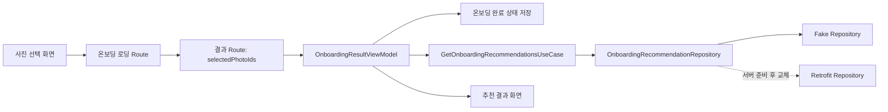

# 온보딩 추천 결과 흐름

## 개념

온보딩 추천 결과는 사용자가 고른 사진 ID를 입력으로 받아 지역 추천 목록을 조회하고, 그 목록의 개수에 따라 서로 다른 화면 구성을 표시하는 기능이다. `OnboardingRecommendationRepository`는 추천 데이터의 출처를 숨기고, ViewModel은 그 결과를 화면에 필요한 loading·content·error 상태로 변환한다.

추천 수가 0개인 것은 서버나 저장소 오류가 아니라 유효한 검색 결과다. 따라서 빈 목록은 `Error`가 아닌 `Content(emptyList())`로 유지한다.

## 도입 이유

추천 화면이 `FakePhotoSelectionRepository` 또는 네트워크 응답을 직접 읽으면, 실제 추천 API가 준비될 때 화면·테스트·내비게이션까지 동시에 바뀌기 쉽다. 추천 조회를 Domain Repository 계약 뒤에 두면 Fake 구현으로 화면을 완성한 뒤 Retrofit 구현만 교체할 수 있다.

또한 결과 Route가 선택 사진 ID를 보관해야 화면 재구성 뒤에도 같은 입력으로 결과를 다시 조회할 수 있다. 로딩 화면이 끝났다는 사실만 넘기면 결과 화면은 어떤 사진을 분석했는지 알 수 없다.

## 프로젝트 적용

- Domain 모델: [`OnboardingRecommendation.kt`](../../app/src/main/java/com/example/sairo14/domain/model/OnboardingRecommendation.kt)
- 사진 선택 상태: [`OnboardingPhotoSelectUiState.kt`](../../app/src/main/java/com/example/sairo14/feature/onboarding/select/OnboardingPhotoSelectUiState.kt), [`OnboardingPhotoSelectViewModel.kt`](../../app/src/main/java/com/example/sairo14/feature/onboarding/select/OnboardingPhotoSelectViewModel.kt)
- Repository 계약: [`OnboardingRecommendationRepository.kt`](../../app/src/main/java/com/example/sairo14/domain/repository/OnboardingRecommendationRepository.kt)
- 완료 상태 정책: [`UpdateOnboardingCompletionUseCase.kt`](../../app/src/main/java/com/example/sairo14/domain/usecase/UpdateOnboardingCompletionUseCase.kt)
- Fake 구현: [`FakeOnboardingRecommendationRepository.kt`](../../app/src/main/java/com/example/sairo14/data/repository/FakeOnboardingRecommendationRepository.kt)
- 화면 상태와 ViewModel: [`OnboardingResultUiState.kt`](../../app/src/main/java/com/example/sairo14/feature/onboarding/OnboardingResultUiState.kt), [`OnboardingResultViewModel.kt`](../../app/src/main/java/com/example/sairo14/feature/onboarding/OnboardingResultViewModel.kt)
- 결과 화면: [`OnboardingResultScreen.kt`](../../app/src/main/java/com/example/sairo14/feature/onboarding/OnboardingResultScreen.kt)

`OnboardingRecommendation`은 카드 표시를 위한 지역명·분위기·이미지·장소 목록만 가진 Domain 모델이다. API DTO나 이미지 검색의 세부 점수는 이 모델에 노출하지 않는다.

사진 선택 상태는 ID를 `Set`이 아닌 `List`로 보관한다. 중복은 ViewModel 이벤트 처리에서 막고, 목록 순서는 사용자가 고른 순서를 뜻한다. 따라서 완료 효과와 이후 로딩 애니메이션이 같은 앞 5장을 사용할 수 있다. 선택은 5장부터 완료할 수 있고 10장에 도달하면 새 사진 선택만 막는다. 이미 선택한 사진은 언제든 해제할 수 있다.

```kotlin
when (uiState) {
    OnboardingResultUiState.Loading -> ResultPending()
    is OnboardingResultUiState.Content -> ResultContent(uiState.recommendations)
    OnboardingResultUiState.Error -> ResultError(onRetryClick)
}
```

화면은 기존 `SairoPlaceFolderCard`를 사용한다. 이 공통 카드는 가로 제약에서 300:286 비율을 계산하므로, 결과 화면은 최대 너비만 정하고 그림·폴더·문구의 겹침 위치를 직접 계산하지 않는다. 긴 장소명은 최대 두 개까지만 표시하고 말줄임 처리한다.

## 흐름과 영향 범위



1. 사진 선택 화면이 선택 순서가 보존된 5~10개의 사진 ID를 로딩 Route로 전달한다.
2. 로딩 완료 뒤 `OnboardingResultRoute(searchSessionId, selectedPhotoIds)`가 기존 로딩 Route를 교체한다.
3. ViewModel은 추천 Repository를 먼저 조회하고, `UpdateOnboardingCompletionUseCase`에 결과를 전달한다. UseCase는 결과가 1개 이상이면 완료 상태를 저장하고, 0개면 완료 상태를 해제한다.
4. 결과가 2개 이상이면 카드 목록만 스크롤한다.
5. 결과가 0개 또는 1개면 하단 안내와 재추천 버튼을 고정한다. 카드가 있는 경우에도 작은 화면에서는 목록 하단 여백으로 버튼과 겹치지 않는다.
6. 뒤로가기는 기존 사진 선택 화면으로 돌아가 선택 상태를 유지한다. 반면 재추천은 기존 사진 선택·결과 목적지를 제거하고 새 탐색 세션의 사진 선택 화면을 추가한다. 홈 버튼은 홈 목적지까지 백스택을 정리한다.

## 트레이드오프와 주의점

- 현재 북마크는 화면 안의 `isSaved`만 전환한다. 실제 저장 여행 기능이 도입되면 코스 API 문서에서 제안한 `SavedTripRepository`에 연결해야 하며, 화면 상태만 바꾸는 로직은 낙관적 업데이트와 실패 복구로 교체한다.
- 완료 상태 저장 또는 해제가 실패하면 추천 결과를 표시하지 않고 오류·재시도를 제공한다. 다음 앱 시작 시의 진입 화면과 결과 수의 정책이 어긋나지 않도록 보장한다.
- Fake Repository는 기본적으로 다수 추천을 반환한다. 0개·1개·오류는 ViewModel 테스트와 Preview에서 별도로 주입해 검증한다.
- 결과 조회가 실제 네트워크에서 길어지면 로딩 화면에서 요청을 미리 시작하는 최적화를 검토할 수 있다. 현재는 Route가 입력을 보존하고 결과 ViewModel이 조회하므로 구현 경계가 단순하다.
- 선택 ID를 `Set`으로 보관하면 중복은 막기 쉽지만 사용자의 선택 순서를 표현할 수 없다. 현재는 최대 10장으로 제한하므로 목록 기반 상태의 탐색 비용보다 순서 보존의 이점이 크다.

## 추가 학습 및 대안

실제 API가 사진 업로드 자체를 요구한다면 Route에 이미지 URL 전체를 넣는 대신 임시 분석 요청 ID만 넘기는 방식을 고려할 수 있다. 큰 데이터나 민감한 메타데이터를 Navigation 상태에 넣지 않아도 되는 장점이 있다.

> 아래 예시는 현재 프로젝트에 적용되지 않은 대안이다.

```kotlin
@Serializable
data class OnboardingResultRoute(
    val analysisId: String,
) : SairoRoute

interface OnboardingRecommendationRepository {
    suspend fun getRecommendations(analysisId: String): AppResult<List<OnboardingRecommendation>>
}
```

현재는 선택 사진 ID가 작고 기존 사진 후보 Repository에서 다시 확인할 수 있으므로, 별도 분석 ID를 저장·만료 관리하는 복잡도보다 ID 목록 전달이 적합하다.
