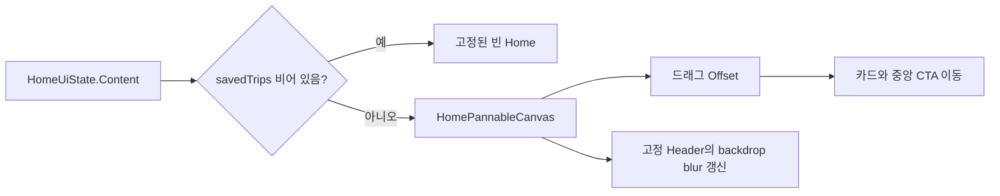

# 이동 가능한 홈 캔버스

## 개념

이동 가능한 캔버스는 화면 전체를 스크롤 목록으로 바꾸지 않고, 한 화면 안의 콘텐츠 묶음만 드래그한 거리만큼 이동시키는 Compose UI 패턴이다. Home에서는 저장 여행지 카드와 중앙 CTA가 캔버스에 속하고 헤더만 화면에 고정된다.

## 도입 이유

저장한 여행지가 있을 때 네 장의 카드가 화면 가장자리에서 일부만 보이는 Figma 구성을 재현하려면 일반적인 세로 목록보다 자유로운 2차원 이동이 필요하다. 반면 저장 여행지가 없는 화면은 드래그할 콘텐츠가 없으므로 기존의 고정된 빈 상태를 유지해야 한다.

## 프로젝트 적용

- 관련 파일: [`HomeScreen.kt`](../../app/src/main/java/com/example/sairo14/feature/home/HomeScreen.kt)
- 관련 파일: [`HomeSavedTripCard.kt`](../../app/src/main/java/com/example/sairo14/feature/home/HomeSavedTripCard.kt)
- 관련 파일: [`HomeUiState.kt`](../../app/src/main/java/com/example/sairo14/feature/home/HomeUiState.kt)

`HomePannableCanvas`는 `savedTrips`가 비어 있지 않을 때만 만들어진다. 저장 카드뿐 아니라 중앙 제목·탐색 CTA도 같은 캔버스 자식으로 배치하므로 드래그할 때 함께 움직인다. 드래그 결과는 ViewModel이 아닌 Composition의 `Offset` 상태로 소유한다. 화면을 다시 열 때 카드 각도가 새로 결정되는 UI 표현과 마찬가지로, 현재 화면 수명에만 필요한 상태이기 때문이다.

이동 한계는 고정 dp 값이 아니라 캔버스의 가로·세로 크기 비율로 계산한다. `SairoHeader`는 화면에 고정하되 같은 backdrop 캡처 계층 위에 두고, 드래그 중 캡처를 갱신해 헤더 안의 blur가 이동한 캔버스를 반영한다.

```kotlin
detectDragGestures { change, dragAmount ->
    change.consume()
    canvasOffset = Offset(
        x = (canvasOffset.x + dragAmount.x).coerceIn(-limit, limit),
        y = (canvasOffset.y + dragAmount.y).coerceIn(-limit, limit),
    )
}
```

카드 위치는 화면의 네 `Alignment` 슬롯과 오프셋으로 정한다. 사진 카드 자체는 Figma 규격인 150×195dp를 유지하고, 각도만 카드 ID를 key로 한 Composition마다 한 번 무작위로 정한다.

## 흐름과 영향 범위



## 트레이드오프와 주의점

- 이동 범위는 제한한다. 제한이 없으면 사용자가 카드를 모두 화면 밖으로 옮겨 현재 위치를 잃을 수 있다.
- 현재 Figma 설계에 맞춰 최대 네 장만 렌더링한다. 저장 여행지가 더 많아지는 제품 요구가 확정되면 슬롯 배치나 페이지 전략을 별도로 설계해야 한다.
- 카드 회전은 재구성마다 바뀌지 않지만, 화면을 새로 만들면 달라진다. 저장된 사용자 설정처럼 영속할 값이 아니므로 Domain 모델에 넣지 않는다.
- 카드 클릭과 드래그는 같은 영역을 공유한다. 드래그 이동이 없는 탭은 카드 클릭으로 전달되며, 이동 거리만 캔버스가 소비한다.

## 추가 학습 및 대안

현재는 확대·축소 없이 드래그만 지원한다. 지도처럼 넓은 영역을 탐색해야 한다면 `transformable`로 scale까지 상태에 포함할 수 있다.

> 아래 예시는 현재 프로젝트에 적용되지 않은 확대·축소 대안이다.

```kotlin
val transformState = rememberTransformableState { zoomChange, panChange, _ ->
    zoom *= zoomChange
    offset += panChange
}

Box(Modifier.transformable(transformState)) {
    // scale과 offset을 함께 적용한 캔버스
}
```

이 방식은 카드의 최소 터치 영역, 캡션 글자 크기, 헤더 blur 캡처 범위를 함께 고려해야 하므로 현재 네 슬롯 Home에는 적용하지 않는다.
