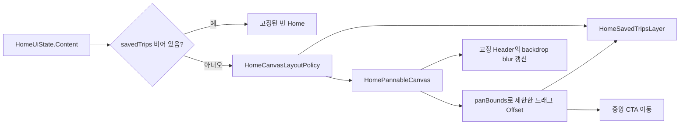

# 이동 가능한 홈 캔버스

## 개념

이동 가능한 캔버스는 화면 전체를 스크롤 목록으로 바꾸지 않고, 한 화면 안의 콘텐츠 묶음만 드래그한 거리만큼 이동시키는 Compose UI 패턴이다. Home에서는 저장 여행지 카드와 중앙 CTA가 캔버스에 속하고 헤더만 화면에 고정된다.

## 도입 이유

저장한 여행지가 있을 때 화면 가장자리에서 일부만 보이는 카드 구성을 재현하려면 일반적인 세로 목록보다 자유로운 2차원 이동이 필요하다. Home은 최대 여덟 장을 표시하며, 네 장을 초과한 카드는 좌·우·상·하 바깥 슬롯에 배치한다. 반면 저장 여행지가 없는 화면은 드래그할 콘텐츠가 없으므로 기존의 고정된 빈 상태를 유지해야 한다.

## 프로젝트 적용

- 관련 파일: [`HomeScreen.kt`](../../app/src/main/java/com/example/sairo14/feature/home/HomeScreen.kt)
- 관련 파일: [`HomeSavedTripCard.kt`](../../app/src/main/java/com/example/sairo14/feature/home/HomeSavedTripCard.kt)
- 관련 파일: [`HomeUiState.kt`](../../app/src/main/java/com/example/sairo14/feature/home/HomeUiState.kt)
- 관련 파일: [`HomeCanvasLayoutPolicy.kt`](../../app/src/main/java/com/example/sairo14/feature/home/HomeCanvasLayoutPolicy.kt)

`HomePannableCanvas`는 `savedTrips`가 비어 있지 않을 때만 만들어진다. 저장 카드뿐 아니라 중앙 제목·탐색 CTA도 같은 캔버스 자식으로 배치하므로 드래그할 때 함께 움직인다. 드래그 결과는 ViewModel이 아닌 Composition의 `Offset` 상태로 소유한다. 화면을 다시 열 때 카드 각도가 새로 결정되는 UI 표현과 마찬가지로, 현재 화면 수명에만 필요한 상태이기 때문이다.

`HomeContentScreen`은 실제 캔버스 크기, 카드 크기, 헤더를 제외한 가시 영역, 저장 카드 수를 `HomeCanvasLayoutPolicy`에 한 번 전달한다. 반환된 `HomeCanvasLayout`은 카드 위치와 `HomeCanvasPanBounds`를 함께 가지며, `HomeSavedTripsLayer`와 `HomePannableCanvas`가 같은 결과를 공유한다. 따라서 카드 배치와 드래그 범위가 서로 어긋나지 않는다.

`SairoHeader`는 화면에 고정하되 같은 backdrop 캡처 계층 위에 둔다. 드래그 시작 시 한 번 즉시 캡처하고, 이후 이벤트는 다음 프레임에 한 번만 갱신한다. 첫 이동의 blur 지연을 줄이면서 구형 기기의 CPU blur 작업을 제한하는 방식이다.

```kotlin
detectDragGestures { change, dragAmount ->
    change.consume()
    canvasOffset = Offset(
        x = (canvasOffset.x + dragAmount.x).coerceIn(panBounds.minX, panBounds.maxX),
        y = (canvasOffset.y + dragAmount.y).coerceIn(panBounds.minY, panBounds.maxY),
    )
}
```

카드 위치는 `HomeSavedTripPlacements`의 최대 여덟 개 슬롯으로 정한다. 처음 네 슬롯은 모서리 구성을 유지하되 우하단 카드가 하단 바깥 카드와 겹치지 않도록 오른쪽 여유를 더 둔다. 5~8번째 슬롯은 좌·우·상·하 바깥에 배치하며, 기준 카드 크기(150×195)에서 카드 사각형 사이에 최소 48dp 상당의 여유를 둔다. 카드 크기가 달라져도 여유는 카드 크기에 비례해 함께 조정된다. 사진 카드는 150×195dp를 유지하며, `savedTripId`를 Compose `key`로 사용해 목록이 변경돼도 카드별 이미지·회전 상태가 다른 카드로 재사용되지 않게 한다.

저장 카드가 더 늘어날 때는 Compose에서 위치와 드래그 한계를 각각 계산하지 않는다. `HomeCanvasLayoutPolicy`는 px 단위의 캔버스·카드·가시 영역과 활성 카드 수를 받아, 카드의 원본 사각형과 회전·그림자 여유가 포함된 시각적 사각형, 비대칭 이동 한계를 함께 반환한다. 고정 헤더를 제외한 영역은 `visibleViewport`로 전달하므로, 작은 화면에서도 실제로 가려지는 방향만큼만 이동할 수 있다.

```kotlin
val layout = HomeCanvasLayoutPolicy.calculate(
    canvasSize = canvasSize,
    visibleViewport = visibleViewport,
    cardSize = cardSize,
    placements = HomeSavedTripPlacements.create(cardSize),
    cardCount = savedTrips.size,
    visualOverflow = shadowAndRotationOverflow,
)
```

카드가 없으면 이동 한계는 모두 0이다. 카드가 화면 왼쪽 밖에만 있으면 오른쪽으로 되돌리는 이동만 허용하는 식으로, `minX..maxX`, `minY..maxY`를 독립적으로 계산한다. 1~4개는 실제 화면 밖으로 나간 모서리 카드만 접근할 수 있을 만큼 제한되고, 5~8개는 추가 바깥 슬롯이 있는 방향으로만 범위가 확장된다. Home은 카드가 화면 경계에 딱 맞아 잘리지 않도록 `revealPadding`과 회전·그림자 여유인 `visualOverflow`도 전달한다. UI는 이 결과를 `canvasOffset.coerceIn(...)`과 카드 위치에 함께 사용한다. 목록 갱신으로 한계가 줄어들면 현재 Offset도 새 범위로 보정한다.

## 흐름과 영향 범위



## 트레이드오프와 주의점

- 이동 범위는 제한한다. 제한이 없으면 사용자가 카드를 모두 화면 밖으로 옮겨 현재 위치를 잃을 수 있다.
- Home 요청과 배치 슬롯은 최대 여덟 장을 기준으로 한다. 카드 간 여유를 넓힌 만큼 5~8개에서는 이동 범위가 이전보다 커진다. 그보다 많은 저장 여행지를 한 화면에서 보여 주려면 새 슬롯을 추가하는 대신 카드 중첩, 접근성, 탐색 피로를 다시 검토해야 한다.
- 정책은 회전·그림자처럼 카드 원본 사각형 밖으로 나가는 요소를 `visualOverflow`로 받을 수 있다. 현재 UI 연결에서는 카드 원본 경계를 사용하므로, 그림자까지 완전히 노출해야 하는 요구가 생기면 실제 그림자·회전 범위를 측정해 해당 값을 전달해야 한다.
- 카드 회전은 재구성마다 바뀌지 않지만, 화면을 새로 만들면 달라진다. 저장된 사용자 설정처럼 영속할 값이 아니므로 Domain 모델에 넣지 않는다.
- 카드 클릭과 드래그는 같은 영역을 공유한다. 드래그 이동이 없는 탭은 카드 클릭으로 전달되며, 이동 거리만 캔버스가 소비한다.
- blur 갱신은 드래그 시작 시 즉시 한 번, 이후 프레임당 한 번으로 제한한다. blur를 드래그 종료 후에만 갱신하면 움직이는 캔버스와 헤더 표현이 분리되어 보이므로, 프레임 단위 갱신을 유지한다.

## 추가 학습 및 대안

현재는 확대·축소 없이 드래그만 지원한다. 지도처럼 넓은 영역을 탐색해야 한다면 `transformable`로 scale까지 상태에 포함할 수 있다.

> 아래 예시는 현재 프로젝트에 적용되지 않은 확대·축소 대안이다.

```kotlin
val transformState = rememberTransformableState { zoomChange, panChange, _ ->
    zoom *= zoomChange
    offset += panChange
}

Box(Modifier.transformable(transformState)) {
    // scale과 offset을 함께 적용한 캔버스
}
```

이 방식은 카드의 최소 터치 영역, 캡션 글자 크기, 헤더 blur 캡처 범위를 함께 고려해야 하므로 현재 8개 카드 Home에는 적용하지 않는다.
