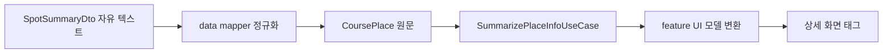

# 장소 정보 요약 정책

## 개념

장소의 운영시간, 휴무일, 주차, 문의처는 서버에서 자유 텍스트로 내려온다. 장소 정보 요약 정책은 이 원문을 바로 화면 문구로 바꾸지 않고, `상시 개방`, `평일·주말 시간`, `주차 가능`처럼 화면이 해석할 수 있는 의미 타입으로 변환하는 방식이다.

## 도입 이유

자유 텍스트에는 줄바꿈 표기, 기간별 시간, 시설별 시간, 기상 조건처럼 형식이 다른 데이터가 섞여 있다. ViewModel에서 문자열을 직접 가공하면 규칙이 화면에 묶이고 테스트가 어려워진다.

domain에서 요약하면 Android UI와 무관하게 규칙을 테스트할 수 있고, 화면은 의미 타입을 `strings.xml`의 문구로만 변환할 수 있다.

## 프로젝트 적용

- 관련 모델: [`app/src/main/java/com/example/sairo14/domain/model/PlaceInfoSummary.kt`](../../app/src/main/java/com/example/sairo14/domain/model/PlaceInfoSummary.kt)
- 관련 UseCase: [`app/src/main/java/com/example/sairo14/domain/usecase/SummarizePlaceInfoUseCase.kt`](../../app/src/main/java/com/example/sairo14/domain/usecase/SummarizePlaceInfoUseCase.kt)
- 관련 UI 변환: [`app/src/main/java/com/example/sairo14/feature/traveldetail/TravelDetailViewModel.kt`](../../app/src/main/java/com/example/sairo14/feature/traveldetail/TravelDetailViewModel.kt)
- 관련 리소스 변환: [`app/src/main/java/com/example/sairo14/feature/traveldetail/TravelDetailScreen.kt`](../../app/src/main/java/com/example/sairo14/feature/traveldetail/TravelDetailScreen.kt)
- 관련 테스트: [`app/src/test/java/com/example/sairo14/domain/usecase/SummarizePlaceInfoUseCaseTest.kt`](../../app/src/test/java/com/example/sairo14/domain/usecase/SummarizePlaceInfoUseCaseTest.kt)

`SummarizePlaceInfoUseCase`는 `CoursePlace`의 원문을 받아 `PlaceInfoSummary`로 반환한다. 값이 없으면 해당 항목을 생략하고, 원문은 있지만 안전하게 해석할 수 없으면 `PhoneInquiry`를 반환한다.

```kotlin
val summary = summarizePlaceInfoUseCase(place)

// 운영시간: 상시 개방, 단순 시간, 기간별 시간, 평일·주말, 전화문의
// 휴무일: 연중무휴, 매주 요일, 공휴일, 기상악화 시 휴무, 전화문의
```

## 흐름과 영향 범위



- `data`는 HTML 줄바꿈과 공백처럼 전송 형식만 정규화한다.
- `domain`은 원문의 표시 정책을 의미 타입으로 해석한다.
- `feature`는 타입을 리소스 문구와 동적 시간·전화번호 텍스트로 변환하고 표시 순서를 정한다.

상세 화면의 태그는 운영시간, 휴무일, 주차, 문의처 순서로 만든다. 동일한 `PhoneInquiry`는 UI 모델의 `distinct()` 처리로 한 번만 표시한다.

운영시간 또는 휴무일에 기상·통제 조건이 있으면, 기본 운영 정보는 유지하면서 휴무일 목록에 `BadWeather`를 추가한다. 따라서 `연중무휴`와 `기상악화 시 휴무`를 함께 표시할 수 있다.

## 트레이드오프와 주의점

정규식 기반 분류는 새 형식이 늘어날 때 규칙과 테스트를 함께 갱신해야 한다. 특히 여러 시설의 시간표를 하나의 시간으로 잘못 축약하면 오해를 만들 수 있으므로, 시설별 정보나 인식 불가 값은 `PhoneInquiry`로 보수적으로 처리한다.

`null`은 서버가 정보를 제공하지 않았다는 뜻이고, `PhoneInquiry`는 값은 있으나 태그로 안전하게 요약할 수 없다는 뜻이다. 두 상태를 구분해야 없는 정보를 임의로 전화문의로 표시하지 않는다.

## 추가 학습 및 대안

> 아래 예시는 현재 프로젝트에 적용되지 않은 대안이다.

서버가 충분히 신뢰할 수 있는 요약 필드를 제공한다면 클라이언트는 서버 요약을 우선 사용할 수 있다. 다만 서버 요약이 없거나 `null`일 때의 안전한 fallback 정책은 여전히 필요하다.

```kotlin
fun summaryOrFallback(serverSummary: String?, rawText: String?): String? =
    serverSummary ?: rawText?.takeIf { it.isNotBlank() }
```

이 대안은 규칙을 서버에 집중할 수 있지만, 앱과 서버 배포 시점이 달라질 때 같은 화면에서 서로 다른 결과가 보일 수 있다.
