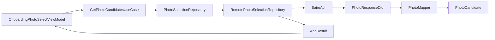

# Retrofit API와 Repository 경계

## 개념

Retrofit API 인터페이스는 HTTP 경로·쿼리·응답 JSON을 표현하고, Repository는 이를 앱의 도메인 모델과 성공·실패 결과로 바꾸는 계층이다. 두 역할을 분리하면 화면은 네트워크 라이브러리와 서버 DTO를 알 필요가 없다.

## 도입 이유

온보딩 사진 선택 화면은 사진 ID와 이미지 URL만 필요하다. 화면이 Retrofit 응답을 직접 받으면 서버 JSON 키, HTTP 오류, 이미지 접근성 기본값 같은 세부 사항이 Feature까지 퍼진다. 또한 서버 연동 전 사용하던 Fake Repository와 실제 구현을 교체하기 어려워진다.

SAIRO API는 성공 응답을 공통 래퍼로 감싸지 않고 각 엔드포인트의 DTO를 직접 반환한다. 따라서 Retrofit은 성공 DTO를 직접 반환하고, Repository가 공통 오류 처리와 Domain mapper를 적용한다.

## 프로젝트 적용

- 관련 파일: [`SairoApi.kt`](../../app/src/main/java/com/example/sairo14/data/remote/SairoApi.kt)
- 관련 파일: [`PhotoResponseDto.kt`](../../app/src/main/java/com/example/sairo14/data/remote/dto/PhotoResponseDto.kt), [`TasteAnalysisDto.kt`](../../app/src/main/java/com/example/sairo14/data/remote/dto/TasteAnalysisDto.kt), [`SavedTripDto.kt`](../../app/src/main/java/com/example/sairo14/data/remote/dto/SavedTripDto.kt)
- 관련 파일: [`PhotoMapper.kt`](../../app/src/main/java/com/example/sairo14/data/mapper/PhotoMapper.kt), [`TasteAnalysisMapper.kt`](../../app/src/main/java/com/example/sairo14/data/mapper/TasteAnalysisMapper.kt), [`SavedTripMapper.kt`](../../app/src/main/java/com/example/sairo14/data/mapper/SavedTripMapper.kt)
- 관련 파일: [`RemotePhotoSelectionRepository.kt`](../../app/src/main/java/com/example/sairo14/data/repository/RemotePhotoSelectionRepository.kt)
- 관련 파일: [`RemoteOnboardingRecommendationRepository.kt`](../../app/src/main/java/com/example/sairo14/data/repository/remote/RemoteOnboardingRecommendationRepository.kt)
- 관련 파일: [`RemoteSavedTripRepository.kt`](../../app/src/main/java/com/example/sairo14/data/repository/remote/RemoteSavedTripRepository.kt)
- 관련 파일: [`RemoteApiModule.kt`](../../app/src/main/java/com/example/sairo14/data/remote/di/RemoteApiModule.kt)

현재 `SairoApi`에는 사진 풀 조회, 온보딩 취향 분석, 저장·해제, 저장 목록 조회 작업만 선언한다. 사용하지 않는 Swagger API는 미리 추가하지 않는다.

```kotlin
@GET("photos")
suspend fun getPhotos(
    @Query("limit") limit: Int = 40,
): List<PhotoResponseDto>
```

사진 API는 공개 사진 풀이라 `X-Device-Id`를 요구하지 않는다. 반면 이후 취향 분석·저장 여행지 API는 Remote Repository가 `DeviceIdProvider`의 값을 Retrofit `@Header` 파라미터로 전달한다.

```kotlin
@POST("taste-analysis")
suspend fun analyzeTaste(
    @Header("X-Device-Id") deviceId: String,
    @Body request: TasteAnalysisRequestDto,
): TasteAnalysisResponseDto
```

`RemoteOnboardingRecommendationRepository`는 사진 ID를 중복 제거한 뒤 5~10장인지 검증하고, 기기 ID를 준비한 뒤에만 이 API를 호출한다. DataStore에서 기기 ID를 읽는 실패는 `runRemoteOperation` 밖에서 처리해 네트워크 오류로 잘못 분류하지 않는다.

저장 요청은 응답의 `savedTripId`를 Domain 모델로 변환해 화면이 이후 삭제 API를 호출할 수 있게 한다. 중복 저장도 서버의 `201 Created` 응답을 그대로 성공으로 처리하며, 응답의 `courseId`를 요청값과 비교하지 않는다.

```kotlin
@POST("saved-trips")
suspend fun saveTrip(
    @Header("X-Device-Id") deviceId: String,
    @Body request: SavedTripSaveRequestDto,
): SavedTripSaveResponseDto

@DELETE("saved-trips")
suspend fun deleteSavedTrip(
    @Header("X-Device-Id") deviceId: String,
    @Query("savedTripId") savedTripId: String,
)
```

삭제 API는 본문 없는 `204 No Content`를 반환하므로 Retrofit 메서드의 반환형을 `Unit`으로 둔다. 정상 삭제뿐 아니라 이미 삭제된 ID도 서버가 `204`로 응답하는 계약이므로, Repository는 모두 `AppResult.Success(Unit)`으로 전달한다.

저장 목록 조회는 항목과 다음 페이지 커서를 함께 반환한다. 첫 요청은 `cursor = null`로 보내 Retrofit이 cursor 쿼리를 생략하고, 이후에는 응답의 `nextCursor`를 수정하지 않고 그대로 전달한다.

```kotlin
@GET("saved-trips")
suspend fun getSavedTrips(
    @Header("X-Device-Id") deviceId: String,
    @Query("cursor") cursor: String? = null,
    @Query("size") size: Int = 20,
): SavedTripListResponseDto
```

[`RemoteSavedTripRepository.kt`](../../app/src/main/java/com/example/sairo14/data/repository/remote/RemoteSavedTripRepository.kt)는 먼저 `DeviceIdProvider`에서 ID를 읽고, 그 성공 뒤에만 `runRemoteOperation` 안에서 API와 `SavedTripMapper`를 호출한다. 따라서 DataStore 접근 실패가 네트워크 실패로 잘못 분류되지 않는다. 목록 DTO의 `regionArea`, `imageUrl`, `reason`, `nextCursor`는 nullable 상태를 Domain까지 보존하고, `spotNames`, `spotImageUrls`는 목록 순서를 유지한 채 전달한다. 화면 전용 mapper는 새 목록이 비었을 때만 기존 지역·대표 이미지로 표시를 보완한다.

## 흐름과 영향 범위



1. ViewModel이 UseCase에 사진 후보 조회를 요청한다.
2. Remote Repository가 `SairoApi.getPhotos()`를 호출한다.
3. 성공 DTO는 `PhotoCandidate`로 변환된다.
4. 네트워크·HTTP 실패는 `runRemoteOperation`과 `RemoteErrorMapper`를 거쳐 `AppResult.Failure`가 된다.
5. ViewModel은 성공·빈 목록·실패를 기존 UI state로 변환한다.

## 트레이드오프와 주의점

- Retrofit 메서드가 DTO 본문을 직접 반환하면 Repository 코드가 간결하지만, HTTP 응답 헤더를 읽어야 하는 특수 API에는 `Response<T>`가 필요할 수 있다. 현재 API에는 해당 요구가 없다.
- DTO의 `id`, `imageUrl`은 서버 계약상 필수로 취급한다. 필드가 누락된 잘못된 응답은 조용히 빈 값으로 바꾸지 않고 실패로 처리한다.
- `SairoApi`에 모든 Swagger API를 미리 선언하지 않는다. 아직 사용하지 않는 DTO와 Deprecated API가 앱에 들어오는 것을 막고, API 변경 영향 범위를 작게 유지한다.
- Fake Repository는 삭제하지 않는다. Unit test·프리뷰·개발 환경에서 Domain 계약을 빠르게 검증하는 데 사용한다. 앱 실행 시에는 Hilt가 실제 Remote Repository를 주입한다.

## 추가 학습 및 대안

> 아래 예시는 현재 프로젝트에 적용하지 않은 HTTP 응답 직접 확인 방식이다.

```kotlin
@GET("photos")
suspend fun getPhotos(
    @Query("limit") limit: Int = 40,
): Response<List<PhotoResponseDto>>
```

이 방식은 상태 코드와 응답 헤더를 Repository에서 직접 읽을 수 있다. 대신 모든 Repository가 `isSuccessful`, `body`, `errorBody` 처리를 반복하게 된다. SAIRO는 공통 `RemoteErrorMapper`를 사용하므로, 현재는 DTO 직접 반환 방식이 더 단순하다.
