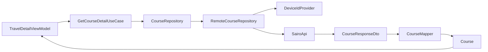

# Retrofit API와 Repository 경계

## 개념

Retrofit API 인터페이스는 HTTP 경로, 헤더, 쿼리, 응답 JSON을 표현한다. Repository는 DTO를 Domain 모델과 `AppResult`로 바꾼다. 이 경계 덕분에 ViewModel과 Composable은 Retrofit, HTTP 상태 코드, 서버 응답 DTO를 알 필요가 없다.

## 도입 이유

사진, 취향 분석, 저장 여행지, 코스 조회 API는 모두 응답 모양과 익명 기기 ID 요구 여부가 다르다. 화면마다 네트워크 요청을 직접 작성하면 `X-Device-Id` 누락, 예외 처리 정책 차이, DTO의 UI 노출이 발생한다.

특히 코스 상세 조회는 저장 여행지와 온보딩 결과 모두에서 사용한다. Domain의 `CourseRepository` 계약 뒤에 원격 구현을 두면 상세 ViewModel은 코스가 서버인지 온보딩 세션인지 알 필요가 없다.

## 프로젝트 적용

- Retrofit 계약: [`SairoApi.kt`](../../app/src/main/java/com/example/sairo14/data/remote/SairoApi.kt)
- DTO: [`CourseDto.kt`](../../app/src/main/java/com/example/sairo14/data/remote/dto/CourseDto.kt), [`TasteAnalysisDto.kt`](../../app/src/main/java/com/example/sairo14/data/remote/dto/TasteAnalysisDto.kt), [`SavedTripDto.kt`](../../app/src/main/java/com/example/sairo14/data/remote/dto/SavedTripDto.kt)
- mapper: [`CourseMapper.kt`](../../app/src/main/java/com/example/sairo14/data/mapper/CourseMapper.kt), [`TasteAnalysisMapper.kt`](../../app/src/main/java/com/example/sairo14/data/mapper/TasteAnalysisMapper.kt), [`SavedTripMapper.kt`](../../app/src/main/java/com/example/sairo14/data/mapper/SavedTripMapper.kt)
- 원격 구현: [`RemoteCourseRepository.kt`](../../app/src/main/java/com/example/sairo14/data/repository/remote/RemoteCourseRepository.kt), [`RemoteSavedTripRepository.kt`](../../app/src/main/java/com/example/sairo14/data/repository/remote/RemoteSavedTripRepository.kt)
- 공통 오류 처리: [`RemoteErrorMapper.kt`](../../app/src/main/java/com/example/sairo14/data/remote/RemoteErrorMapper.kt)

코스 상세 API는 코스 ID path와 기기 ID header를 분리해 선언한다.

```kotlin
@GET("courses/{courseId}")
suspend fun getCourse(
    @Path("courseId") courseId: String,
    @Header("X-Device-Id") deviceId: String,
): CourseResponseDto
```

`RemoteCourseRepository`는 먼저 기기 ID를 읽고, 성공한 경우에만 실제 API 호출을 공통 작업 함수로 감싼다.

```kotlin
override suspend fun getCourse(courseId: String): AppResult<Course> {
    val deviceId = deviceIdProvider.getDeviceId()

    return runRemoteOperation(
        action = "코스 상세 정보를 불러오지 못했습니다.",
        json = json,
    ) {
        api.getCourse(courseId, deviceId).toDomain()
    }
}
```

실제 구현은 기기 ID 저장소의 `IOException`, 손상, 취소를 별도로 처리한다. 이 코드를 간략화한 예시처럼 기기 ID 읽기 자체를 `runRemoteOperation` 안에 넣으면 저장소 오류가 네트워크 오류로 잘못 분류될 수 있다.

`CourseMapper`는 `CourseResponseDto`와 취향 분석의 `CourseCardDto`가 공유하는 `SpotSummaryDto`를 같은 `CoursePlace`로 변환한다. 따라서 이미지 공백은 `null`, 불완전한 좌표는 `null`, 운영 정보 태그는 같은 순서로 유지된다.

## 흐름과 영향 범위



1. ViewModel은 코스 ID만 UseCase에 전달한다.
2. Repository가 기기 ID 준비와 HTTP 헤더 정책을 소유한다.
3. Retrofit 성공 DTO는 mapper를 거쳐 Domain `Course`가 된다.
4. 네트워크·HTTP 실패는 `runRemoteOperation`과 `RemoteErrorMapper`를 거쳐 `AppResult.Failure`가 된다.
5. ViewModel은 성공·로딩·오류를 UI 상태로 변환한다.

## 트레이드오프와 주의점

- Retrofit 메서드가 DTO 본문을 직접 반환하면 코드가 간결하다. 응답 헤더가 실제 기능 요구가 될 때만 `Response<T>` 반환으로 확장한다.
- `404 COURSE_NOT_FOUND`는 `AppError.ResourceNotFound`, 400은 `InvalidRequest`, 500은 `ServerFailure`로 변환한다. HTTP 예외 자체를 Feature에 전달하지 않는다.
- `CancellationException`은 결과로 변환하지 않고 다시 던진다. 화면이 사라진 요청이 오류 상태를 만들지 않게 하기 위해서다.
- `SairoApi`에는 실제 사용 중인 API만 추가한다. 공유 코스나 장소 상세 API는 기능을 구현할 때 선언한다.

## 추가 학습 및 대안

> 아래 예시는 현재 프로젝트에 적용하지 않은 `Response<T>` 기반 대안이다.

```kotlin
@GET("courses/{courseId}")
suspend fun getCourse(
    @Path("courseId") courseId: String,
    @Header("X-Device-Id") deviceId: String,
): Response<CourseResponseDto>
```

이 방식은 상태 코드와 응답 헤더를 Repository에서 직접 읽을 수 있다. 하지만 각 Repository가 `isSuccessful`, `body`, `errorBody` 처리를 반복해야 하므로, 현재는 공통 `RemoteErrorMapper`를 사용하는 DTO 직접 반환 방식을 유지한다.
