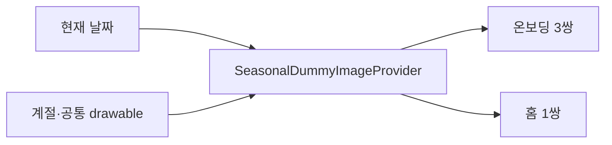

# 계절별 로컬 이미지 선택

## 개념

계절별 로컬 이미지 선택은 현재 날짜의 계절 이미지와 공통 이미지를 정해진 비율로 섞어 화면에 배정하는 정책이다. 같은 날짜에는 난수 시드를 고정해 화면 재구성이나 재진입에도 같은 결과를 제공한다.

## 도입 이유

온보딩은 세 개의 겹친 카드 묶음에 여섯 장, 홈은 한 묶음에 두 장이 필요하다. 화면이 각각 임의로 이미지를 고르면 중복될 수 있으므로, 두 화면이 하나의 여덟 장 배정 결과를 공유하도록 한다.

## 프로젝트 적용

- 관련 파일: [`SeasonalDummyImageProvider.kt`](../../app/src/main/java/com/example/sairo14/core/dummyimage/SeasonalDummyImageProvider.kt)
- 관련 파일: [`OnboardingIntroViewModel.kt`](../../app/src/main/java/com/example/sairo14/feature/onboarding/intro/OnboardingIntroViewModel.kt)
- 관련 파일: [`HomeViewModel.kt`](../../app/src/main/java/com/example/sairo14/feature/home/HomeViewModel.kt)

계절·공통 이미지에서 각각 네 장을 고른 뒤, 온보딩에는 계절 세 장과 공통 세 장을, 홈에는 남은 계절·공통 한 장씩을 배정한다.

## 흐름과 영향 범위



`feature`는 Provider가 반환한 drawable ID만 UI state에 보관한다. `domain`과 `data`는 Android 리소스에 의존하지 않으므로 기존 계층 경계를 유지한다.

## 트레이드오프와 주의점

날짜 seed는 같은 날 모든 설치에서 같은 조합을 만든다. 더미 이미지에는 재현성이 유리하지만, 사용자별 다양성이 필요하면 DataStore에 설치별 seed를 저장해 날짜 seed와 조합해야 한다. 각 계절과 공통 카탈로그는 최소 네 장을 유지해야 한다.

## 추가 학습 및 대안

> 아래 예시는 현재 프로젝트에 적용하지 않은 사용자별 seed 방식이다.

```kotlin
val random = Random(todaySeed xor installSeed)
val images = catalog.shuffled(random)
```

설치별 seed는 다양성을 높이지만 DataStore 읽기와 초기화 정책이 추가된다.
