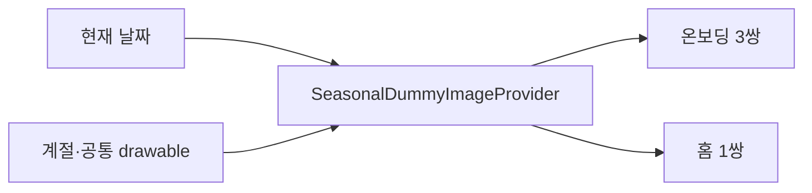

# 계절별 로컬 이미지 선택

## 개념

계절별 로컬 이미지 선택은 현재 날짜의 계절 이미지와 공통 이미지를 정해진 비율로 섞어 화면에 배정하는 정책이다. 화면에 새로 진입할 때마다 새 조합을 생성하되, 같은 화면에 머무르는 동안에는 ViewModel이 선택 결과를 유지한다.

## 도입 이유

온보딩은 세 개의 겹친 카드 묶음에 여섯 장, 홈은 한 묶음에 두 장이 필요하다. 카드별로 임의의 이미지를 고르면 같은 이미지가 반복될 수 있으므로, 화면 진입마다 여덟 장을 먼저 뽑아 배정한다.

## 프로젝트 적용

- 관련 파일: [`SeasonalDummyImageProvider.kt`](../../app/src/main/java/com/example/sairo14/core/dummyimage/SeasonalDummyImageProvider.kt)
- 관련 파일: [`OnboardingIntroViewModel.kt`](../../app/src/main/java/com/example/sairo14/feature/onboarding/intro/OnboardingIntroViewModel.kt)
- 관련 파일: [`HomeViewModel.kt`](../../app/src/main/java/com/example/sairo14/feature/home/HomeViewModel.kt)

계절·공통 이미지에서 각각 네 장을 고른 뒤, 온보딩에는 계절 세 장과 공통 세 장을, 홈에는 남은 계절·공통 한 장씩을 배정한다.

## 흐름과 영향 범위



`feature`는 Provider가 반환한 drawable ID만 UI state에 보관한다. 진입 시 `onScreenEntered()`가 새 묶음을 선택하며, 저장 목록 갱신처럼 같은 화면 안에서 발생하는 상태 변경은 기존 이미지 쌍을 유지한다. `domain`과 `data`는 Android 리소스에 의존하지 않으므로 기존 계층 경계를 유지한다.

## 트레이드오프와 주의점

난수 선택은 화면 진입마다 달라지므로, 사용자가 화면을 보고 있는 중에는 다시 선택하지 않아야 이미지가 깜빡이지 않는다. 각 계절과 공통 카탈로그는 최소 네 장을 유지해야 한다.

## 추가 학습 및 대안

> 아래 예시는 현재 프로젝트에 적용하지 않은 날짜별 고정 방식이다.

```kotlin
val random = Random(todaySeed)
val images = catalog.shuffled(random)
```

날짜 seed를 사용하면 같은 날에는 같은 조합을 재현할 수 있지만, 화면 재진입 때마다 새 분위기를 보여 주기는 어렵다.
