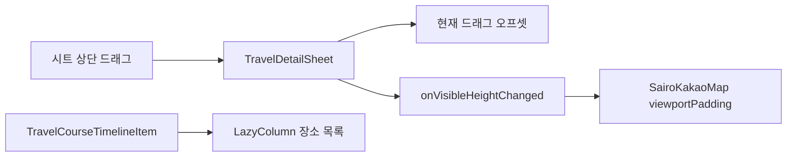

# 자유 드래그 여행 상세 시트

## 개념

자유 드래그 시트는 위·아래 이동 범위만 제한하고, 드래그를 놓은 시점의 위치에 그대로 머무는 패널이다. 이 화면은 처음에 기본 위치에서 시작하지만, 확장·기본·접힘 같은 정해진 위치로 다시 정착하지 않는다. 최하단에서는 시트 헤더만 남겨 지도를 최대한 넓게 볼 수 있다.

이 화면에서는 시트의 상단 영역만 드래그하고 장소 목록은 별도 `LazyColumn`으로 둔다. 따라서 목록을 읽기 위해 위아래로 쓸어도 시트 위치가 함께 바뀌지 않으며, 화면 밖 장소는 보이는 시점에 구성된다.

## 도입 이유

여행 상세 화면은 지도와 코스 목록을 한 화면에서 함께 보여 준다. 사용자는 기본 상태에서 지도와 첫 장소를 함께 보고, 필요할 때는 목록을 넓게 펼치거나 최소화해 지도를 확인해야 한다.

Material 3의 기본 바텀시트는 이 화면의 자유 드래그 범위와 지도 뷰포트 연동을 직접 표현하기 어렵다. 그래서 화면 전용 시트가 현재 오프셋과 노출 높이 콜백을 관리한다.

## 프로젝트 적용

- 관련 파일: [`TravelDetailSheet.kt`](../../app/src/main/java/com/example/sairo14/feature/traveldetail/TravelDetailSheet.kt)
- 관련 파일: [`TravelCourseTimeline.kt`](../../app/src/main/java/com/example/sairo14/feature/traveldetail/TravelCourseTimeline.kt)
- 관련 파일: [`SairoKakaoMap.kt`](../../app/src/main/java/com/example/sairo14/core/map/SairoKakaoMap.kt)

`TravelDetailSheet`는 부모 영역의 높이와 완전 확장 시 남겨 둘 상단 영역을 바탕으로 드래그 범위를 계산한다. 접힌 위치는 헤더의 실제 높이를 사용하므로 특정 기기 높이나 고정된 접힘 높이를 기준으로 시트의 y 좌표를 정하지 않는다. `TravelDetailScreen`이 화면 전체에 navigation bar inset을 한 번 적용하므로, 지도와 시트는 시스템 제스처 영역 위에서 함께 끝난다.

시트 컨테이너의 높이는 화면 전체가 아니라 `containerHeight - sheetOffset`으로 계산한다. 내부 `LazyColumn`이 실제로 화면에 보이는 높이를 viewport로 사용하므로, 작은 화면이나 중간 드래그 위치에서도 마지막 장소가 화면 밖에 잘린 채 스크롤 범위에서 빠지지 않는다. 일차를 변경하면 새 일정의 첫 장소부터 볼 수 있도록 목록 위치를 처음으로 되돌린다.

```kotlin
sheetOffsetPx = (currentOffset + delta)
    .coerceIn(expandedOffsetPx, collapsedOffsetPx)
```

드래그가 끝날 때 별도 애니메이션이나 anchor 정착 동작을 실행하지 않으므로, 사용자가 놓은 위치가 그대로 유지된다.

목록 행은 `TravelCourseTimelineItem`이 각 lazy item의 순서 핀과 연결선만 그린다. 실제 장소 이름, 태그, 이미지와 클릭 동작은 `SairoPlaceListItem`을 제공하는 화면이 소유한다.

## 흐름과 영향 범위



시트의 노출 높이는 이후 화면이 `SairoMapViewportPadding`의 bottom 값으로 변환해 전달한다. 지도 구현은 시트 자체를 알 필요가 없고, feature는 Kakao SDK 타입을 알 필요가 없다.

## 트레이드오프와 주의점

- 본문까지 드래그 대상으로 만들면 세로 스크롤 목록과 제스처가 경쟁할 수 있다. 현재는 상단 영역만 드래그 대상으로 제한했다.
- 장소별로 lazy item을 분리했으므로 장소 ID는 선택한 일차 안에서 고유해야 한다. 안정적인 key 덕분에 항목 재구성과 이미지 로딩을 줄일 수 있다.
- 시트가 보이는 높이는 드래그하는 동안 계속 바뀐다. 지도 카메라를 매 프레임 이동하면 사용성이 떨어질 수 있으므로, 다음 화면 단계에서는 padding 업데이트와 카메라 이동의 책임을 분리한다.
- 드래그 범위는 부모 크기와 화면 밀도가 바뀔 때 다시 계산한다. 최초 기본 위치는 한 번만 사용하며, 재구성 때마다 현재 드래그 위치를 초기화하지 않는다.
- navigation bar inset을 시트 본문과 화면 루트에 중복 적용하면 마지막 장소 아래에 불필요한 빈 공간이 생긴다. 현재는 화면 루트만 이를 적용한다.
- 정해진 위치가 없으므로 사용자가 자주 찾는 높이가 있다면 매번 직접 조절해야 한다. 명확한 상태 전환이나 접근성 액션이 필요해지면 anchor 기반 시트를 다시 검토한다.

## 추가 학습 및 대안

> 아래 예시는 현재 프로젝트에 적용되지 않은 대안이다.

정해진 위치가 필요하다면 anchor 기반 드래그를 적용할 수 있다.

```kotlin
val anchors = DraggableAnchors {
    SheetValue.Expanded at expandedOffsetPx
    SheetValue.Collapsed at collapsedOffsetPx
}
```

anchor 기반 시트는 상태별 동작을 만들기 쉽지만, 이 화면처럼 사용자가 놓은 높이를 유지해야 하는 요구에는 맞지 않는다.
