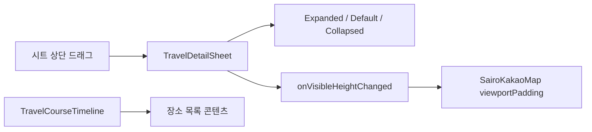

# 세 단계 여행 상세 시트

## 개념

세 단계 시트는 접힌 상태, 기본 상태, 확장 상태처럼 둘 이상의 정해진 위치에 멈추는 드래그 패널이다. Compose Foundation의 `AnchoredDraggableState`는 각 상태와 화면의 세로 좌표를 anchor로 연결하고, 드래그가 끝나면 가장 적절한 anchor로 시트를 이동시킨다.

이 화면에서는 시트의 상단 영역만 드래그하고 장소 목록은 별도 스크롤 영역으로 둔다. 따라서 목록을 읽기 위해 위아래로 쓸어도 시트 위치가 함께 바뀌지 않는다.

## 도입 이유

여행 상세 화면은 지도와 코스 목록을 한 화면에서 함께 보여 준다. 사용자는 기본 상태에서 지도와 첫 장소를 함께 보고, 필요할 때는 목록을 넓게 펼치거나 최소화해 지도를 확인해야 한다.

Material 3의 기본 바텀시트는 이 화면의 세 위치와 지도 뷰포트 연동을 직접 표현하기 어렵다. 그래서 화면 전용 시트가 세 anchor와 현재 노출 높이 콜백을 관리한다.

## 프로젝트 적용

- 관련 파일: [`TravelDetailSheet.kt`](../../app/src/main/java/com/example/sairo14/feature/traveldetail/TravelDetailSheet.kt)
- 관련 파일: [`TravelCourseTimeline.kt`](../../app/src/main/java/com/example/sairo14/feature/traveldetail/TravelCourseTimeline.kt)
- 관련 파일: [`SairoKakaoMap.kt`](../../app/src/main/java/com/example/sairo14/core/map/SairoKakaoMap.kt)

`TravelDetailSheet`는 부모 영역의 높이와 완전 확장 시 남겨 둘 상단 영역을 바탕으로 anchor를 계산한다. 따라서 특정 기기 높이를 기준으로 시트의 y 좌표를 고정하지 않는다.

```kotlin
val anchors = DraggableAnchors {
    TravelDetailSheetValue.Expanded at expandedOffsetPx
    TravelDetailSheetValue.Default at defaultOffsetPx
    TravelDetailSheetValue.Collapsed at collapsedOffsetPx
}
```

목록 행은 `TravelCourseTimeline`이 순서 핀과 연결선만 그린다. 실제 장소 이름, 태그, 이미지와 클릭 동작은 다음 화면 단계에서 `SairoPlaceListItem`을 제공하는 화면이 소유한다.

## 흐름과 영향 범위



시트의 노출 높이는 이후 화면이 `SairoMapViewportPadding`의 bottom 값으로 변환해 전달한다. 지도 구현은 시트 자체를 알 필요가 없고, feature는 Kakao SDK 타입을 알 필요가 없다.

## 트레이드오프와 주의점

- 본문까지 드래그 대상으로 만들면 세로 스크롤 목록과 제스처가 경쟁할 수 있다. 현재는 상단 영역만 드래그 대상으로 제한했다.
- 시트가 보이는 높이는 드래그하는 동안 계속 바뀐다. 지도 카메라를 매 프레임 이동하면 사용성이 떨어질 수 있으므로, 다음 화면 단계에서는 padding 업데이트와 카메라 이동의 책임을 분리한다.
- anchor는 부모 크기와 화면 밀도가 바뀔 때 다시 계산한다. `initialValue`는 최초 표시 위치일 뿐, 재구성 때마다 현재 드래그 위치를 초기화하지 않는다.

## 추가 학습 및 대안

> 아래 예시는 현재 프로젝트에 적용되지 않은 대안이다.

두 위치만 필요하고 지도와의 연동이 없다면 Material 3의 기본 시트를 사용할 수 있다.

```kotlin
ModalBottomSheet(
    onDismissRequest = onDismiss,
) {
    CourseContent()
}
```

기본 시트는 빠르게 도입할 수 있지만, 이 화면처럼 접힘·기본·확장의 세 위치를 명시적으로 제어하거나 현재 노출 높이를 지도에 전달하는 요구에는 맞지 않는다.
